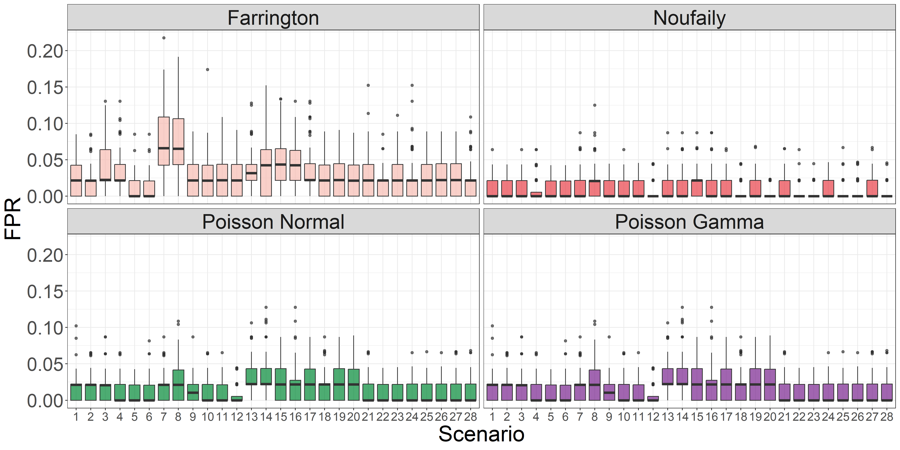
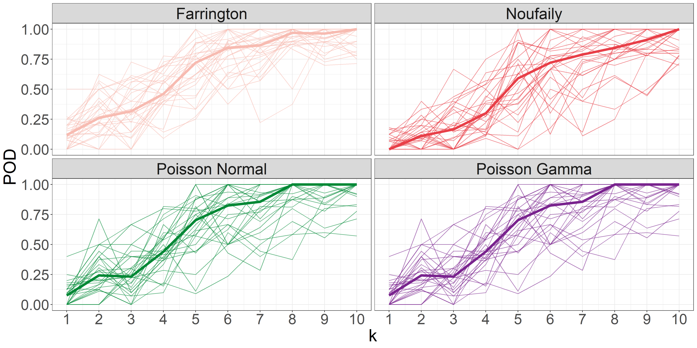

```{r import_libraries, include=FALSE}
library(dplyr)
library(kableExtra)
library(readr)

POD <- read_rds(file = "../../src/simulation/POD.Rds")
FPR <- read_rds(file = "../../src/simulation/FPR.Rds")

```

# Introduction

The fight against infectious disease not only requires proper treatment of patients and implementation of preventive measure but also demands early detection of emerging disease outbreaks. Timely identification and intervention can mean the difference between containing an outbreak or facing a devastating epidemic.

Statistical outbreak detection begins with the identification of an aberrant number of cases of a particular disease within a specific time and space. When an increase in the number of cases is detected, a signal or alarm is raised by the detection method. Subsequently, an epidemiologist assesses the public health relevance of the aberration to determine if further investigation is warranted.

Today epidemiologists and public health professionals utilize a range of tools and methodologies to effectively tackle disease outbreaks. Here, laboratory-based approaches play a crucial role in outbreak investigations and may involve techniques such as molecular epidemiology [@Honardoost_2018, @Struelens_2013] and, more recently Whole Genome Sequencing (WGS) [@Koeser_2012, @Baldry_2010].

However, in recent years, there has been a growing interest in statistical method for automated and early detection of disease outbreaks. These methodologies encompass various statistical techniques, including regression analysis, time series methodology, methods inspired by statistical process control, approaches incorporating spatial information, and multivariate outbreak detection. A comprehensive review of these method can be found in studies by @Buckeridge_2007 and @Unkel_2012.

To establish a golden standard, this article will focus on the method initially proposed by @Farrington_1996 and the subsequent improvements proposed by @Noufaily_2013. These methods offer advanced statistical tools for detecting and monitoring disease outbreak and are currently *the* methods of choice at European public health institute [@Hulth_2010]. They can be accessed through the R package called `surveillance` developed by @Salmon_2016.

It is a well known fact, that one limitation of these detection algorithms is an occasional lack of specificity, leading to false alarms that can overwhelm the epidemiologists with verification tasks [@Bedubourg_2017]. Therefore, in this article, these established methods will be compared to a novel outbreak detection algorithm based on hierarchical models. This article introduces this new algorithm as an innovative approach to outbreak detection and aims to assess its performance in comparison to already existing methods.

While hierarchical models have earned a reputation within ecology [@Bolker_2009, @Zuur_2009], urban energy modeling [@Real_2021, @Jaume_2022], and other fields, their application in the automatic detection of disease outbreaks is relatively unproven. However, there is a promising paper by @Heisterkamp_2006 that applied a hierarchical time series model to detect infectious disease outbreaks in empirical data from *Rubella* and *Salmonella*. The authors concluded that the method is a powerful and versatile way of analyzing time series of routinely recorded laboratory data.

In the context of this article, the focus will be on the prospective detection of disease outbreaks, considering the potential of hierarchical models to effectively identify and respond to emerging outbreaks in a timely manner.

# Materials and methods


## Novel outbreak detection algorithm

The novel algorithm utilizes a generalized mixed effects model or a hierarchical generalized linear model as a modeling framework to model the count observations $y$ and assess the unobserved random effects $u$. These random effects are used directly in the detection algorithm to characterize an outbreak. The theoretical foundations of these models will be further discussed in Sections \ref{glmm} and \ref{hglm}.

The first step involves fitting either a hierarchical Poisson Normal or Poisson Gamma model with a log link to the reference data. Here, it is possible for the user to include an arbitrary number of covariates by supplying a model formula. In order to account for structural changes in the time series, e.g. an improved and more sensitive diagnostic method or a new screening strategy at hospitals, a rolling window with width $k$ is used to estimate the time-varying model parameters. Also, it is assumed that the count is proportional to the population size $n$. Hence in terms of the canonical link the model for the fixed effects is

\begin{equation}
  \log(\lambda_{it}) = x_{it}\beta + \log(n_{it}), \quad i=1,\dots,m, \quad t=1,\dots,T
\end{equation}

Here $x_{it}$ and $\beta$ are $p$-dimensional vectors of covariates and fixed effects parameters respectively, where $p$ denotes the number of covariates or fixed effects parameters, $m$ denotes the number of groups, and $T$ denotes the length of the period.

In the second step of the algorithm, as a new observation becomes available, the algorithm infers the one-step ahead random effect $u_{it_1}$ for each group using the obtained model estimates $\theta_{t_0}$. Here, $t_0$ represents the current time point, and $t_1$ represent the one-step ahead time points. The threshold $U_{t_0}$ for detecting outbreak signals is defined as a quantile of the distribution of random effects in the second stage model. This threshold can be calculated based on either a Gaussian distribution using the plug-in estimate $\hat{\sigma}_{t_0}$ or a Gamma distribution using the plug-in estimate $\hat{\phi}_{t_0}$. The choice of distribution depends on the specific modeling framework and assumptions used in the analysis.

In the final step, the inferred random effect $\hat{u}_{it_1}$ is compared to the upper bound $U_{t_0}$, and an alarm is raised if $\hat{u}_{it_1}>U_{t_0}$. If an outbreak is detected, the related observation $y_{it_1}$ is omitted from the parameter estimation in the future. Thus, resulting in a smaller sample size for the rolling window until that specific observation is discarded.

## Generalized mixed effects models \label{glmm}

The generalized mixed effects model can be represented by its likelihood function

\begin{equation}\label{eq:glmm}
  L_{M}(\theta; y)=\int_{\mathbb{R}^{q}} L(\theta;u,y) du
\end{equation}

where $y$ is the observed random variable, $\theta$ is the model parameters to be estimated and $U$ is the $q$ unobserved random variables. The likelihood function $L$ is the joint likelihood of both the observed and the unobserved random variables. The likelihood function for estimating $\theta$ is the marginal likelihood $L_{M}$ obtained by integrating out the unobserved random variables. In general it is difficult to solve the integral in \eqref{eq:glmm} if the number of unobserved random variables is more than a few and hence numerical methods must be used. Thus, an outline of the Laplace approximation is included in this section.

### Hiearchical models

It is useful to formulate the model as a hierarchical model containing a *first stage model*

\begin{equation}\label{eq:firstStage}
  f_{Y|u}(y;u,\beta)
\end{equation}

which is a model for the observed random variables given the unobserved random variables, and a *second stage model*

\begin{equation}\label{eq:secondStage}
  f_{U}(u; \Psi)
\end{equation}

which is a model for the unobserved random variables. Here $\beta$ represent the fixed effects parameters and $\Psi$ is a model parameter. The total set of parameters is $\theta=(\beta, \Psi)$. Hence the joint likelihood is given as

\begin{equation}\label{eq:jl}
  L(\beta, \Psi; u, y)=f_{Y|u}(y;u,\beta) f_{U}(u; \Psi)
\end{equation}

To obtain the likelihood for the model parameters $(\beta, \Psi)$ the unobserved random variables are integrated out. The likelihood function for estimating $(\beta, \Psi)$ is as in \eqref{eq:glmm} the marginal likelihood

\begin{equation}\label{eq:glmm2}
  L_{M}(\beta, \Psi; y)=\int_{\mathbb{R}^{q}} L(\beta, \Psi;u,y) du
\end{equation}

where $q$ is the number of unobserved random variables, and $\beta$ and $\Psi$ are the parameters to be estimated.

### Laplace approximation

The Laplace approximation will be outlined in the following. A thorough description of the Laplace approximation in nonlinear mixed effects models is found in @Wolfinger_1997.

For a given set of model parameters $\theta$ the joint log-likelihood $\ell(\theta, u, y)=\log\big(L(\theta, u, y)\big)$ is approximated using a second order Taylor approximation around the optimum $\tilde{u}=\hat{u}_\theta$ of the log-likelihood function w.r.t. the unobserved random variables $u$, i.e.,

\begin{equation}\label{eq:laplaceApprox}
  \ell(\theta, u, y)\approx\ell(\theta, \tilde{u}, y) - \frac{1}{2}(u-\tilde{u})^T H(\tilde{u})(u-\tilde{u})
\end{equation}

where the first-order term of the Taylor expansion disappears since the expansion is done around the optimum $\tilde {u}$ and $H(\tilde{u})=-\ell_{uu}''(\theta, u, y)|_{u=\tilde{u}}$ is the negative Hessian of the joint log-likelihood evaluated at $\tilde{u}$. 

It is readily seen that the joint log-likelihood for the hierarchical model specified in \ref{eq:firstStage} and \ref{eq:secondStage} is

\begin{equation}
  \ell(\theta, u, y) = \ell(\beta, \Psi, u, y) = \log f_{Y|u}(y;u,\beta)+\log f_U(u;\Psi)
\end{equation}

which implies that the Laplace approximation becomes

\begin{equation}
  \ell_{M,LA}(\theta, y)=\log f_{Y|u}(y; \tilde{u},\beta)+\log f_U(\tilde{u}, \Psi)-\frac{1}{2}\log\Bigg|\frac{H(\tilde{u})}{2\pi}\Bigg|
\end{equation}

### Formulation of the generalized mixed effects model

The generalized mixed effects model utilized in the novel outbreak detection algorithm is formulated as a hierarchical Poisson Normal model. This section presents the joint likelihood function for the first and second stage models.

In order to simplify the notation, the probability density functions are presented for a specific observation. Hence, the subscripts indicating the group and time are omitted. The conditional distribution of the count observations is assumed to be a Poisson distribution with intensities $\lambda$

\begin{equation}
  f_{Y|u}(y; u, \beta)=\frac{\lambda\exp(u)^{y}}{y!}\exp\big(-\lambda\exp(u)\big)
\end{equation}

Also, it is assumed that the count is proportional to the population size $n$. Hence, in terms of the canonical link for the Poisson distribution the model for the fixed effects is

\begin{equation}
\log(\lambda_{it})= x_{it} \beta + \log(n_{it}), \quad i=1,\dots,m, \quad t=1,\dots,T
\end{equation}

The probability density function for the distribution of the random effects is assumed to follow a zero mean Gaussian distribution, $u\sim\mathrm{N}(0,I\sigma^2)$, i.e.

\begin{equation}
  f_U(u;\sigma)=\frac{1}{\sigma\sqrt{2\pi}}\exp\Bigg(-\frac{u^2}{2\sigma^2}\Bigg)
\end{equation}

where $\sigma$ is a model parameter. 

Henceforth, the total set of parameters are $\theta=(\beta,\sigma)$ and the model can be formulated as a two-level hierarchical model

\begin{subequations} \label{eq:PoisN}
  \begin{alignat}{2}
    {Y|u} &\sim \mathrm{Pois} \big( \lambda \exp(u) \big) \label{eq:pois_n0} \\ 
    {u} &\sim \mathrm{N}({0},I\sigma^2) \label{eq:pois_n1}
  \end{alignat}
\end{subequations}

The joint likelihood for the count observations $y$ and the random effects $u$ becomes

\begin{equation}\label{eq:jnllPoisN}
  L(\beta, \sigma;u_{it},y_{it})=\prod_{t=1}^{T}\prod_{i=1}^{m} \frac{\big(\lambda_{it}\exp(u_{it})\big)^{y_{it}}}{y_{it}!}\exp\big(-\lambda_{it}\exp(u_{it})\big) \prod_{t=1}^{T}\prod_{i=1}^{m} \frac{1}{\sigma\sqrt{2\pi}}\exp\Bigg(-\frac{u_{it}^2}{2\sigma^2}\Bigg)
\end{equation}

## Hiearchical generalized linear models \label{hglm}

In this section selected theory related to hierarchical generalized linear models is presented. The model class was initially formulated by @Lee_1996 as a natural generalization of the generalized linear model to also incorporate random effects. A starting point in hierarchical modelling is an assumption that the distribution of random effects may be modeled by an exponential dispersion family. This family of models were first introduced by @Fisher_1922, and has proven to play an important role in mathematical statistics because of their simple inferential properties. The exponential dispersion family considers a family of distributions, which can be written on the form

\begin{equation}\label{eq:expDispFam}
  f_Y(y;\theta)=c(y,\phi)\exp\big(\phi \{\theta y-\kappa(\theta) \}\big)
\end{equation}

Here the parameter $\phi>0$ is called the *precision parameter*, which in some cases represents a shape parameter as for the Gamma distribution. In other cases the precision parameter represents an over-dispersion that is not related to the mean. These distributions combine with the so-called *standard conjugate distributions* in a simple way, and lead to marginal distributions that may be expressed in a closed form suited for likelihood calculations. For an introduction to the concept of *standard conjugate distributions* and the definition of a hierarchical generalized linear model, refer to Section 6.3 and Section 6.5 of @Madsen_2010, respectively.

### Formulation of the hiearchical generalzied linear model

The hierarchical generalized linear model used by the novel outbreak detection algorithm is formulated as a hierarchical Poisson Gamma model. This section present the derivation of the marginal distribution of $Y$ along with the joint likelihood function for the first and second stage models.

In the compound Poisson Gamma model the conditional distribution of the count observations are assumed to be a Poisson distribution with intensities $\lambda$

\begin{equation}\label{eq:pdfPois}
  f_{Y|u}(y;u,\beta)=\frac{(\lambda u)^{y}}{y!}\exp(-\lambda u)
\end{equation}

The probability density function for the random effects $u$ are assumed to follow a reparametrized Gamma distribution with mean $1$, $u \sim \mathrm{G}(1/\phi,\phi)$ that is

\begin{equation} \label{eq:pdfGamma}
  f_{u}(u;\phi)=\frac{1}{\phi \Gamma(1/\phi)} \bigg(\frac{u}{\phi}\bigg)^{1/\phi-1} \exp (-u/\phi)
\end{equation}

Subsequently, the model can be formulated as a two-level hierarchical model

\begin{subequations} \label{eq:PoisGam}
  \begin{alignat}{2}
    {Y|u} &\sim \mathrm{Pois} (\lambda u) \label{eq:pois_g0} \\ 
    {u} &\sim \mathrm{G}( 1/\phi,\phi) \label{eq:pois_g1}
  \end{alignat}
\end{subequations}

Given \ref{eq:pdfPois} and \ref{eq:pdfGamma}, the probability function for the marginal distribution of $Y$ is determined from

\begin{equation} \label{eq:marMix}
  \begin{aligned}
    g_{Y}(y;\beta,\phi)&=\int_{u=0}^\infty f_{Y|u}(y;u,\beta) f_{u}(u;\phi) \,du \\
    &=\int_{u=0}^\infty \frac{(\lambda u)^y}{y!} \exp (-\lambda u) \frac{1}{\phi \Gamma(1/\phi)} \bigg(\frac{u}{\phi}\bigg)^{1/\phi-1} \exp (-u /\phi) \,du\\
    &=\frac{\lambda^{y}}{y!\Gamma(1/\phi)\phi^{1/\phi}} \int_{u=0}^\infty u^{y+1/\phi-1} \exp \big(-u(\lambda \phi+1)/\phi\big) \,du
  \end{aligned}
\end{equation}

In \ref{eq:marMix} it is noted that the integrand is the kernel in the probability density function for a Gamma distribution, $\mathrm{G}\big(y+1/\phi,\phi/(\lambda \phi+1)\big)$. As the integral of the density shall equal one, it is found by adjusting the norming constant that

\begin{equation}
  \int_{u=0}^\infty  u^{ y+ 1/\phi-1} \exp \Big(- u/\big(\phi/( \lambda \phi+1)\big)\Big) \,du = \frac{\phi^{ y+ 1/\phi}\Gamma( y+ 1/\phi)}{( \lambda \phi + 1)^{y+1/\phi}}
\end{equation}

Therefore, it is shown that the marginal distribution of $Y$ is a Negative Binomial distribution, $Y\sim\mathrm{NB}\big(1/\phi,1/(\lambda\phi+1)\big)$. The probability function for $Y$ is 

\begin{equation} \label{eq:pdfMix}
  \begin{aligned}
    P[Y=y]&=g_{Y}(y; \beta, \phi) \\
    &=\frac{\lambda^{y}}{y!\Gamma(1/\phi)\phi^{1/\phi}}\frac{\phi^{y+1/\phi}\Gamma(y+1/\phi)}{(\lambda \phi + 1)^{y+1/\phi}} \\
    &=\frac{\Gamma(y+1/\phi)}{\Gamma(1/\phi)y!}\frac{1}{(\lambda\phi+1)^{1/\phi}}\bigg(\frac{\lambda\phi}{\lambda\phi+1}\bigg)^{y} \\
    &=\begin{pmatrix} y+1/\phi-1 \\ y \end{pmatrix} \frac{1}{(\lambda\phi+1)^{1/\phi}}\bigg(\frac{\lambda\phi}{\lambda\phi+1}\bigg)^{y} \ , \quad \mathrm{for} \ y = 0, 1, 2, \dots
  \end{aligned}
\end{equation}

where the following convention is used

\begin{equation}
  \begin{pmatrix} z\\y \end{pmatrix} = \frac{\Gamma(z+1)}{\Gamma(z+1-y)y!}
\end{equation}

for $z$ real and $y$ integer values. Consequently, the mean and variance of $Y$ are given by

\begin{equation}\label{eq:meanNB}
  \mathrm{E}[Y] = \lambda \qquad \mathrm{V}[Y] = \lambda (\lambda \phi + 1)
\end{equation}

The joint likelihood function for estimating $(\beta,\phi)$ is

\begin{equation}\label{eq:jnllPoisG}
  L( \beta, \phi; y_{it})=\prod_{t=1}^{T}\prod_{i=1}^{m} \begin{pmatrix} y_{it}+1/\phi-1 \\ y_{it} \end{pmatrix} \frac{1}{(\lambda_{it}\phi+1)^{1/\phi}}\bigg(\frac{\lambda_{it}\phi}{\lambda_{it}\phi+1}\bigg)^{y_{it}}
\end{equation}

### Inference on individual groups

Consider the compound Poisson Gamma model in \ref{eq:PoisGam}, and assume that a value $Y=y$ has been observed.

The conditional distribution of $u$ for given $Y=y$ is found using Bayes Theorem. In order to simplify the notation, the subscript indicating the group and time are omitted. 

\begin{equation}
  \begin{aligned}
    g_{u}(u|Y=y)&=\frac{f_{y,u}(y,u)}{g_Y(y;\lambda, \phi)} \\
    &=\frac{f_{y|u}(y;u)g_{u}(u)}{g_{Y}(y;\lambda,\phi)} \\
    &=\frac{1}{g_{Y}(y;\lambda,\phi)}\Bigg(\frac{(\lambda u)^y}{y!} \exp (-\lambda u) \frac{1}{\phi \Gamma(1/\phi)} \bigg(\frac{u}{\phi}\bigg)^{1/\phi-1} \exp (-u/\phi)\Bigg) \\
    &\propto u^{y+1/\phi-1} \exp \big(- u(\lambda\phi+1)/\phi\big)
  \end{aligned}
\end{equation}

Here, the \textit{kernel} of the probability density function is identified

\begin{equation}
  u^{y+1/\phi-1} \exp (- u(\lambda\phi+1)/\phi)
\end{equation}

as the kernel of a Gamma distribution, $\mathrm{G}(y+1/\phi,\phi/(\lambda\phi+1))$, i.e. the conditional distribution of $u$ for given $Y=y$ can be written as

\begin{equation}
  u| Y=y\sim \mathrm{G}\big(y+1/\phi,\phi/(\lambda \phi+1)\big)
\end{equation}

The mean of the conditional distribution is given by:

\begin{equation}
  \mathrm{E}[u|Y=y]=\frac{y\phi+1}{\lambda \phi+1}
\end{equation}

And the variance of the conditional distribution is:  

\begin{equation}
  \mathrm{V}[u|Y=y]=\frac{( \phi^2+\phi)}{(\lambda \phi + 1)^2}
\end{equation}

These formulas provide the mean and variance of the conditional distribution of $u$ given the observed value $Y=y$. 

### The rationale for employing the Gamma distribution as a second stage model

The choice of the Gamma distribution for modeling the random effects has been motivated by several reasons. Firstly, the support of the Gamma distribution, which ranges from 0 to infinity, aligns with the mean-value space, denoted as $\mathcal{M}$, for the Poisson distribution. This ensures that the random effects are constrained within a meaningful range for the underlying Poisson process.

Secondly, the two-parameter family of Gamma distributions offers considerable flexibility, encompassing a wide range of shapes and distributions that can span from exponential-like distributions to fairly symmetrical distributions on the positive real line. This flexibility allows the model to capture various patterns and characteristics observed in the data.

Additionally, the choice of the Gamma distribution has benefits in terms of the derivation of the marginal distribution of the response variable $Y$. The kernel $u^{\alpha-1}\exp(-u/\beta)$ of the Gamma distribution used for modeling the random effects exhibits a similar structure to the kernel $u^y\exp(-u)$ of the likelihood function corresponding to the sampling distribution of $Y$. This similarity facilitates the analytical computation of the integral involved in deriving the marginal distribution, as it can be expressed in terms of known functions.

Overall, the Gamma distribution is selected due to its alignment with the mean-value space of the Poisson distribution, its flexibility in capturing diverse distributions, and its analytical convenience in computing the marginal distribution of the response variable.

## Parameter estimation

The generalized mixed effect and hierarchical generalized linear models are implemented in R using the open-source R package `TMB` (Template Model Builder) developed by @Kristensen_2016. This package facilitates efficient maximum likelihood estimation and uncertainty calculations for the parameter set $\theta=(\beta, \Psi)$ and random effects $u$. The presentation of the parameter estimation conducted in `TMB` is strongly inspired by Chapter 2 in @Kristensen_2016 and Section 5.10 in @Madsen_2010.

`TMB` maximizes a user-provided objective function in the form of a C++ template, to estimate the maximum likelihood for the parameter set $\theta=(\beta, \Psi)$. The following code chunk illustrates the C++ template for the hierarchical Poisson Normal model specified in \ref{eq:PoisN}:

```{Rcpp, eval=FALSE}
#include <TMB.hpp>
template<class Type>
Type objective_function<Type>::operator() ()
{
  // R input data
  DATA_VECTOR(y);                               // Count data
  DATA_VECTOR(x);                               // Population size
  DATA_MATRIX(X);                               // Design matrix
  PARAMETER_VECTOR(u);                          // Random effects
  // Parameters
  PARAMETER_VECTOR(beta);                       // Fixed effects parameters
  PARAMETER(log_sigma_u);                       // Model parameter
  vector<Type> lambda  = exp(X*beta-log(x)+u);  // Construct 'lambda'
  Type sigma_u = exp(log_sigma_u);              // And the model parameters
  Type mean_ran = Type(0);
  // Objective function
  Type f = 0;                                   // Declare the objective
  f -= sum(dnorm(u,mean_ran,sigma_u,true));     // Calculate the objective
  f -= sum(dpois(y,lambda,true));               // Calculate the objective
  return f;
}
```

The objective function maximizes the marginal log-likelihood function, which integrates out the random effects $u$

\begin{equation}
  \ell_{M}(\theta; y)=\int_{\mathbb{R}^{q}} \ell (\theta;u,y) du
\end{equation}

where $\ell(\theta, u,y)$ is the joint log-likelihood function of the data given the parameters and random effects. The maximizer $\hat{u}_{\theta}$ of the joint log-likelihood $\ell(\theta;u,y)$ with respect to the random effects $u$ is defined as:

\begin{equation}
  \hat{u}_{\theta}=\argmax_{u} \ell(\theta;u,y)
\end{equation}

Using $H(\hat{u}_{\theta})$ to denote the negative Hessian of the joint log-likelihood evaluated at $\hat{u}_{\theta}$; i.e,

\begin{equation}
  H(\hat{u}_{\theta}) =-\ell_{uu}''(\theta, u, y)|_{u=\hat{u}_{\theta}}
\end{equation}

The Laplace approximation for the marginal log-likelihood $\ell_M(\theta)$ is

\begin{equation}
  \ell_{M,LA}(\theta, y)=\ell(\theta,u,y)-\frac{1}{2}\log \Big|\frac{H(\hat{u}_{\theta})}{2\pi}\Big|
\end{equation}

Our estimate of $\theta$ minimizes the negative log of the Laplace approximation, i.e.,

\begin{equation}
  \hat{\theta}=\argmin_{\theta} - \ell_{M, LA}(\theta, y)
\end{equation}

The minimization of the Laplace approximation for the marginal likelihood is then performed using conventional R optimization routines (e.g., BFGS) to optimize the objective and obtain our estimate $\hat{\theta}$. Uncertainty of the estimate $\hat{\theta}$, or any differentiable function of the estimate $\phi(\hat{\theta})$, is obtained by the $\delta$-method:

\begin{equation}
  \mathrm{V}\big(\phi(\hat{\theta})\big)=-\phi_{\theta}'(\hat{\theta})\Big(\Delta^2 \ell_{M,LA}(\hat{\theta}, y)\Big)^{-1} \phi_{\theta}'(\hat{\theta})^T
\end{equation}

Additionally, `TMB` utilizes Automatic Differentiation (AD) techniques [@Griewank_2008] to evaluate first, second, and potentially third-order derivatives. This approach enhances the computational efficiency and accuracy of the parameter estimation process in the implemented models. Therefore, even though the random effects are analytically integrated out in the hierarchical Poisson Gamma model, and the Laplace approximation is not needed, implementing the joint log-likelihood function in `TMB` can still result in more efficient computations. For a comprehensive introduction to the concept of AD, it is recommended to read Section 2.1 and Section 2.2 of @Fournier_2012. 

## Simulation study

This subsection includes a thorough description of the simulation study conducted to evaluate the performance of the novel outbreak detection algorithm compared to state-of-the-art algorithms. The simulations cover various scenarios, adapted from the study by @Noufaily_2013. 

The subsection begins by describing the method used to simulate the baseline data. These data are generated using a Negative Binomial model with a time-dependent mean $\mu(t)$. Next, the assumptions regarding the simulated outbreaks are outlined, including the outbreak size and distribution in time.

The evaluation measures used to assess the performance of the outbreak detection algorithms are then presented. These measures are designed to capture relevant quantities in the context of outbreak detection.

### The simulated baseline data

The simulated baseline data is generated using a Negative Binomial model with a mean parameter $\mu$ and a variance parameter $\phi\mu$. The dispersion parameter $\phi$ is assumed to be greater than or equal to 1. The mean $\mu(t)$ is defined by a linear predictor that includes a trend component and a seasonality component represented by Fourier terms.

The equation for $\mu(t)$ is given as:

\begin{equation}
  \mu(t)=\exp\Biggl(\theta+\beta_t+\sum_{j=1}^m \biggl(\gamma_1 \cos\Bigl(\frac{2\pi jt}{52}\Bigl) + \gamma_2 \sin \Bigl(\frac{2\pi jt}{52} \Bigl)\biggl)\Biggl)
\end{equation}

In this equation, $m$ represents the number of Fourier terms used to model seasonality. When $m=0$, it indicates the absence of seasonality, while $m=1$ corresponds to annual seasonality.

To cover a wide range of data sets encountered in practical applications, 28 different parameter combinations are generated. These combinations vary in terms of trends (represented by different values of $\beta$), seasonalities (represented by different values of $\gamma_1$ and $\gamma_2$), baseline frequencies of reports (represented by different values of $\theta$), and dispersion (represented by different values of $\phi$). The specific parameter values for the 28 scenarios are provided in Table \@ref(tab:scenariosTbl).

```{r scenariosTbl, echo=FALSE}
scenarios <- readr::read_rds(file = "../../src/simulation/scenarios.Rds")
scenarios %>%
  mutate(Scenario = row_number()) %>%
  select(
    Scenario, 
    theta, 
    phi, 
    beta, 
    gamma1, 
    gamma2, 
    m, 
    trend) %>%
  rename(
    `$\\theta$` = theta, 
    `$\\beta$` = beta, 
    `$m$` = m, 
    `$\\phi$` = phi, 
    `$\\gamma_1$` = gamma1, 
    `$\\gamma_2$` = gamma2,
    Trend = trend) %>%
  kbl(
    booktabs = TRUE, 
    escape = FALSE, 
    align = "l", 
    longtable = TRUE, 
    caption = "Parameters and criteria utilized to generate the 28 scenarios.",
    linesep = c(rep("", 3), "\\addlinespace")) %>%
  kable_paper(
    latex_options = c("repeat_header", "HOLD_position"),
    repeat_header_method = c("replace"))
```

To simulate the baseline data without outbreaks, 100 replicates are generated for each of the 28 parameter scenarios. Each replicate consist of a time series of size $T=624$ weeks. 

The 624 weeks are divided into three periods: weeks 1-313 are used for training, weeks 313-575 are considered as baseline weeks, and weeks 576-624 are designated as the test weeks for evaluation. 

The simulation results are based on the test weeks of all the replicates, totaling $100\times 49=4900$ weeks, for each of the 28 data scenarios and each method investigated.

### The simulated outbreaks

The outbreaks starting in week $t_i$ are simulated using the following procedure. First, a constant value $k$ is chosen at random. The size of the outbreak, denoted as $v$, is then generated randomly from a Poisson distribution with a mean equal to $k$ times the standard deviation of the baseline count in that scenario.

Next, the outbreak is distributed randomly in time according to a discretized log-normal distribution with a mean of $0$ and a standard deviation of $0.5$, represented as $Z \sim \lfloor \mathrm{LN}(0,0.5^2)\rfloor$. This is achieved by drawing $v$ random numbers, which correspond to the outbreak size, from the specified log-normal distribution and then rounding down these numbers to the nearest integer.

The probability mass function for the discretized log-normal distribution is visualized in Figure \@ref(fig:PDFLogNormal).

(ref:PDFLogNormal) Stairstep plot of the probability mass function for the discretized log-normal distribution with a mean of 0 and a standard deviation of 0.5, i.e. $Z \sim \lfloor \mathrm{LN}(0,0.5^2)\rfloor$.

```{r PDFLogNormal, echo=FALSE, out.width="100%", fig.cap="(ref:PDFLogNormal)", fig.pos = "H", fig.show = "hold"}

knitr::include_graphics("../../figures/PDFLogNormal.png")

```

Typically, outbreak durations of 2-4 weeks are observed when values of $k$ are in the range of 2-10. To simulate the outbreaks, the outbreak cases are added to the baseline count in week $t_i+z_i$, where $t_i$ represents the start time of the outbreak and $z_i$ represents the number of weeks after the start of the outbreak. The start and end times of the outbreaks are recorded for evaluating the performance of the methods.

To simulate outbreaks, the following procedure is followed:

\begin{itemize} 
\item \textbf{Outbreaks in baseline weeks:} For each data series, four outbreaks are generated. The start time of each outbreak is randomly selected from the baseline weeks (weeks 313-575). The value of $k$ is sampled randomly with replacement from the set $\{2, 3, 5, 10\}$. It should be noted that different outbreaks are generated for each of the 2800 runs.
\item \textbf{Outbreaks in current weeks:} For each data series, one outbreak is generated. The start time of the outbreak is randomly chosen from the last 49 weeks (weeks 576-624). The value of $k$ is sampled randomly in the range of 1 to 10. Similar to the previous case, different outbreaks are generated for each of the 2800 runs.
\end{itemize}

One randomly chosen realization for scenario 8, 12, 13, and 20 are visualized in Figure \@ref(fig:Realizations).

(ref:Realizations) Plots of one randomly chosen realization for scenario 8, 12, 13, and 20 (see Table \@ref(tab:scenariosTbl)). During outbreaks (circles), outbreak cases are added to the baseline data. Four outbreaks are added during the baseline weeks and 1 outbreak is added during the test weeks. The results are based on the data obtained in the test weeks (grey area).

```{r Realizations, echo=FALSE, out.width="100%", fig.cap="(ref:Realizations)", fig.pos = "H", fig.show = "hold"}
knitr::include_graphics("../../figures/Realizations.png")
```

Evidently, the scenarios vary in their epidemiological characteristics, such as seasonality, trend, and incidence.

### Evaluation measures

To evaluate the performance of the outbreak detection system in the absence and presence of outbreaks, several measures are employed to assess its effectiveness. These measures are specifically designed to capture relevant quantities in the given context.

In the absence of outbreaks in the data, one of the primary measures used is the FPR. This is calculated for each of the 28 scenarios, before the addition of the simulated outbreaks to the baseline data. The FPR is determined by calculating the proportion of the 49 weeks and 100 replicates in which the observed value exceeds the threshold in the absence of any simulated outbreaks.

Another measure is the POD of an outbreak. Likewise, this is calculated for each of the 28 scenarios, but this time it is in the presence of the simulated outbreaks. The algorithm is applied iteratively for the 49 current weeks, and an outbreak is considered detected if the observed value exceeds the threshold at least once within the start and end times of the outbreak. The POD of an outbreak is then determined as the proportion of outbreaks detected out of the 100 runs.

It is important to note that the FPR is a rate per week, while the POD is a rate per realization. These evaluation measures are chosen because they provide insights into the performance of the detection system on individual time series.

# Results

Lorem ipsum dolor sit amet, consectetur adipiscing elit, sed do eiusmod tempor incididunt ut labore et dolore magna aliqua. Ut enim ad minim veniam, quis nostrud exercitation ullamco laboris nisi ut aliquip ex ea commodo consequat. Duis aute irure dolor in reprehenderit in voluptate velit esse cillum dolore eu fugiat nulla pariatur. Excepteur sint occaecat cupidatat non proident, sunt in culpa qui officia deserunt mollit anim id est laborum.

## Simulation study

### False positive rate

In general, the method introduced by @Farrington_1996 tends to have relatively higher FPR compared to the other methods. This observation is consistent with the results presented in Table \@ref(tab:FPRTbl). However, this outcome is not surprising since the Farrington method is known to be overly sensitive, making it more prone to producing false alarms. On the other hand, the improved method by @Noufaily_2013 outperforms the other methods by minimizing the FPR.

Additionally, it is noted that the novel algorithms, using the two different modeling frameworks, perform somewhere in between the two state-of-the-art algorithms in terms of minimizing the FPR.

```{r FPRTbl, echo=FALSE}
FPR %>%
  group_by(Method) %>%
  reframe(median(FPR), mean(FPR), sd(FPR), min(FPR), max(FPR)) %>%
  kbl(booktabs = TRUE, escape = FALSE, align = "l", digits = 3, caption = "Summary statstics of the FPR obtained in the 28 scenarios using the four different methods.") %>%
  kable_paper(latex_option = c("HOLD_position"))
```

Upon examining Figure \@ref(fig:FPR), it becomes even more apparent that the Noufaily method consistently outperforms the other methods. Furthermore, it is interesting to note that scenario 8 and 15 consistently pose challenges for all methods, while scenarios 13-20 prove to be particularly problematic for the novel method. 

A closer look reveals that scenarios 13-20 have the highest overdispersion parameters, indicating increased variability in the data. On the other hand, scenario 8 incorporates both a steep trend and a seasonality component, which can complicate the detection process for all methods.

(ref:FPR) FPR obtained in each of the 28 scenarios for each of the methods applied.

```{r FPR, echo=FALSE, out.width="100%", fig.cap="(ref:FPR)", fig.pos = "H", fig.show = "hold"}



```

### Probability of detection

As expected, the POD of an outbreak increases with the size of $k$. Intuitively, when the outbreak size $v$ is larger, it becomes more likely to be detected by the outbreak detection algorithms. In Table \@ref(tab:PODTbl), it is evident that the Farrington method performs very well in terms of POD, closely followed by the novel method using either modeling framework. Moreover, it can be seen that the Noufaily method is outperformed by the other methods, w.r.t. POD. 

The high performance of the Farrington method can be attributed to its sensitivity in detecting outbreaks. Similarly, the novel method utilizing both modeling frameworks demonstrates its effectiveness in detecting outbreaks of varying sizes.

```{r PODTbl, echo=FALSE}
POD %>%
  filter(k %in% c(2,4,6,8,10)) %>%
  reframe(median(POD), mean(POD),   sd(POD), min(POD), max(POD)) %>%
  kbl(booktabs = TRUE, escape = FALSE, align = "l", digits = 3, longtable = TRUE, caption = "Summary statistics of the POD of an outbreak of size $k$ times the standard deviations of the baseline data for each of the methods applied.", linesep = c(rep("", 4), "\\addlinespace")) %>%
  kable_paper(latex_options = c("repeat_header", "HOLD_position"), repeat_header_method = c("replace")) %>%
  collapse_rows(columns = 1, 
                latex_hline = "custom",
                valign = "middle",
                custom_latex_hline = 1)
```

In Figure \@ref(fig:PropDetect), the variability in POD of outbreaks can be observed across the 28 scenarios. The level of variability in POD is generally low when the outbreak size factor $k$ is set to 1, indicating that only a few outbreaks are detected in these scenarios. Similarly, when $k$ is set to 10, indicating that almost all outbreaks are detected, the variability in POD is also low.

On the other hand, the variability in POD across the scenarios is highest when $k$ is set to 5, and around $75\%$ of the outbreaks are detected.

(ref:PropDetect) POD of an outbreak of a random size $v$ drawn from a Poisson distribution with mean equal to $k$ times the standard deviations of the baseline data. The x-axis shows increasing values of $k$. The POD for each scenario is plotted along with the median curves (bold) across all 28 scenarios.

```{r PropDetect, echo=FALSE, out.width="100%", fig.cap="(ref:PropDetect)", fig.pos = "H", fig.show = "hold"}

```

It is important to bear in mind that an outbreak of size $v$ is randomly distributed in time according to a discretized log-normal distribution with a mean of $0$ and a standard deviation of $0.5$, denoted as $Z \sim \lfloor \mathrm{LN}(0,0.5^2)\rfloor$. The probability mass function of $Z$ is shown in Figure \@ref(fig:PDFLogNormal). From the figure, it can be observed that $50\%$ of the outbreak cases are added to the same week as the outbreak starts, $42\%$ are added to the following week, and only $7\%$ are added two weeks after the start. Therefore, the simulated outbreak cases are not observed in a single week only but rather in several concurrent weeks.

Consequently, an outbreak of size $v$ generated from a Poisson distribution with a mean equal to $k$ times the standard deviation of the baseline series is perceived to be relatively smaller than initially perceived in the simulation setup. For example, an outbreak of size $k=4$ times the standard deviation may only be perceived as an outbreak signal of size $2$ times the standard deviation in an individual week.


# Discussion

Lorem ipsum dolor sit amet, consectetur adipiscing elit, sed do eiusmod tempor incididunt ut labore et dolore magna aliqua. Ut enim ad minim veniam, quis nostrud exercitation ullamco laboris nisi ut aliquip ex ea commodo consequat. Duis aute irure dolor in reprehenderit in voluptate velit esse cillum dolore eu fugiat nulla pariatur. Excepteur sint occaecat cupidatat non proident, sunt in culpa qui officia deserunt mollit anim id est laborum.

# Conclusion

Lorem ipsum dolor sit amet, consectetur adipiscing elit, sed do eiusmod tempor incididunt ut labore et dolore magna aliqua. Ut enim ad minim veniam, quis nostrud exercitation ullamco laboris nisi ut aliquip ex ea commodo consequat. Duis aute irure dolor in reprehenderit in voluptate velit esse cillum dolore eu fugiat nulla pariatur. Excepteur sint occaecat cupidatat non proident, sunt in culpa qui officia deserunt mollit anim id est laborum.

# References {-}

