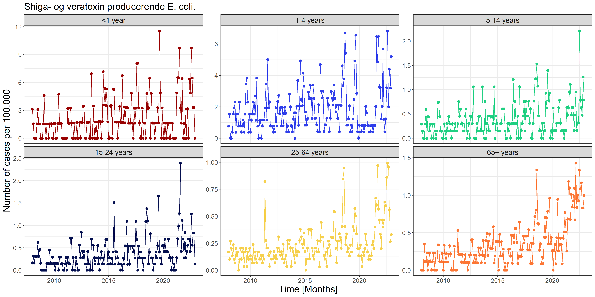

```{r setup, include=FALSE}
def.chunk.hook  <- knitr::knit_hooks$get("chunk")
knitr::knit_hooks$set(chunk = function(x, options) {
  x <- def.chunk.hook(x, options)
  paste0("\n \\", "tiny","\n\n", x, "\n\n \\normalsize")
})

library(dplyr)
library(kableExtra)
library(knitr)
library(psych)
library(readr)
library(TMB)

# Dynamically link the C++ template
dyn.load(dynlib(name = "../src/models/PoissonLognormal"))

# Load in the processed data
dat <- read_rds(file = "../data/processed/dat.rds")

# Only consider some of the data
y <- dat %>%
  filter(caseDef == "Shiga- og veratoxin producerende E. coli.") %>%
  group_by(Date, ageGroup) %>%
  summarize(y = sum(cases))

# Load the Poisson-lognormal model
PoisLN <- read_rds(file = "../src/models/PoissonLognormal.rds")
# ... and generate report
rep <- sdreport(PoisLN, getJointPrecision = TRUE)

# Extract agegroups
ageGroup <- levels(y$ageGroup)

names(rep$par.fixed) <- c(paste0("$\\lambda_{", ageGroup, "}$"), "$\\log(\\sigma_u)$")

res <- tibble(Parameter = names(rep$par.fixed),
              Estimate = rep$par.fixed,
              `Std. Error` = sqrt(diag(rep$cov.fixed)))

```

# Data exploration

## VTEC / STEC {.unlisted .unnumbered}

```{r VTECTable, echo=FALSE}

options(knitr.kable.NA = "...")
kable(headTail(y),
      digits = 2, 
      format = "latex",
      booktabs = TRUE, 
      linesep = "") %>%
  kable_styling(full_width = F, font_size = 12)

```


## VTEC / STEC

```{r VTECFigure, echo=FALSE, out.width="100%"}

```

# Hierachical Poisson Normal model

## Fomulation

\begin{subequations}
  \begin{alignat}{2}
    Y_{i}|u_{i} &\sim \mathrm{Pois} \big( \lambda_{i} \exp(u_{i}) \big) \label{eq:pois_ln0} \\ 
    u_{i} &\sim \mathrm{N}(0,\sigma^2) \label{eq:pois_ln1}
  \end{alignat}
\end{subequations}

## Implementation

### Implementation - Objective function in C++
```{Rcpp, eval=FALSE}
#include <TMB.hpp>				// Links in the TMB libraries

template<class Type>
Type objective_function<Type>::operator() ()
{
  DATA_VECTOR(y);				        // Data vector transmitted from R
  DATA_FACTOR(ageGroup);        // Data factor transmitted from R

  PARAMETER_VECTOR(u);			    // Random effects
   
  // Parameters
  PARAMETER_VECTOR(lambda); 	  // Parameter value transmitted from R
  PARAMETER(log_sigma_u);				// Parameter value transmitted from R
  
  Type sigma_u = exp(log_sigma_u);

  int nobs = y.size();
  Type mean_ran = Type(0);
  
  int j;

  Type f = 0;               // Declare the "objective function" (neg. log. likelihood)
  for(int i=0; i < nobs; i++){
    f -= dnorm(u[i],mean_ran,sigma_u,true);
    j = ageGroup[i];
    f -= dpois(y[i],lambda[j]*exp(u[i]),true);
  }
  
  return f;
}
```

### Implementation - Call from R

```{r, eval=FALSE}
# Import libraries
library(readr)
library(dplyr)
library(TMB)

# Import the data
dat <- read_rds(file = "../../data/processed/dat.rds")

# Only consider some of the data
y <- dat %>%
  filter(caseDef == "Shiga- og veratoxin producerende E. coli.") %>%
  group_by(Date, ageGroup) %>%
  summarize(y = sum(cases))

compile(file = "PoissonLognormal.cpp")  # Compile the C++ file
dyn.load(dynlib("PoissonLognormal"))    # Dynamically link the C++ code

# Function and derivative
PoisLN <- MakeADFun(
  data = list(y = y$y, ageGroup = y$ageGroup),
  parameters = list(u = rep(1, length(y$y)),
                    lambda = rep(1, nlevels(y$ageGroup)),
                    log_sigma_u = log(1)),
  random = "u",
  DLL = "PoissonLognormal"
)

opt <- nlminb(start = PoisLN$par, PoisLN$fn, PoisLN$gr, lower = c(0.01, 0.01))
```

### Results

```{r PoisLN, echo=FALSE, comment=""}
res <- tibble(Parameter = names(rep$par.fixed), Estimate = rep$par.fixed, `Std. Error` = sqrt(diag(rep$cov.fixed)))

kable(res,
      digits = 2, 
      format = "latex",
      booktabs = TRUE, 
      escape = FALSE,
      linesep = "") %>%
  kable_styling(full_width = F, font_size = 10)

```

### Results

```{r VTECxRandomEffects, echo=FALSE, out.width="100%"}
include_graphics("../figures/VTECxRandomEffects.png")
```

# Hierachical Poisson Gamma model

## Formulation

\begin{subequations}
  \begin{alignat}{2}
    Y_{i}|u_{i} &\sim \mathrm{Pois} (\lambda_{i} u_{i}) \label{eq:pois_g0} \\ 
    u_{i} &\sim \mathrm{G}(1,\phi) \label{eq:pois_g1}
  \end{alignat}
\end{subequations}

### Probability function for $Y$

\begin{equation}
  \begin{aligned}
    P[Y=y]&=g_{Y}(y;\lambda, \phi) \\
    &=1234
  \end{aligned}
\end{equation}

### Proof

The probability function for the conditional distribution of $Y$ for given $u$

\begin{equation} \label{eq:pdfPois}
  f_{Y|u}(y;\lambda, u)=\frac{(\lambda u)^y}{y!} \exp (-\lambda u)
\end{equation}

and the probability density function for the distribution of $u$ is

\begin{equation} \label{eq:pdfGamma}
  f_{u}(u;\phi)=\frac{1}{\phi} \exp (-u/\phi)
\end{equation}

### Proof

Given \eqref{eq:pdfPois} and \eqref{eq:pdfGamma}, the probability function for the marginal distribution of $Y$ is determined from

\begin{equation}
  \begin{aligned}
    g_{Y}(y;\lambda,\phi)&=\int_{u=0}^\infty f_{Y|u}(y;\lambda, u) f_{u}(u;\phi) du \\
    &=\int_{u=0}^\infty \frac{(\lambda u)^y}{y!} \exp (-\lambda u) \frac{1}{\phi} \exp (-u/\phi) du\\
    &=\frac{1}{y!\phi} \int_{u=0}^\infty (\lambda u)^y \exp (-u(\lambda+1/\phi)) du
  \end{aligned}
\end{equation}


