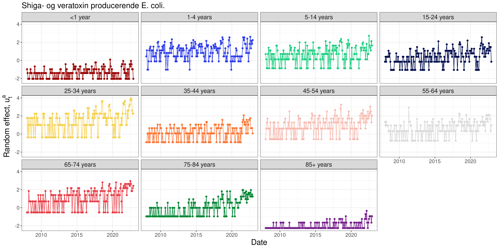

```{r setup, include=FALSE}
def.chunk.hook  <- knitr::knit_hooks$get("chunk")
knitr::knit_hooks$set(chunk = function(x, options) {
  x <- def.chunk.hook(x, options)
  paste0("\n \\", "tiny","\n\n", x, "\n\n \\normalsize")
})

library(dplyr)
library(kableExtra)
library(knitr)
library(psych)
library(readr)
library(TMB)

# Dynamically link the C++ template
dyn.load(dynlib(name = "../src/models/PoissonLognormal"))

# Load in the processed data
dat <- read_rds(file = "../data/processed/dat.rds")

# Only consider some of the data
y <- dat %>%
  filter(caseDef == "Shiga- og veratoxin producerende E. coli.") %>%
  group_by(Date, ageGroup) %>%
  reframe(y = sum(cases), n = sum(n))

# Load the Poisson-lognormal model
PoisLN <- read_rds(file = "../src/models/PoissonLognormal.rds")
# ... and generate report
rep <- sdreport(PoisLN, getJointPrecision = TRUE)

# Extract agegroups
ageGroup <- levels(y$ageGroup)

names(rep$par.fixed) <- c(paste0("$\\log(\\lambda_{", ageGroup, "})$"), "$\\log(\\sigma_u)$")

res <- tibble(Parameter = names(rep$par.fixed),
              Estimate = rep$par.fixed,
              `Std. Error` = sqrt(diag(rep$cov.fixed)))

```

# Data exploration

## VTEC / STEC {.unlisted .unnumbered}

```{r VTECTable, echo=FALSE}

options(knitr.kable.NA = "...")
kable(headTail(y),
      digits = 2, 
      format = "latex",
      booktabs = TRUE, 
      linesep = "") %>%
  kable_styling(full_width = F, font_size = 12)

```


## VTEC / STEC

```{r VTECFigure, echo=FALSE, out.width="100%"}
include_graphics("../figures/ShigaogveratoxinproducerendeEcolixAgeGroup.png")
```

# Hierachical Poisson-Normal model

## Fomulation

\begin{subequations}
  \begin{alignat}{2}
    Y_{t}^{a}|u_{t}^{a} &\sim \Pois \big( w_{t}^{a} \lambda_{a} \exp(u_{t}^{a}) \big) \label{eq:pois_ln0} \\ 
    u_{t}^{a} &\sim \N(0,\sigma^2) \label{eq:pois_ln1}
  \end{alignat}
\end{subequations}

## Implementation

### Implementation - Objective function in C++
```{Rcpp, eval=FALSE}
#include <TMB.hpp>				// Links in the TMB libraries
template<class Type>
Type objective_function<Type>::operator() ()
{
  DATA_VECTOR(y);				        // Data vector transmitted from R
  DATA_VECTOR(w)                // Data vector transmitted from R
  DATA_FACTOR(ageGroup);        // Data factor transmitted from R

  PARAMETER_VECTOR(u);			    // Random effects
   
  // Parameters
  PARAMETER_VECTOR(lambda); 	  // Parameter value transmitted from R
  PARAMETER(log_sigma_u);				// Parameter value transmitted from R
  
  Type sigma_u = exp(log_sigma_u);

  int nobs = y.size();
  Type mean_ran = Type(0);
  
  int j;

  Type f = 0;               // Declare the "objective function" (neg. log. likelihood)
  for(int i=0; i < nobs; i++){
    f -= dnorm(u[i],mean_ran,sigma_u,true);
    j = ageGroup[i];
    f -= dpois(y[i],exp(log(lambda[j])-log(w[j]))*exp(u[i]),true);
  }
  
  return f;
}
```

### Implementation - Call from R

```{r, eval=FALSE}
# Import libraries
library(readr)
library(dplyr)
library(TMB)

# Import the data
dat <- read_rds(file = "../../data/processed/dat.rds")

# Only consider some of the data
y <- dat %>%
  filter(caseDef == "Shiga- og veratoxin producerende E. coli.") %>%
  group_by(Date, ageGroup) %>%
  mutate(y = sum(cases)) %>%
  select(Date, ageGroup, y, n)

compile(file = "PoissonLognormal.cpp")  # Compile the C++ file
dyn.load(dynlib("PoissonLognormal"))    # Dynamically link the C++ code

# Function and derivative
PoisLN <- MakeADFun(
  data = list(y = y$y, ageGroup = y$ageGroup, w = y$n),
  parameters = list(u = rep(1, length(y$y)),
                    lambda = rep(1, nlevels(y$ageGroup)),
                    log_sigma_u = log(1)),
  random = "u",
  DLL = "PoissonLognormal"
)

opt <- nlminb(start = PoisLN$par, PoisLN$fn, PoisLN$gr, lower = c(0.01, 0.01))
```

### Results

```{r PoisLN, echo=FALSE, comment=""}
kable(res,
      digits = 2, 
      format = "latex",
      booktabs = TRUE, 
      escape = FALSE,
      linesep = "") %>%
  kable_styling(full_width = F, font_size = 10)
```

### Results

```{r VTECxRandomEffects, echo=FALSE, out.width="100%"}

```

# Hierachical Poisson-Gamma model

## Formulation

\begin{subequations} \label{eq:PoisGam}
  \begin{alignat}{2}
    Y_{i}|u_{i} &\sim \Pois (\lambda_{i} u_{i}) \label{eq:pois_g0} \\ 
    u_{i} &\sim \G(1/\beta,\beta) \label{eq:pois_g1}
  \end{alignat}
\end{subequations}

## Probability function for $Y$

\begin{equation} \label{eq:pdfMix}
  \begin{aligned}
    P[Y=y]&=g_{Y}(y;\lambda, \beta) \\
    &=\frac{\lambda^{y}}{y!\Gamma(1/\beta)\beta^{1/\beta}}\frac{\beta^{y+1/\beta}\Gamma(y+1/\beta)}{(\lambda \beta + 1)^{y+1/\beta}} \\
    &=\frac{\Gamma(y+1/\beta)}{\Gamma(1/\beta)y!}\frac{1}{(\lambda\beta+1)^{1/\beta}}\bigg(\frac{\lambda\beta}{\lambda\beta+1}\bigg)^{y} \\
    &=\begin{pmatrix} y+1/\beta-1 \\ y \end{pmatrix} \frac{1}{(\lambda\beta+1)^{1/\beta}}\bigg(\frac{\lambda\beta}{\lambda\beta+1}\bigg)^{y} \ , \ for \ y = 0, 1, 2, \dots
  \end{aligned}
\end{equation}

where we have used the convention

\begin{equation}
  \begin{pmatrix} z\\y \end{pmatrix} = \frac{\Gamma(z+1)}{\Gamma(z+1-y)y!}
\end{equation}

The marginal distribution of $Y$ is a negative binomial distribution, $Y\sim \NB\big(1/\beta,1/(\lambda \beta+1)\big)$

### Proof

The probability function for the conditional distribution of $Y$ for given $u$

\begin{equation} \label{eq:pdfPois}
  f_{Y|u}(y;\lambda, u)=\frac{(\lambda u)^y}{y!} \exp (-\lambda u)
\end{equation}

and the probability density function for the distribution of $u$ is

\begin{equation} \label{eq:pdfGamma}
  f_{u}(u;\beta)=\frac{1}{\beta \Gamma(1/\beta)} \bigg(\frac{u}{\beta}\bigg)^{1/\beta-1} \exp (-u/\beta)
\end{equation}

### Proof

Given \eqref{eq:pdfPois} and \eqref{eq:pdfGamma}, the probability function for the marginal distribution of $Y$ is determined from

\begin{equation} \label{eq:marMix}
  \begin{aligned}
    g_{Y}(y;\lambda,\beta)&=\int_{u=0}^\infty f_{Y|u}(y;\lambda, u) f_{u}(u;\beta) \,du \\
    &=\int_{u=0}^\infty \frac{(\lambda u)^y}{y!} \exp (-\lambda u) \frac{1}{\beta \Gamma(1/\beta)} \bigg(\frac{u}{\beta}\bigg)^{1/\beta-1} \exp (-u/\beta) \,du\\
    &=\frac{\lambda^{y}}{y!\Gamma(1/\beta)\beta^{1/\beta}} \int_{u=0}^\infty u^{y+1/\beta} \exp \big(-u(\lambda \beta+1)/\beta\big) \,du
  \end{aligned}
\end{equation}

### Proof

In \eqref{eq:marMix} it is noted that the integrand is the *kernel* in the probability density function for a Gamma distribution, $\G\big(y+1/\beta,\beta/(\lambda \beta+1)\big)$. As the integral of the density shall equal one, we find by adjusting the norming constant that

\begin{equation}
  \int_{u=0}^\infty u^{y+1/\beta} \exp \bigg(-u/\Big(\beta/(\lambda \beta+1)\Big)\bigg) \,du = \frac{\beta^{y+1/\beta}\Gamma(y+1/\beta)}{(\lambda \beta + 1)^{y+1/\beta}}
\end{equation}

and then \eqref{eq:pdfMix} follows

## Inference on individual group means

Consider the hierarchical Poisson-Gamma model in \eqref{eq:PoisGam}, and assume that a value $Y=y$ has been observed. Then the conditional distribution of $u$ for given $Y=y$ is a Gamma distribution,

\begin{equation}
  u|Y=y\sim \G\big(y+1/\beta,\beta/(\lambda \beta+1)\big)
\end{equation}

with mean

\begin{equation}
  \E[u|Y=y]=\frac{y\beta+1}{\lambda\beta+1}
\end{equation}

### Proof

The conditional distribution is found using Bayes Theorem

\begin{equation}
  \begin{aligned}
    g_{u}(u|Y=y)&=\frac{f_{y,u}(y,u)}{g_Y(y;\lambda, \phi)} \\
    &=\frac{f_{y|u}(y;u)g_{u}(u)}{g_{Y}(y;\lambda,\beta)} \\
    &=\frac{1}{g_{Y}(y;\lambda,\beta)}\bigg(\frac{(\lambda u)^y}{y!} \exp (-\lambda u) \frac{1}{\beta \Gamma(1/\beta)} \bigg(\frac{u}{\beta}\bigg)^{1/\beta-1} \exp (-u/\beta)\bigg) \\
    &\propto u^{y+1/\beta-1} \exp \big(- u(\lambda\beta+1)/\beta\big)
  \end{aligned}
\end{equation}

We identify the *kernel* of the probability density function

\begin{equation}
  u^{y} \exp \big(- u(\lambda+1)/\phi\big)
\end{equation}

as the kernel of a Gamma distribution, $\G(y+1/\beta,\beta/(\lambda\beta+1))$
