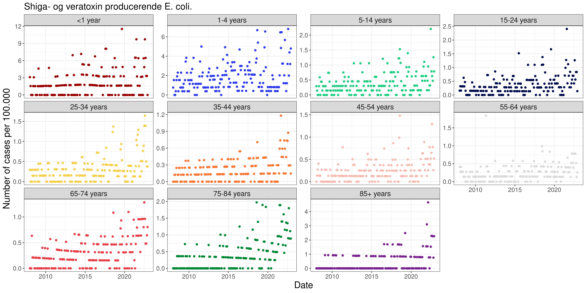

```{r setup, include=FALSE}
def.chunk.hook  <- knitr::knit_hooks$get("chunk")
knitr::knit_hooks$set(chunk = function(x, options) {
  x <- def.chunk.hook(x, options)
  paste0("\n \\", "tiny","\n\n", x, "\n\n \\normalsize")
})

library(readr)
library(dplyr)
library(tidyr)
library(surveillance)
library(psych)
library(kableExtra)
library(knitr)

# Load in the processed data
dat <- read_rds(file = "../data/processed/dat.rds")

# Only consider some of the data
y <- dat %>%
  filter(caseDef == "Shiga- og veratoxin producerende E. coli.") %>%
  group_by(Date, ageGroup) %>%
  reframe(y = sum(cases), n = sum(n))

```

# Data exploration

## VTEC / STEC {.unlisted .unnumbered}

```{r VTECTable, echo=FALSE}

options(knitr.kable.NA = "...")
kable(headTail(y),
      digits = 2, 
      format = "latex",
      booktabs = TRUE, 
      linesep = "") %>%
  kable_styling(full_width = F, font_size = 12)

```

## VTEC / STEC

```{r VTECFigure, echo=FALSE, out.width="100%"}

```


# Farrington

## Implementation

# Noufaily

## Implementation

# Results


