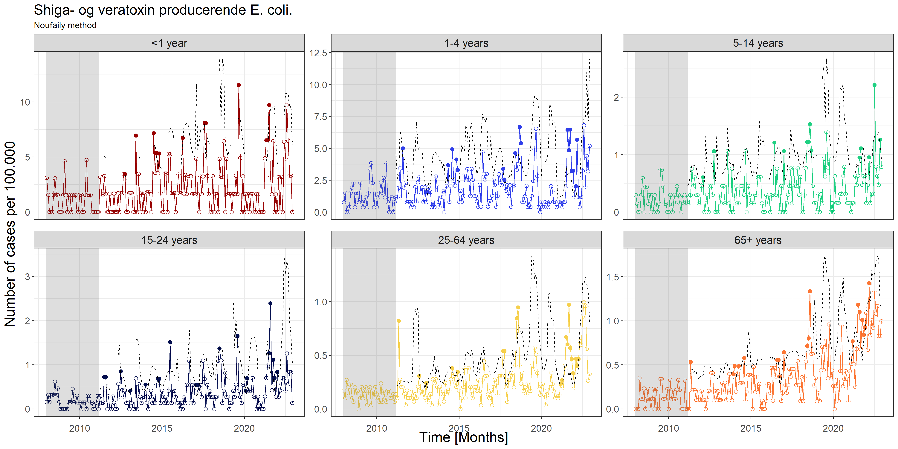

```{r setup, include=FALSE}
def.chunk.hook  <- knitr::knit_hooks$get("chunk")
knitr::knit_hooks$set(chunk = function(x, options) {
  x <- def.chunk.hook(x, options)
  paste0("\n \\", "tiny","\n\n", x, "\n\n \\normalsize")
})

library(dplyr)
library(kableExtra)
library(knitr)
library(psych)
library(readr)
library(TMB)

# Dynamically link the C++ template
dyn.load(dynlib(name = "../src/models/PoissonNormal"))

# Load in the processed data
# dat <- read_rds(file = "../data/processed/dat.rds") # 11-agegroups
dat <- read_rds(file = "../data/processed/dat2.rds") # 6-agegroups
# Only consider some of the data
y <- dat %>%
  filter(caseDef == "Shiga- og veratoxin producerende E. coli.") %>%
  group_by(Date, ageGroup) %>%
  reframe(y = sum(cases), n = sum(n))

# Load the Poisson-lognormal model
PoisLN <- read_rds(file = "../src/models/PoissonNormal.rds")
# ... and generate report
rep <- sdreport(PoisLN, getJointPrecision = TRUE)

# Extract agegroups
ageGroup <- levels(y$ageGroup)

# res <- tibble(ageGroup = ageGroup,
#        `$\\lambda$` = rep$par.fixed[1:11],
#        `$\\sigma$` = exp(rep$par.fixed[12:22]))


names(rep$par.fixed) <- c(paste0("$\\beta_{", ageGroup, "}$"), "$\\sigma$")

res <- tibble(Parameter = names(rep$par.fixed),
              Estimate = c(rep$par.fixed[1:nlevels(y$ageGroup)],
                           exp(rep$par.fixed[nlevels(y$ageGroup)+1])),
              `Std. Error` = sqrt(diag(rep$cov.fixed)))

# Load the Poisson-Gamma model
PoisG <- read_rds(file = "../src/models/PoissonGamma.rds")

```

# Shiga- and verotoxin producing E. coli.

## Data exploration

```{r VTECTable, echo=FALSE}

options(knitr.kable.NA = "...")


y.tbl <- headTail(y)
names(y.tbl) <- c("Date", "ageGroup", "$y_{it}$", "$x_{it}$") 

kable(y.tbl,
      digits = 2, 
      format = "latex",
      booktabs = TRUE, 
      linesep = "",
      escape = FALSE) %>%
  kable_styling(full_width = F, font_size = 12)

```

### Data exploration
```{r EpixSTEC, echo=FALSE, out.width="100%"}
include_graphics("../figures/EpixSTEC.png")
```

### Data exploration

```{r STECxEpixAgeGroup, echo=FALSE, out.width="100%"}
include_graphics("../figures/STECxEpixAgeGroup.png")
```

### Data exploration

```{r VTECFigure, echo=FALSE, out.width="100%"}
include_graphics("../figures/ShigaogveratoxinproducerendeEcolixAgeGroup.png")
```

# State-of-the-art methods

State-of-the-art methods for aberration detection is presented in \cite{Salmon_2016} and implemented in the R package **surveillance**. The R package includes methods such as the Farrington method introduced by \cite{Farrington_1996} together with the improvements proposed by \cite{Noufaily_2013}.

## Farrington

```{r STEC_Farrington, echo=FALSE, out.width="100%"}
include_graphics("../figures/STEC_farrington.png")
```

## Noufaily

```{r STEC_Noufaily, echo=FALSE, out.width="100%"}

```

# Novel methods based on general mixed effect models

In the following two novel methods, based on theory presented in \cite{Madsen_2010}, for aberration detection is presented. Namely, a hierachical Poisson-Normal model and a hierachical Poisson-Gamma model.

### Hierachical models

It is useful to formulate the model as a hierarchical model containing a \textit{first stage model}

\begin{equation}
  f_{Y|u}(\boldsymbol{y};\boldsymbol{u},\boldsymbol{\beta})
\end{equation}

which is a model for the data given the random effects, and a \textit{second stage model}

\begin{equation}
  f_U(\boldsymbol{u}, \boldsymbol{\Psi})
\end{equation}

which is a model for the random effects. The total set of parameters is $\boldsymbol{\theta}=(\boldsymbol{\beta}, \boldsymbol{\Psi})$.

### Objective

\begin{itemize}
  \item The objective is to assess the unobserved random effects, $\boldsymbol{u}$, and determine the critical value, $C_\alpha$, with significance level $\alpha$.
  \item If $u_{it}>C_\alpha$, the observation is characterized as an outbreak.
\end{itemize}
\
\
\textbf{NOTE:} For this presentation a default of $\alpha=0.05$ is used.

## Hierachical Poisson-Normal model

The model can be formulated as a two-level hierarchical model

\begin{subequations}
  \begin{alignat}{2}
    \boldsymbol{Y|u} &\sim \Pois (\boldsymbol{\lambda} e^{\boldsymbol{u}}) \label{eq:pois_ln0} \\
    \boldsymbol{u} &\sim \N (\boldsymbol{0}, \sigma^2) \label{eq:pois_ln1}
  \end{alignat}
\end{subequations}

### Hierachical Poisson-Normal model

\begin{itemize}
  \item $\boldsymbol{Y|u}$ are assumed to be a Poisson distribution with intensities $\boldsymbol{\lambda}$.
  \item An offset is included to account for the population size, $x_{it}$.
  \item Hence, the model for the fixed effect is
\end{itemize}

\begin{equation}
  \log(\lambda_{i})=\boldsymbol{X}_i^T\boldsymbol{\beta}+\log(x_{it})
\end{equation}

\begin{itemize}
  \item Here $\boldsymbol{X}_i$ is a $p$-dimensional vector of covariates, and $\boldsymbol{\beta}$ contains the corresponding fixed effect parameters.
  \item The random effects $\boldsymbol{u}$ are assumed to be Gaussian.
\end{itemize}

\begin{equation}
  u_{it} = \epsilon_{it}
\end{equation}

\begin{itemize}
  \item Here $\epsilon_{it}\sim\N(\boldsymbol{0},\sigma^2)$ is a white noise process, and $\sigma$ is a model parameter.
  \item The model parameters are estimated in a rolling window of length \textit{k}.
\end{itemize}


### Results

```{r thetaSTECPoisNExclude, echo=FALSE, out.width="100%"}

```

### Results

```{r phiSTECPoisNExclude, echo=FALSE, out.width="100%"}
include_graphics("../figures/phiSTECPoisNExclude.png")
```

### Threshold calculation

The critical value, $C_\alpha$, is computed from the $1-\alpha$-quantile of the Normal distribution with the maximum-likelihood estimate for the variance, $\hat\sigma$.

\begin{equation}
  C_\alpha=\N(\boldsymbol{0},\hat\sigma^2)_{1-\alpha}
\end{equation}

### Results - Out-of-sample random effects

```{r windowedSTEDPoisNExclude, echo=FALSE, out.width="100%"}
include_graphics("../figures/windowedSTEDPoisNExclude.png")
```

## Hierachical Poisson-Gamma model

\begin{itemize}
  \item $\boldsymbol{Y|u}$ are assumed to follow a Poisson distribution. 
  \item The intensities, $\lambda_{i}$, are defined as
\end{itemize}

\begin{equation}
  \log(\lambda_{i})=\boldsymbol{X}_{i}^{T}\boldsymbol{\beta}+\log(x_{it})
\end{equation}

\begin{itemize}
  \item Here $\boldsymbol{X}_{i}$ is a $p$-dimensional vector of covariates, and $\boldsymbol{\beta}$ contains the corresponding fixed effect parameter.
  \item The random effects $\boldsymbol{u}$ are assumed to follow a reparametrized Gamma distribution with mean $\boldsymbol{1}$.
  \item The model parameters are estimated in a rolling window of length \textit{k}.
\end{itemize}

### Hierachical Poisson-Gamma model

Subsequently, the model can be formulated as a two-level hierarchical model

\begin{subequations} \label{eq:PoisGam}
  \begin{alignat}{2}
    \boldsymbol{Y|u} &\sim \Pois (\boldsymbol{\lambda} \boldsymbol{u}) \label{eq:pois_g0} \\ 
    \boldsymbol{u} &\sim \G(\boldsymbol{1}/\phi,\phi) \label{eq:pois_g1}
  \end{alignat}
\end{subequations}

### Probability function for $Y$

\begin{equation} \label{eq:pdfMix}
  \begin{aligned}
    P[Y=y_i]&=g_{Y}(y;\lambda, \phi) \\
    &=\frac{\lambda^{y}}{y!\Gamma(1/\phi)\phi^{1/\phi}}\frac{\phi^{y+1/\phi}\Gamma(y+1/\phi)}{(\lambda \phi + 1)^{y+1/\phi}} \\
    &=\frac{\Gamma(y+1/\phi)}{\Gamma(1/\phi)y!}\frac{1}{(\lambda\phi+1)^{1/\phi}}\bigg(\frac{\lambda\phi}{\lambda\phi+1}\bigg)^{y} \\
    &=\begin{pmatrix} y+1/\phi-1 \\ y \end{pmatrix} \frac{1}{(\lambda\phi+1)^{1/\phi}}\bigg(\frac{\lambda\phi}{\lambda\phi+1}\bigg)^{y} \ , \ for \ y = 0, 1, 2, \dots
  \end{aligned}
\end{equation}

where we have used the convention

\begin{equation}
  \begin{pmatrix} z\\y \end{pmatrix} = \frac{\Gamma(z+1)}{\Gamma(z+1-y)y!}
\end{equation}

The marginal distribution of $Y$ is a negative binomial distribution, $Y\sim \NB\big(1/\phi,1/(\lambda \phi+1)\big)$

### Inference on individual group means

Consider the hierarchical Poisson-Gamma model in \eqref{eq:PoisGam}, and assume that a value $Y=y$ has been observed. Then the conditional distribution of $u$ for given $Y=y$ is a Gamma distribution,

\begin{equation}
  u|Y=y\sim \G\big(y+1/\phi,\phi/(\lambda \phi+1)\big)
\end{equation}

with mean

\begin{equation}
  \E[u|Y=y]=\frac{y\phi+1}{\lambda\phi+1}
\end{equation}

and variance

\begin{equation}
  \V[u|Y=y]=\frac{(y \phi^2+\phi)}{(\lambda \phi + 1)^2}
\end{equation}

### Results

```{r thetaSTECPoisGExclude, echo=FALSE, out.width="100%"}

```

### Results

```{r phiSTECPoisGExclude, echo=FALSE, out.width="100%"}

```


### Threshold calculation

The critical value, $C_\alpha$, is computed from the $1-\alpha$-quantile of the reparametrized Gamma distribution with the maximum-likelihood estimate for the variance, $\hat\phi$.

\begin{equation}
  C_\alpha=\G(\boldsymbol{1}/\hat\phi,\hat\phi)_{1-\alpha}
\end{equation}


### Results - Out-of-sample random effects

```{r windowedSTECPoisGExclude, echo=FALSE, out.width="100%"}
include_graphics("../figures/windowedSTECPoisGExclude.png")
```

# Comparison of methods

```{r compareMethods, echo=FALSE, out.width="100%"}

```

# References

\printbibliography[heading=none]

# Appendix

### Proof - Probability function for *Y*

The probability function for the conditional distribution of $Y$ for given $u$

\begin{equation} \label{eq:pdfPois}
  f_{Y|u}(y;\lambda, u)=\frac{(\lambda u)^y}{y!} \exp (-\lambda u)
\end{equation}

and the probability density function for the distribution of $u$ is

\begin{equation} \label{eq:pdfGamma}
  f_{u}(u;\phi)=\frac{1}{\phi \Gamma(1/\phi)} \bigg(\frac{u}{\phi}\bigg)^{1/\phi-1} \exp (-u/\phi)
\end{equation}

### Proof - Probability function for *Y*

Given \eqref{eq:pdfPois} and \eqref{eq:pdfGamma}, the probability function for the marginal distribution of $Y$ is determined from

\begin{equation} \label{eq:marMix}
  \begin{aligned}
    g_{Y}(y;\lambda,\phi)&=\int_{u=0}^\infty f_{Y|u}(y;\lambda, u) f_{u}(u;\phi) \,du \\
    &=\int_{u=0}^\infty \frac{(\lambda u)^y}{y!} \exp (-\lambda u) \frac{1}{\phi \Gamma(1/\phi)} \bigg(\frac{u}{\phi}\bigg)^{1/\phi-1} \exp (-u/\phi) \,du\\
    &=\frac{\lambda^{y}}{y!\Gamma(1/\phi)\phi^{1/\phi}} \int_{u=0}^\infty u^{y+1/\phi-1} \exp \big(-u(\lambda \phi+1)/\phi\big) \,du
  \end{aligned}
\end{equation}

### Proof - Probability function for *Y*

In \eqref{eq:marMix} it is noted that the integrand is the *kernel* in the probability density function for a Gamma distribution, $\G\big(y+1/\phi,\phi/(\lambda \phi+1)\big)$. As the integral of the density shall equal one, we find by adjusting the norming constant that

\begin{equation}
  \int_{u=0}^\infty u^{y+1/\phi-1} \exp \bigg(-u/\Big(\phi/(\lambda \phi+1)\Big)\bigg) \,du = \frac{\phi^{y+1/\phi}\Gamma(y+1/\phi)}{(\lambda \phi + 1)^{y+1/\phi}}
\end{equation}

and then \eqref{eq:pdfMix} follows

### Proof - Conditional distribution of *Y*

The conditional distribution is found using Bayes Theorem

\begin{equation}
  \begin{aligned}
    g_{u}(u|Y=y)&=\frac{f_{y,u}(y,u)}{g_Y(y;\lambda, \phi)} \\
    &=\frac{f_{y|u}(y;u)g_{u}(u)}{g_{Y}(y;\lambda,\phi)} \\
    &=\frac{1}{g_{Y}(y;\lambda,\phi)}\bigg(\frac{(\lambda u)^y}{y!} \exp (-\lambda u) \frac{1}{\phi \Gamma(1/\phi)} \bigg(\frac{u}{\phi}\bigg)^{1/\phi-1} \exp (-u/\phi)\bigg) \\
    &\propto u^{y+1/\phi-1} \exp \big(- u(\lambda\phi+1)/\phi\big)
  \end{aligned}
\end{equation}

We identify the *kernel* of the probability density function

\begin{equation}
  u^{y+1/\phi-1} \exp (- u(\lambda\phi+1)/\phi)
\end{equation}

as the kernel of a Gamma distribution, $\G(y+1/\phi,\phi/(\lambda\phi+1))$