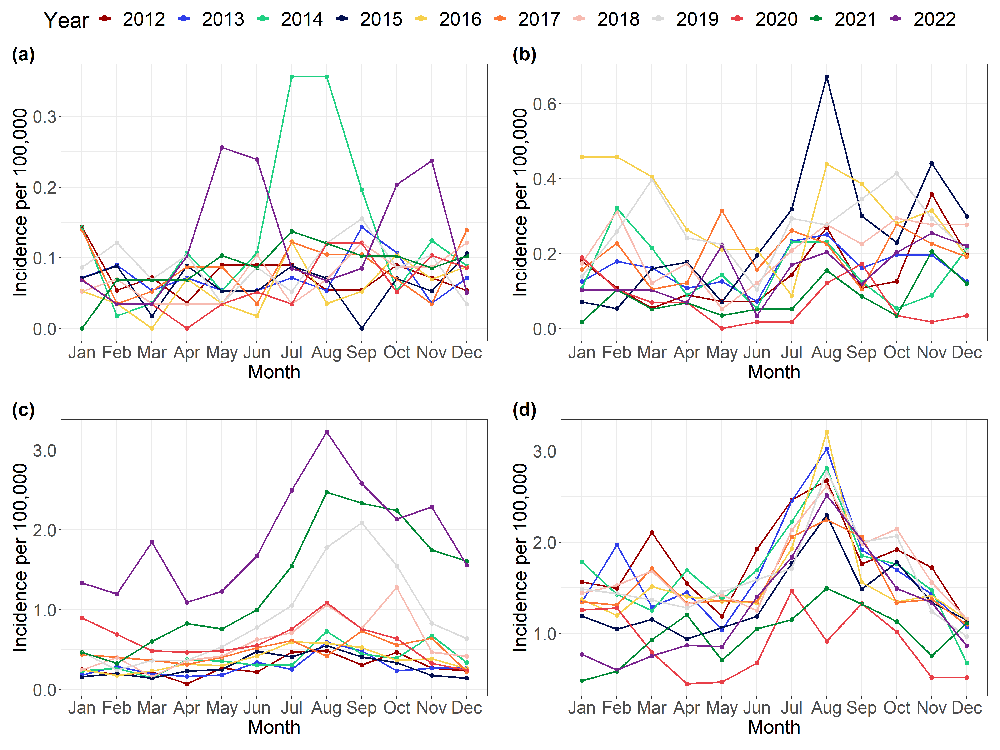
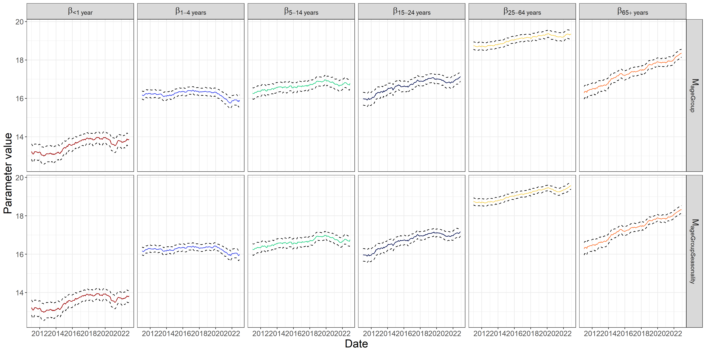
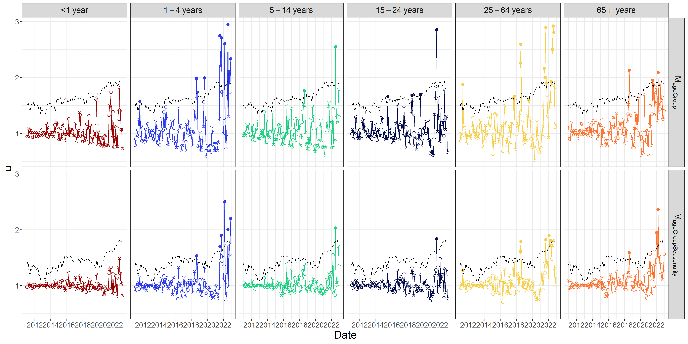

```{r setup, include=FALSE}
def.chunk.hook  <- knitr::knit_hooks$get("chunk")
knitr::knit_hooks$set(chunk = function(x, options) {
  x <- def.chunk.hook(x, options)
  paste0("\n \\", "tiny","\n\n", x, "\n\n \\normalsize")
})

```


# Data

```{r EpiPlot, echo=FALSE, out.width="80%", fig.cap="Epidemic curve showing the incidence per 100,000 in Denmark, 2012-2022, for the subset of diseases considered in this master thesis. (a) Listeriosis, (b) Shigellosis, (c) STEC, and (d) Salmonellosis.", fig.pos = "H", fig.show = "hold"}

```

## Focusing on STEC

```{r STECLongPlot, echo=FALSE, out.width="100%"}
knitr::include_graphics("../figures/STEC_long_plot.png")
```

# Model formulas

\begin{equation}
  \log(\lambda_{it})=\boldsymbol{x}_{it}^T\boldsymbol{\beta}+\log(n_{it}), \quad i=1,\dots,k, \quad t=1,\dots,T
\end{equation}

## Agegroup 

\begin{equation}
  \log(\lambda_{it}) = \beta(ageGroup_{i}) + \log(n_{it})
\end{equation}

## Agegroup and seasonality

\begin{equation}
  \log(\lambda_{it}) = \beta(ageGroup_{i}) \beta_i + \sin\Big(\frac{\pi\cdot monthInYear_t}{6}\Big) \beta_{\sin} + \cos\Big(\frac{\pi \cdot monthInYear_t}{6}\Big) \beta_{\cos} + \log(n_{it})
\end{equation}

# Hierarchical Poisson Normal model

\begin{subequations} \label{eq:PoisN}
  \begin{alignat}{2}
    \boldsymbol{Y|u} &\sim \Pois \big( \boldsymbol{\lambda} \exp(\boldsymbol{u}) \big) \label{eq:pois_n0} \\ 
    \boldsymbol{u} &\sim \N(\boldsymbol{0},I\sigma^2) \label{eq:pois_n1}
  \end{alignat}
\end{subequations}

## Implementation 

```{Rcpp, eval=FALSE}
#include <TMB.hpp>				// Links in the TMB libraries

template<class Type>
Type objective_function<Type>::operator() ()
{
  DATA_VECTOR(y);				                // Data vector transmitted from R
  DATA_VECTOR(x);                       // Data vector transmitted from R
  DATA_MATRIX(X);                       // Design matrix transmitted from R
  
  PARAMETER_VECTOR(u);			            // Random effects
  
  // Parameters
  PARAMETER_VECTOR(beta);         // Parameter value transmitted from R
  PARAMETER(log_sigma_u);				// Parameter value transmitted from R
  
  vector<Type> lambda  = exp(X*beta-log(x)+u);
  Type sigma_u = exp(log_sigma_u);
  
  int nobs = y.size();
  Type mean_ran = Type(0);
  
  Type f = 0;                           // Declare the "objective function"
  for(int t=0; t < nobs; t++){
    f -= dnorm(u[t],mean_ran,sigma_u,true);
    f -= dpois(y[t],lambda[t],true);
  }
  
  return f;
}

```

## Results


### Model performance

```{r AICxSTEC_PoisN, echo=FALSE, out.width="100%"}

```

### Agegroup parameters

```{r ageGroupParxSTEC_PoisN, echo=FALSE, out.width="100%"}

```

### Seasonality parameters

```{r SeasonalityParxSTEC_PoisN, echo=FALSE, out.width="100%"}

```

### Variance parameter

```{r log_sigmaxSTEC_PoisN, echo=FALSE, out.width="100%"}

```

### Outbreak detection

```{r OutbreakDetectionxSTEC_PoisN, echo=FALSE, out.width="100%"}

```


# Hierarchical Poisson Gamma model

\begin{subequations} \label{eq:PoisGam}
  \begin{alignat}{2}
    \boldsymbol{Y|u} &\sim \Pois (\boldsymbol{\lambda u}) \label{eq:pois_g0} \\ 
    \boldsymbol{u} &\sim \G(\boldsymbol 1/\phi,\phi) \label{eq:pois_g1}
  \end{alignat}
\end{subequations}

## Implementation 

```{Rcpp, eval=FALSE}
#include <TMB.hpp>				// Links in the TMB libraries

template<class Type>
Type objective_function<Type>::operator() ()
{
  DATA_VECTOR(y);				                // Data vector transmitted from R
  DATA_VECTOR(x);                       // Data vector transmitted from R
  DATA_MATRIX(X);                       // Design matrix transmitted from R
  
  // Parameters
  PARAMETER_VECTOR(beta);         // Parameter value transmitted from R
  PARAMETER(log_phi_u);				// Parameter value transmitted from R
  
  vector<Type> lambda  = exp(X*beta-log(x)); // Construct the model parameters
  Type phi_u = exp(log_phi_u); // ... and the model parameters
  
  Type r = 1/phi_u; // Construct the size
  vector<Type> p = 1/(lambda*phi_u+1); // ... and the probability parameter
  
  Type f = -sum(dnbinom(y, r, p,true)); // Calculate the "objective function"
  
  return f;
}

```

## Results


### Model performance

```{r AICxSTEC_PoisG, echo=FALSE, out.width="100%"}

```

### Agegroup parameters

```{r ageGroupParxSTEC_PoisG, echo=FALSE, out.width="100%"}
knitr::include_graphics("../figures/ageGroupParxSTEC_PoisG.png")
```

### Seasonality parameters

```{r SeasonalityParxSTEC_PoisG, echo=FALSE, out.width="100%"}

```

### Variance parameter

```{r log_phixSTEC_PoisG, echo=FALSE, out.width="100%"}

```

### Outbreak detection

```{r OutbreakDetectionxSTEC_PoisG, echo=FALSE, out.width="100%"}

```


