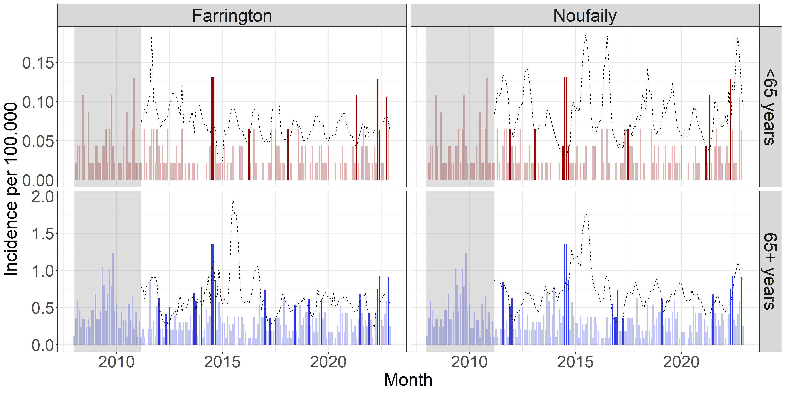
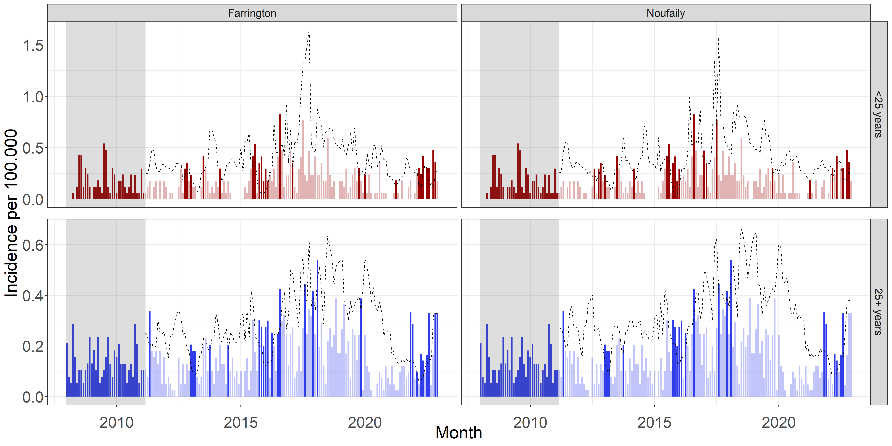
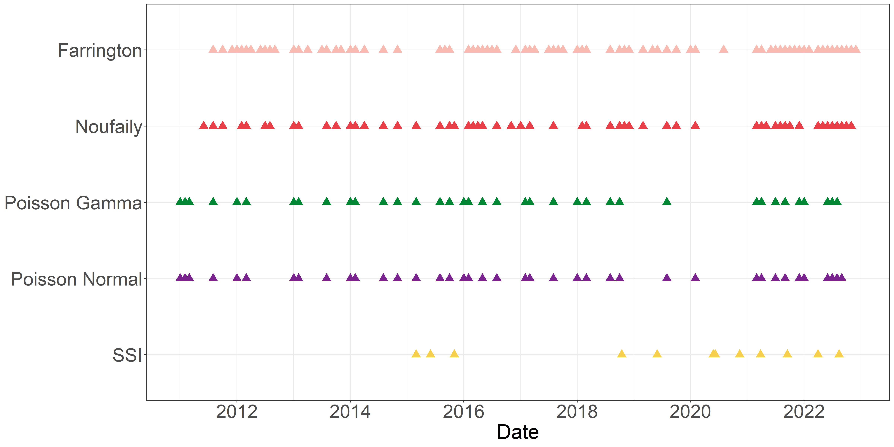

```{r setup, include=FALSE}
def.chunk.hook  <- knitr::knit_hooks$get("chunk")
knitr::knit_hooks$set(chunk = function(x, options) {
  x <- def.chunk.hook(x, options)
  paste0("\n \\", "tiny","\n\n", x, "\n\n \\normalsize")
})

```

# Data

```{r EpiPlot, echo=FALSE, out.width="70%", fig.cap="Epidemic curve showing the incidence per 100,000 in Denmark, 2012-2022, for the subset of diseases considered in this master thesis. \\textbf{(a)} Listeriosis, \\textbf{(b)} Shigellosis, \\textbf{(c)} STEC, and \\textbf{(d)} Salmonellosis.", fig.pos = "H", fig.show = "hold"}
knitr::include_graphics("../figures/EpiPlot.png")
```

# Novel Algorithm for Prospective Disease Outbreak Detection

## Procedure

### Step 1: Modeling Framework

\begin{itemize}
  \item Assume a hierarchical Poisson Normal or Poisson Gamma model to reference data using a log link.
  \item Assume count is proportional to population size $n$
  \item Incorporate covariates by supplying a model formula on the form.
  \begin{equation}
    \log(\lambda_{it})=\boldsymbol x_{it}\boldsymbol \beta+\log(n_{it}), \quad i=1,\dots,m, \quad t=1,\dots,T
  \end{equation}
  \item Account for structural changes in the time series using a rolling window of width $k$.
\end{itemize}

### Step 2: Inference of Random Effects

\begin{itemize}
  \item Infer one-step ahead random effects $u_{i{t_0}}$ for each group using the fitted model.
  \item Define outbreak detection threshold $U_{t_0}$ as a quantile of the second stage model's random effects distribution
  \item Use either a Gaussian or Gamma distribution with respective plug-in estimates
\end{itemize}

### Step 3: Outbreak Detection and Parameter Estimation

\begin{itemize}
  \item Compare inferred random effects $u_{i{t_0}}$ to an upper bound $U_{t_0}$
  \item Raise and alarm if the inferred random effect exceeds the upper bound, i.e. $u_{i{t_0}}>U_{t_0}$
  \item Omit outbreak related observations from future parameter estimation, reducing the rolling window's sample size until the observation is discarded.
\end{itemize}

## Hierarchical Poisson Normal model

\begin{subequations} \label{eq:PoisN}
  \begin{alignat}{2}
    \boldsymbol{Y|u} &\sim \Pois \big( \boldsymbol{\lambda} \exp(\boldsymbol{u}) \big) \label{eq:pois_n0} \\ 
    \boldsymbol{u} &\sim \N(\boldsymbol{0},I\sigma^2) \label{eq:pois_n1}
  \end{alignat}
\end{subequations}

## Hierarchical Poisson Gamma model

\begin{subequations} \label{eq:PoisGam}
  \begin{alignat}{2}
    \boldsymbol{Y|u} &\sim \Pois (\boldsymbol{\lambda u}) \label{eq:pois_g0} \\ 
    \boldsymbol{u} &\sim \G(\boldsymbol 1/\phi,\phi) \label{eq:pois_g1}
  \end{alignat}
\end{subequations}

# Proposed Models for the Novel Algorithm

## Constant model

\begin{equation}\label{eq:Agegroup}
  \log(\lambda_{it}) = \beta(ageGroup_{i}) + \log(n_{it})
\end{equation}

\begin{itemize}
  \item $\lambda_{it}$ is the outbreak intensity at time $t$ for age group $i$.
  \item $\beta(ageGroup_{i})$ is the fixed effect specific to age group $i$.
  \item $\log(n_{it})$ acts as an offset, accounting for the population size at time $t$ for age group $i$.
\end{itemize}

## Trend model

\begin{equation}
  \log(\lambda_{it})=\beta(ageGroup_{i}) + \beta_{trend} t + \log(n_{it})
\end{equation}

\begin{itemize}
  \item In addition to Model 1, includes a trend component.
  \item $\beta_{trend}$ quantifies the rate of change in the outbreak intensity over time.
\end{itemize}

## Seasonality model

\begin{equation}
\log(\lambda_{it})=\beta(ageGroup_{i})+ \sin \big(\frac{2\pi\cdot \tau_t}{12}\big) \beta_{\sin} + \cos \big(2\frac{\pi\cdot \tau_t}{12}\big) \beta_{\cos} + \log(n_{it})
\end{equation}

\begin{itemize}
  \item In addition to Model 1, incorporates an annual seasonality pattern.
  \item $\tau_t$ represents the time period $t$ within a year (1-12).
  \item $\beta_{\sin}$ and $\beta_{\cos}$ capture the effect of the seasonal pattern.
\end{itemize}

## Combined trend and seasonality model

\begin{equation}\label{eq:AgegroupTrendSeasonality}
  \log(\lambda_{it})=\beta(ageGroup_{i}) + \beta_{trend} t + \sin \big(\frac{2\pi\cdot \tau_t}{12}\big) \beta_{\sin} + \cos \big(\frac{2\pi\cdot \tau_t}{12}\big)\beta_{\cos} + \log(n_{it})
\end{equation}

\begin{itemize}
  \item Builds upon previous models, combining trend and seasonality components.
  \item Includes both $\beta_{trend}$ and $\beta_{\sin}$/$\beta_{\cos}$ parameters.
\end{itemize}

# State-of-the-art Algorithm for Prospective Disease Outbreak Detection

State-of-the-art methods for aberration detection is presented in \cite{Salmon_2016} and implemented in the R package **surveillance**. The R package includes methods such as the Farrington method introduced by \cite{Farrington_1996} together with the improvements proposed by \cite{Noufaily_2013}.


# Case studies

## *Listeriosis*

```{r CompareStateOfTheArtLIST, echo=FALSE, out.width="70%", fig.cap="One-step ahead random effects $u_{t_1}$ (circles) given the model described in \\eqref{eq:Agegroup} for \\textit{Listeriosis} in Denmark, 2011-2022. Poisson Normal model (right) and Poisson Gamma model (left) monitor the disease. Alarm raised (solid circle) if $u_{t_1}$ exceeds the threshold $U_{t_0}$ (dashed line).", fig.pos = "H", fig.show = "hold"}

```

### *Listeriosis*

```{r CompareNovelLIST, echo=FALSE, out.width="70%", fig.cap="One-step ahead random effects $u_{t_1}$ of \\textit{Listeriosis} in Denmark, 2011-2022, as circles. Poisson Normal model (top) and Poisson Gamma model (bottom) monitor the disease. Alarm raised (solid circle) if $u_{t_1}$ exceeds the threshold $U_{t_0}$ (dashed line).", fig.pos = "H", fig.show = "hold"}
knitr::include_graphics("../figures/Compare_novel_LIST.png")
```

### *Listeriosis*

```{r CompareAlarmsLIST, echo=FALSE, out.width="70%", fig.cap="Alarm plot displaying alarms for \\textit{Listeriosis} time series using four different algorithms, along with outbreaks investigated by SSI.", fig.pos = "H", fig.show = "hold"}
knitr::include_graphics("../figures/Compare_alarms_LIST.png")
```

## *Shigellosis*

```{r CompareStateOfTheArtSHIG, echo=FALSE, out.width="70%", fig.cap="Monthly \\textit{Shigellosis} incidence per 100.000 in Denmark, 2008-2022. Monitored by (left) Farrington and (right) Noufaily method. Reference data for the estimation of model parameters from January 2008 to March 2011 (grey area). Threshold (dashed line) is computed for observations timepoints outside reference data. Alarm triggered (full opacity) if observations exceeds threshold. ", fig.pos = "H", fig.show = "hold"}

```

### *Shigellosis*

```{r CompareNovelSHIG, echo=FALSE, out.width="70%", fig.cap="One-step ahead random effects $u_{t_1}$ of \\textit{Shigellosis} in Denmark, 2011-2022, as circles. Poisson Normal model (top) and Poisson Gamma model (bottom) monitor the disease. Alarm raised (solid circle) if $u_{t_1}$ exceeds the threshold $U_{t_0}$ (dashed line).", fig.pos = "H", fig.show = "hold"}

```

### *Shigellosis*

```{r CompareAlarmsSHIG, echo=FALSE, out.width="70%", fig.cap="Alarm plot displaying alarms for \\textit{Shigellosis} time series using four different algorithms, along with outbreaks investigated by SSI.", fig.pos = "H", fig.show = "hold"}

```

## Shiga toxin (verotoxin)-producing *Escherichia coli*

```{r CompareStateOfTheArtSTEC, echo=FALSE, out.width="70%", fig.cap="Monthly Shiga toxin (verotoxin)-producing \\textit{Escherichia coli} incidence per 100.000 in Denmark, 2008-2022. Monitored by (left) Farrington and (right) Noufaily method. Reference data for the estimation of model parameters from January 2008 to March 2011 (grey area). Threshold (dashed line) is computed for observations timepoints outside reference data. Alarm triggered (dark color) if observations exceeds threshold. ", fig.pos = "H", fig.show = "hold"}
knitr::include_graphics("../figures/Compare_stateOfTheArt_STEC.png")
```

### Shiga toxin (verotoxin)-producing *Escherichia coli*

```{r CompareNovelSTEC, echo=FALSE, out.width="70%", fig.cap="One-step ahead random effects $u_{t_1}$ (circles) given the model described in \\eqref{eq:AgegroupTrendSeasonality} for Shiga toxin (verotoxin)-producing \\textit{Escherichia coli} in Denmark, 2011-2022. Poisson Normal model (right) and Poisson Gamma model (left) monitor the disease. Alarm raised (solid circle) if $u_{t_1}$ exceeds the threshold $U_{t_0}$ (dashed line).", fig.pos = "H", fig.show = "hold"}
knitr::include_graphics("../figures/Compare_novel_STEC.png")
```

### Shiga toxin (verotoxin)-producing *Escherichia coli*

```{r CompareAlarmsSTEC, echo=FALSE, out.width="70%", fig.cap="Alarm plot displaying alarms for \\textit{Shigellosis} time series using four different algorithms, along with outbreaks investigated by SSI.", fig.pos = "H", fig.show = "hold"}
knitr::include_graphics("../figures/Compare_alarms_STEC.png")
```

## *Salmonellosis*

```{r CompareStateOfTheArtSALM, echo=FALSE, out.width="70%", fig.cap="Monthly \\textit{Salmonellosis} incidence per 100.000 in Denmark, 2008-2022. Monitored by (left) Farrington and (right) Noufaily method. Reference data for the estimation of model parameters from January 2008 to March 2011 (grey area). Threshold (dashed line) is computed for observations timepoints outside reference data. Alarm triggered (full opacity) if observations exceeds threshold. ", fig.pos = "H", fig.show = "hold"}
knitr::include_graphics("../figures/Compare_stateOfTheArt_SALM.png")
```

### *Salmonellosis*


```{r ref:CompareNovelSALM, echo=FALSE, out.width="70%", fig.cap="One-step ahead random effects $u_{t_1}$ of \\textit{Salmonellosis} in Denmark, 2011-2022, as circles. Poisson Normal model (top) and Poisson Gamma model (bottom) monitor the disease. Alarm raised (solid circle) if $u_{t_1}$ exceeds the threshold $U_{t_0}$ (dashed line).", fig.pos = "H", fig.show = "hold"}
knitr::include_graphics("../figures/Compare_novel_SALM.png")
```

### *Salmonellosis*

```{r CompareAlarmsSALM, echo=FALSE, out.width="70%", fig.cap="Alarm plot displaying alarms for \\textit{Salmonellosis} time series using four different algorithms, along with outbreaks investigated by SSI.", fig.pos = "H", fig.show = "hold"}

```

# References

\printbibliography[heading=none]


