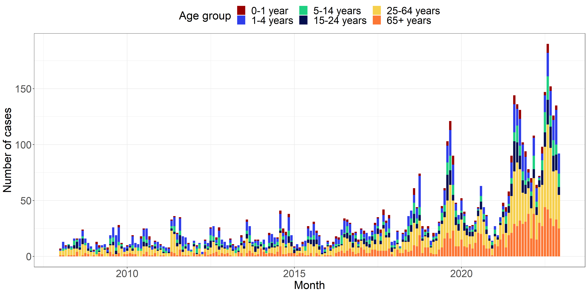

```{r setup, include=FALSE}
def.chunk.hook  <- knitr::knit_hooks$get("chunk")
knitr::knit_hooks$set(chunk = function(x, options) {
  x <- def.chunk.hook(x, options)
  paste0("\n \\", "tiny","\n\n", x, "\n\n \\normalsize")
})

```

# Introduction

## Motivation

\begin{columns}
\begin{column}{.58\textwidth}
\begin{itemize}
  \item Establishment of the Danish Microbiology Database (MiBa) by Statens Serum Institut (SSI) in 2010
  \item Great opportunity for data analysis
  \item No fully automated procedures in place at SSI
\end{itemize}
\end{column}
\hfill
\begin{column}{.38\textwidth}
```{r MiBa, echo=FALSE, out.width="75%", fig.pos = "H", fig.show = "hold", fig.keep='all', fig.ncol = 2}
knitr::include_graphics("../figures/MiBaPetriComp.png")
knitr::include_graphics("../figures/MiBa.png")
```
\end{column}
\end{columns}

## Research goals

\begin{itemize}
  \item<1> Review of existing literature on statistical methods for detecting disease outbreaks
  \item<1>  Identification and implementation of state-of-the-art methods for detection of disease outbreaks
  \item<1-2> Formulation of \textbf<2>{hierarchical} models for the individually notifiable diseases
  \item<1-2> Development of an \textbf<2>{automated method}, based on the hierarchical models, for automated and early detection of disease outbreaks
  \item<1-2> Comparison of the developed method and state-of-the-art methods in \textbf<2>{one} or more case study
  \item<1-2> Comparison of the developed method and state-of-the-art methods in a \textbf<2>{simulation study}
\end{itemize}

# Algorithms for prospective disease outbreak detection

## State-of-the-art algorithms

State-of-the-art algorithms for aberration detection is presented in \cite{Salmon_2016} and implemented in the R package **surveillance**. The R package includes the method introduced by \cite{Farrington_1996} together with the subsequently improved method proposed by \cite{Noufaily_2013}.

## Novel algorithm

The novel algorithm utilizes a generalized mixed effects model or a hierarchical mixed effects model as a modeling framework to model the count case observations $\boldsymbol y$ and assess the unobserved random effects $\boldsymbol u$. These random effects are used directly to characterize an outbreak.

### Step 1: Modeling framework

\begin{itemize}
  \item Assume a hierarchical Poisson Normal or Poisson Gamma model to reference data using a log link
  \item Incorporate covariates by supplying a model formula on the form
  \begin{equation}
    \log(\lambda_{it})=\boldsymbol x_{it}\boldsymbol \beta+\log(n_{it}), \quad i=1,\dots,m, \quad t=1,\dots,T
  \end{equation}
  \item Account for structural changes in the time series using a rolling window of width $k$
\end{itemize}

### Step 2: Inference of random effects

\begin{itemize}
  \item Infer one-step ahead random effects $u_{i{t_0}}$ for each group using the fitted model
  \item Define outbreak detection threshold $U_{t_0}$ as a quantile of the second stage model's random effects distribution
  \item Use either a Gaussian or Gamma distribution with respective plug-in estimates
\end{itemize}

### Step 3: Parameter estimations and outbreak detection

\begin{itemize}
  \item Compare inferred random effects $u_{i{t_0}}$ to an threshold $U_{t_0}$
  \item Raise and alarm if the inferred random effect exceeds the threshold, i.e. $u_{i{t_0}}>U_{t_0}$
  \item Omit outbreak related observations from future parameter estimation
\end{itemize}

## Formulation of hierarchical models

\begin{align*}
  \mathbf{Pois}&\mathbf{son} \ \mathbf{Normal} & \mathbf{Pois}&\mathbf{son} \ \mathbf{Gamma} \\
  \boldsymbol{Y|u} &\sim \Pois \big( \boldsymbol{\lambda} \exp(\boldsymbol{u}) \big) & \boldsymbol{Y|u} &\sim \Pois (\boldsymbol{\lambda u}) \\
  \boldsymbol{u} &\sim \N(\boldsymbol{0},I\sigma^2) & \boldsymbol{u} &\sim \G(\boldsymbol 1/\phi,\phi)
\end{align*}

# Case study

## Shiga toxin (verotoxin)-producing *Escherichia coli* (STEC)

```{r STEC, echo=FALSE, out.width="75%", fig.cap="A stacked bar graph illustrating the number of monthly STEC cases observed in the period from 2008 to 2022 for the six age groups.",fig.pos = "H", fig.show = "hold"}

```

## Constant model

\begin{equation}\label{eq:Agegroup}
  \log(\lambda_{it}) = \beta(ageGroup_{i}) + \log(n_{it})
\end{equation}

\begin{itemize}
  \item $\lambda_{it}$ is the outbreak intensity at time $t$ for age group $i$.
  \item $\beta(ageGroup_{i})$ is the fixed effect specific to age group $i$.
  \item $\log(n_{it})$ acts as an offset, accounting for the population size at time $t$ for age group $i$.
\end{itemize}

## Trend model

\begin{equation}
  \log(\lambda_{it})=\beta(ageGroup_{i}) + \beta_{trend} t + \log(n_{it})
\end{equation}

\begin{itemize}
  \item In addition to constant model, includes a trend component.
  \item $\beta_{trend}$ quantifies the rate of change in the outbreak intensity over time.
\end{itemize}

## Seasonality model

\begin{equation}
\log(\lambda_{it})=\beta(ageGroup_{i})+ \sin \bigg(\frac{2\pi\cdot \tau_t}{12}\bigg) \beta_{\sin} + \cos \bigg(2\frac{\pi\cdot \tau_t}{12}\bigg) \beta_{\cos} + \log(n_{it})
\end{equation}

\begin{itemize}
  \item In addition to constant model, incorporates an annual seasonality pattern.
  \item $\tau_t$ represents the time period $t$ within a year (1-12).
  \item $\beta_{\sin}$ and $\beta_{\cos}$ capture the effect of the seasonal pattern.
\end{itemize}

## Combined trend and seasonality model

\begin{equation}\label{eq:AgegroupTrendSeasonality}
  \log(\lambda_{it})=\beta(ageGroup_{i}) + \beta_{trend} t + \sin \bigg(\frac{2\pi\cdot \tau_t}{12}\bigg) \beta_{\sin} + \cos \bigg(\frac{2\pi\cdot \tau_t}{12}\bigg)\beta_{\cos} + \log(n_{it})
\end{equation}

\begin{itemize}
  \item Builds upon previous models, combining trend and seasonality components.
  \item Includes both $\beta_{trend}$, $\beta_{\sin}$, and $\beta_{\cos}$ parameters.
\end{itemize}

## Estimated one-step ahead random effects

\begin{columns}
\begin{column}{.53\textwidth}
\begin{itemize}
  \item<1> The upper bound $U_{t_0}$ is calculated based on the $90\%$ quantile of the distribution of the random effects
  \item<1> If the one-step ahead random effects $u_{it_1}$ exceeds the upper bound $U_{t_0}$ an alarm is raised
  \item<1> In the hierarchical Poisson Normal model (left), the random effects are exponentiated to transform them into the same domain as the hierarchical Poisson Gamma model (right)
\end{itemize}
\vspace{.3cm}
\begin{itemize}
  \item<2> 30 alarms are generated using the hierarchical Poisson Normal framework, while 31 alarms are generated using the hierarchical Poisson Gamma framework.
  \item<2> A great number of alarms are generated in the period from March 2021 to March 2022
\end{itemize}
\end{column}
\hfill
\begin{column}{.43\textwidth}
```{r CompareNovelSTEC, echo=FALSE, out.width="100%", fig.pos = "H", fig.show = "hold"}
knitr::include_graphics("../figures/Compare_novel_STEC.png")
```
\end{column}
\end{columns}


# References

\printbibliography[heading=none]


