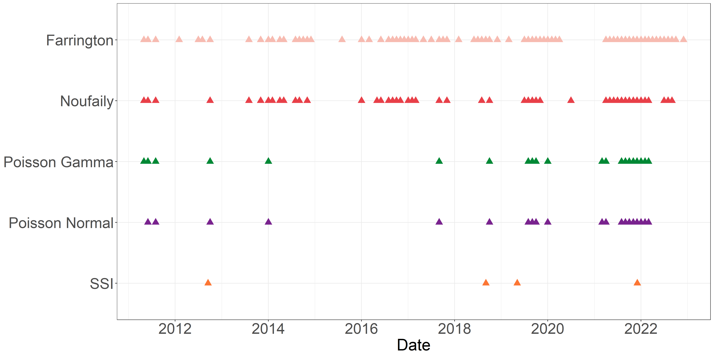
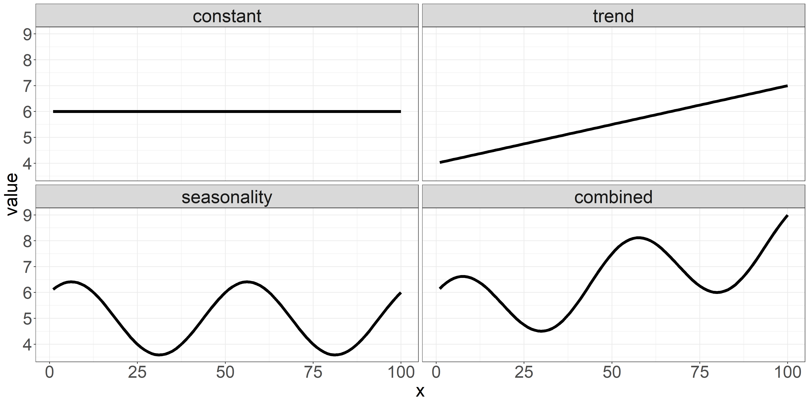
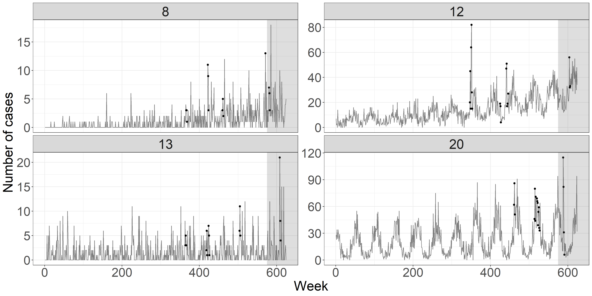
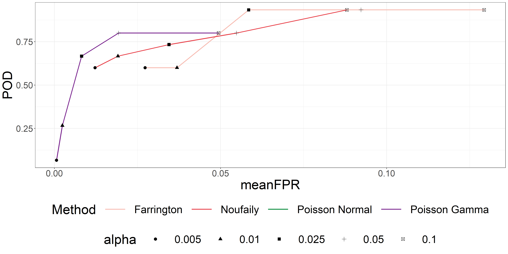
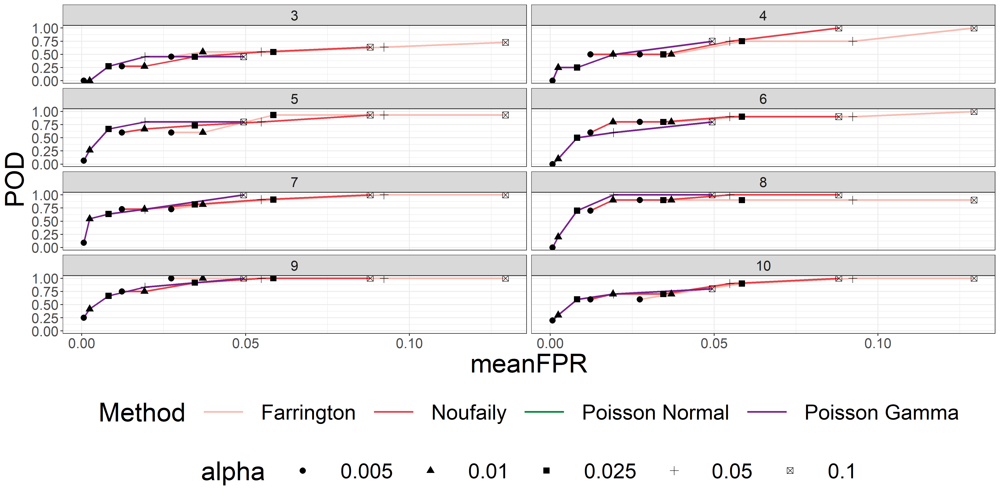

```{r setup, include=FALSE}
def.chunk.hook  <- knitr::knit_hooks$get("chunk")
knitr::knit_hooks$set(chunk = function(x, options) {
  x <- def.chunk.hook(x, options)
  paste0("\n \\", "tiny","\n\n", x, "\n\n \\normalsize")
})


```

# Introduction

## About me

\begin{columns}
\begin{column}{.48\textwidth}
\begin{itemize}
  \item MSc Eng., Quantitative Biology and Disease Modelling @ DTU
  \item Wife and three kids @ Vedbæk
  \item Passionate about e-Sports, particularly Counter Strike
\end{itemize}
\end{column}
\hfill
\begin{column}{.48\textwidth}
```{r family, echo=FALSE, out.width="75%", fig.pos = "H", fig.show = "hold"}

```
\end{column}
\end{columns}

## Motivation

\begin{columns}
\begin{column}{.58\textwidth}
\begin{itemize}
  \item Establishment of MiBa by SSI in 2010
  \item Great opportunity for data analysis
  \item No fully automated procedures in place at SSI
\end{itemize}
\end{column}
\hfill
\begin{column}{.38\textwidth}
```{r MiBa, echo=FALSE, out.width="75%", fig.pos = "H", fig.show = "hold", fig.keep='all', fig.ncol = 2}
knitr::include_graphics("../figures/MiBaPetriComp.png")

```
\end{column}
\end{columns}

# Algorithms for prospective disease outbreak detection

## State-of-the-art algorithms

State-of-the-art algorithms for aberration detection is presented in \cite{Salmon_2016} and implemented in the R package **surveillance**. The R package includes the method introduced by \cite{Farrington_1996} together with the subsequently improved method proposed by \cite{Noufaily_2013}.

## Novel algorithm

The novel algorithm utilizes a generalized mixed effects model or a hierarchical mixed effects model as a modeling framework to model the count case observations $\boldsymbol y$ and assess the unobserved random effects $\boldsymbol u$. These random effects are used directly to characterize an outbreak.

### Formulation of hierarchical models
\only<1>{
\begin{align*}
  \mathbf{Pois}&\mathbf{son} \ \mathbf{Normal} & \mathbf{Pois}&\mathbf{son} \ \mathbf{Gamma} \\
  \boldsymbol{Y|u} &\sim \Pois \big( \boldsymbol{\lambda} \exp(\boldsymbol{u}) \big) & \boldsymbol{Y|u} &\sim \Pois (\boldsymbol{\lambda u}) \\
  \boldsymbol{u} &\sim \N(\boldsymbol{0},I\sigma^2) & \boldsymbol{u} &\sim \G(\boldsymbol 1/\phi,\phi)
\end{align*}
}
\only<2>{
\begin{align*}
  \mathbf{Pois}&\mathbf{son} \ \mathbf{Normal} & \mathbf{Pois}&\mathbf{son} \ \mathbf{Gamma} \\
  \boldsymbol{Y|u} &\sim \Pois \big( \boldsymbol{\lambda} \exp(\boldsymbol{u}) \big) & \boldsymbol{Y|u} &\sim \Pois (\boldsymbol{\lambda u}) \\
  \boldsymbol{u} &\sim \N(\boldsymbol{0},I\sigma^2) & \boldsymbol{u} &\sim \G(\boldsymbol 1/\phi,\phi) \\
  & & & \\
  & & Y&\sim\NB\big(1/\phi,1/(\lambda\phi+1)\big)
\end{align*}
}

### Step 1: Modeling framework

\begin{itemize}
  \item Assume a hierarchical Poisson Normal or Poisson Gamma model to reference data using a log link
  \item Incorporate covariates by supplying a model formula on the form
  \begin{equation}
    \log(\lambda_{it})=\boldsymbol x_{it}\boldsymbol \beta+\log(n_{it}), \quad i=1,\dots,m, \quad t=1,\dots,T
  \end{equation}
  \item Account for structural changes in the time series using a rolling window of width $k$
\end{itemize}

### Step 2: Inference of random effects

\begin{itemize}
  \item Infer one-step ahead random effects $\hat u_{i{t_1}}$ for each group using the fitted model
  \item Define outbreak detection threshold $U_{t_0}$ as a quantile of the second stage model's random effects distribution
  \item Use either a Gaussian or Gamma distribution with respective plug-in estimates
\end{itemize}

### Step 3: Parameter estimations and outbreak detection

\begin{itemize}
  \item Compare inferred random effects $\hat u_{i{t_1}}$ to a threshold $U_{t_0}$
  \item Raise and alarm if the inferred random effect exceeds the threshold, i.e. $\hat u_{i{t_1}}>U_{t_0}$
  \item Omit outbreak related observations from future parameter estimation
\end{itemize}

# Case study

## Shiga toxin (verotoxin)-producing *Escherichia coli* (STEC)

```{r STEC, echo=FALSE, out.width="75%", fig.cap="A stacked bar graph illustrating the number of monthly STEC cases observed in the period from 2008 to 2022 for the six age groups.",fig.pos = "H", fig.show = "hold"}
knitr::include_graphics("../figures/STEC_long_plot.png")
```

## Constant model

\begin{equation}\label{eq:Agegroup}
  \log(\lambda_{it}) = \beta(ageGroup_{i}) + \log(n_{it})
\end{equation}

\begin{itemize}
  \item $\lambda_{it}$ is the outbreak intensity at time $t$ for age group $i$
  \item $\beta(ageGroup_{i})$ is the fixed effect specific to age group $i$
  \item $\log(n_{it})$ acts as an offset, accounting for the population size at time $t$ for age group $i$
\end{itemize}

## Trend model

\begin{equation}
  \log(\lambda_{it})=\beta(ageGroup_{i}) + \beta_{trend} t + \log(n_{it})
\end{equation}

\begin{itemize}
  \item In addition to constant model, includes a trend component
  \item $\beta_{trend}$ quantifies the rate of change in the outbreak intensity over time
\end{itemize}

## Seasonality model

\begin{equation}
\log(\lambda_{it})=\beta(ageGroup_{i})+ \sin \bigg(\frac{2\pi\cdot \tau_t}{12}\bigg) \beta_{\sin} + \cos \bigg(2\frac{\pi\cdot \tau_t}{12}\bigg) \beta_{\cos} + \log(n_{it})
\end{equation}

\begin{itemize}
  \item In addition to constant model, incorporates an annual seasonality pattern
  \item $\tau_t$ represents the time period $t$ within a year (1-12)
  \item $\beta_{\sin}$ and $\beta_{\cos}$ capture the effect of the seasonal pattern
\end{itemize}

## Combined trend and seasonality model

\begin{equation}\label{eq:AgegroupTrendSeasonality}
  \log(\lambda_{it})=\beta(ageGroup_{i}) + \beta_{trend} t + \sin \bigg(\frac{2\pi\cdot \tau_t}{12}\bigg) \beta_{\sin} + \cos \bigg(\frac{2\pi\cdot \tau_t}{12}\bigg)\beta_{\cos} + \log(n_{it})
\end{equation}

\begin{itemize}
  \item Builds upon previous models, combining trend and seasonality components
  \item Includes both $\beta_{trend}$, $\beta_{\sin}$, and $\beta_{\cos}$ parameters
\end{itemize}

## Estimated one-step ahead random effects

\begin{columns}
\begin{column}{.50\textwidth}
\begin{itemize}
  \item<1> A rolling window of width $k=36$ months is employed
  \item<1> The combined model minimizes the logarithmic score  
  \item<1> Upper bound $U_{t_0}$ is based on the $90\%$ quantile of the random effects distribution
  \item<1> If the one-step ahead random effects $u_{it_1}$ exceeds $U_{t_0}$ an alarm is raised
\end{itemize}
\vspace{.1cm}
\begin{itemize}
  \item<2> 30 alarms are generated using the Poisson Normal framework, while 31 alarms are generated using the Poisson Gamma framework.
  \item<2> A great number of alarms are generated in the period from March 2021 to March 2022
\end{itemize}
\end{column}
\hfill
\begin{column}{.46\textwidth}
```{r CompareNovelSTEC, echo=FALSE, out.width="100%", fig.pos = "H", fig.show = "hold"}
knitr::include_graphics("../figures/Compare_novel_STEC.png")
```
\end{column}
\end{columns}

## Performance of statistical outbreak detection algorithms

```{r CompareAlarmsSTEC, echo=FALSE, out.width="100%", fig.pos = "H", fig.show = "hold"}

```

# Simulation study

## Baseline data

Simulated baseline data is generated according to a Negative Binomial distribution with mean $\mu$ and a variance parameter $\phi\mu$. The equation for the mean $\mu(t)$ is given as:

\begin{equation}
\mu(t)=\exp\Biggl(\theta+\beta_{trend} t+\sum_{j=1}^m \biggl(\gamma_1 \cos\Bigl(\frac{2\pi jt}{52}\Bigl) + \gamma_2 \sin \Bigl(\frac{2\pi jt}{52} \Bigl)\biggl)\Biggl)
\end{equation}


## Scenarios

```{r scenariosTbl, echo=FALSE, message=FALSE, warning=FALSE}
library(readr)
library(dplyr)
library(kableExtra)
library(psych)
options(knitr.kable.NA = "...")
scenarios <- read_rds(file = "../src/simulation/scenarios.Rds")
scenarios %>%
  mutate(Scenario = row_number()) %>%
  select(Scenario, theta, phi, beta, gamma1, gamma2, m, trend) %>%
  headTail(top = 8, bottom = 4, digits = 6) %>%
  rename(`$\\theta$` = theta, `$\\beta$` = beta, `$m$` = m, `$\\phi$` = phi, `$\\gamma_1$` = gamma1, `$\\gamma_2$` = gamma2, Trend = trend) %>%
  mutate_all(.funs = as.numeric) %>%
  kbl(format = "latex", booktabs = TRUE, escape = FALSE, align = "l",
      linesep = c(rep("", 3), "\\addlinespace",rep("", 3), rep("\\addlinespace",2),rep("", 3), "\\addlinespace")) %>%
  kable_paper(latex_options = c("HOLD_position"), font_size = 10)

```

## Scenarios illustration

```{r scenariosPlot, echo=FALSE, out.width="100%", fig.pos = "H", fig.show = "hold"}

```

## Outbreaks

\begin{columns}
\begin{column}{.50\textwidth}
\begin{itemize}
  \item Four outbreaks during baseline weeks (313-575), one outbreak during current weeks (576-624)
  \item Random constant value $k$ is chosen
  \item Outbreak size $v$ is generated from a Poisson distribution with mean equal to $k$ times the standard deviation from the baseline data
  \item The $v$ outbreak cases are distributed randomly in time according to a discretized log-normal distribution represented as $Z \sim \lfloor \LN(0,0.5^2)\rfloor$
\end{itemize}
\end{column}
\hfill
\begin{column}{.46\textwidth}
```{r Realizations, echo=FALSE, out.width="100%", fig.cap="Plots of one randomly chosen realization for scenario 8, 12, 13, and 20.", fig.pos = "H", fig.show = "hold"}

```
\end{column}
\end{columns}
## False Positive Rates

```{r FPR, echo=FALSE, out.width="100%", fig.pos = "H", fig.show = "hold"}
knitr::include_graphics("../figures/FPRPlot.png")
```

## Probability an outbreak is detected

```{r PropDetect, echo=FALSE, out.width="100%", fig.pos = "H", fig.show = "hold"}
knitr::include_graphics("../figures/PropDetect.png")
```

## Profile of POD vs FPR

```{r profilePODxFPR, echo=FALSE, out.width="100%", fig.pos = "H", fig.show = "hold"}

```

## Profile of POD vs FPR for different outbreak sizes

```{r profilePODxFPRFacet, echo=FALSE, out.width="100%", fig.pos = "H", fig.show = "hold"}

```

# Summary

\begin{itemize}
  \item Easy incorporation of \textbf{covariates}
  \item Estimates are \textbf{consistent} across the two modeling frameworks
  \item Positively \textbf{identified outbreaks} coinciding with well-documented outbreaks
  \item Effectively \textbf{control the number of "false alarms"}
  \item Great potential in utilizing \textbf{MiBa-based surveillance}
\end{itemize}

# References

\printbibliography[heading=none]

# Hierarchical Poisson Gamma model

## Probability function for $Y$

\begin{equation} \label{eq:pdfMix}
  \begin{aligned}
    P[Y=y]&=g_{Y}(y;\boldsymbol \beta, \phi) \\
    &=\frac{\lambda^{y}}{y!\Gamma(1/\phi)\phi^{1/\phi}}\frac{\phi^{y+1/\phi}\Gamma(y+1/\phi)}{(\lambda \phi + 1)^{y+1/\phi}} \\
    &=\frac{\Gamma(y+1/\phi)}{\Gamma(1/\phi)y!}\frac{1}{(\lambda\phi+1)^{1/\phi}}\bigg(\frac{\lambda\phi}{\lambda\phi+1}\bigg)^{y} \\
    &=\begin{pmatrix} y+1/\phi-1 \\ y \end{pmatrix} \frac{1}{(\lambda\phi+1)^{1/\phi}}\bigg(\frac{\lambda\phi}{\lambda\phi+1}\bigg)^{y} \ , \quad \mathrm{for} \ y = 0, 1, 2, \dots
  \end{aligned}
\end{equation}

where the following convention is used

\begin{equation}
  \begin{pmatrix} z\\y \end{pmatrix} = \frac{\Gamma(z+1)}{\Gamma(z+1-y)y!}
\end{equation}

The marginal distribution of $Y$ is a negative binomial distribution, $Y\sim \NB\big(1/\phi,1/(\lambda \phi+1)\big)$

## Proof

The probability function for the conditional distribution of $Y$ for given $u$

\begin{equation}\label{eq:pdfPois}
  f_{Y|u}(y;u,\boldsymbol{\beta})=\frac{(\lambda u)^{y}}{y!}\exp(-\lambda u)
\end{equation}

and the probability density function for the distribution of $u$ is

\begin{equation} \label{eq:pdfGamma}
  f_{u}(u;\phi)=\frac{1}{\phi \Gamma(1/\phi)} \bigg(\frac{u}{\phi}\bigg)^{1/\phi-1} \exp (-u/\phi)
\end{equation}

### Proof

Given \eqref{eq:pdfPois} and \eqref{eq:pdfGamma}, the probability function for the marginal distribution of $Y$ is determined from

\begin{equation} \label{eq:marMix}
  \begin{aligned}
    g_{Y}(y;\beta,\phi)&=\int_{u=0}^\infty f_{Y|u}(y;u,\beta) f_{u}(u;\phi) \,du \\
    &=\int_{u=0}^\infty \frac{(\lambda u)^y}{y!} \exp (-\lambda u) \frac{1}{\phi \Gamma(1/\phi)} \bigg(\frac{u}{\phi}\bigg)^{1/\phi-1} \exp (-u /\phi) \,du\\
    &=\frac{\lambda^{y}}{y!\Gamma(1/\phi)\phi^{1/\phi}} \int_{u=0}^\infty u^{y+1/\phi-1} \exp \big(-u(\lambda \phi+1)/\phi\big) \,du
  \end{aligned}
\end{equation}

### Proof

In \eqref{eq:marMix} it is noted that the integrand is the *kernel* in the probability density function for a Gamma distribution, $\G\big(y+1/\phi,\phi/(\lambda \phi+1)\big)$. As the integral of the density shall equal one, we find by adjusting the norming constant that

\begin{equation}
  \int_{u=0}^\infty  u^{ y+ 1/\phi-1} \exp \Big(- u/\big(\phi/( \lambda \phi+1)\big)\Big) \,du = \frac{\phi^{ y+ 1/\phi}\Gamma( y+\boldsymbol 1/\phi)}{( \lambda \phi + 1)^{y+1/\phi}}
\end{equation}

and then \eqref{eq:pdfMix} follows


