```{r setup, include=FALSE}
options(digits = 4)

# Install the packages needed by this book
lapply(c("ggplot2", "readr", "dplyr", "tidyr", "forcats", "tibble","kableExtra", "psych", "knitr"), function(pkg) {
  if(system.file(package = pkg) == "") install.packages(pkg)
})

# Import libraries
library(knitr)
library(readr)
library(dplyr)
library(tidyr)
library(tibble)
library(forcats)
library(kableExtra)
library(psych)
library(ggplot2)

Sys.setlocale("LC_ALL","English")

row_group_label_fonts <- list(
list(bold = TRUE, italic = TRUE),
list(bold = FALSE, italic = FALSE)
)

```


```{r dataLoadResults, echo=FALSE, warning=FALSE}

scenarios <- read_rds(file = "../src/simulation/scenarios.Rds")

Compare_novel_dat <- read_rds(file = "../src/cases/Compare_novel_dat.rds")
LIST_novel_tbl <- read_rds(file = "../src/cases/LIST_novel_tbl.rds")
STEC_novel_tbl <- read_rds(file = "../src/cases/STEC_novel_tbl.rds")
SHIL_novel_tbl <- read_rds(file = "../src/cases/SHIL_novel_tbl.rds")
SALM_novel_tbl <- read_rds(file = "../src/cases/SALM_novel_tbl.rds")

Compare_stateOfTheArt_LIST_dat <- read_rds(file = "../src/cases/Compare_stateOfTheArt_LIST_dat.rds")
Compare_stateOfTheArt_SHIL_dat <- read_rds(file = "../src/cases/Compare_stateOfTheArt_SHIL_dat.rds")
Compare_stateOfTheArt_STEC_dat <- read_rds(file = "../src/cases/Compare_stateOfTheArt_STEC_dat.rds")
Compare_stateOfTheArt_SALM_dat <- read_rds(file = "../src/cases/Compare_stateOfTheArt_SALM_dat.rds")

LIST_LogS <- LIST_novel_tbl %>%
  group_by(method) %>%
  distinct(avgLogS)

STEC_LogS <- STEC_novel_tbl %>%
  group_by(method) %>%
  distinct(avgLogS)

SHIL_LogS <- SHIL_novel_tbl %>%
  group_by(method) %>%
  distinct(avgLogS)

SALM_LogS <- SALM_novel_tbl %>%
  group_by(method) %>%
  distinct(avgLogS)

LIST_alarms_StateOfTheArt <- Compare_stateOfTheArt_LIST_dat %>% filter(Date %in% dateOfAlarm)
SHIL_alarms_StateOfTheArt <- Compare_stateOfTheArt_SHIL_dat %>% filter(Date %in% dateOfAlarm)
STEC_alarms_StateOfTheArt <- Compare_stateOfTheArt_STEC_dat %>% filter(Date %in% dateOfAlarm)
SALM_alarms_StateOfTheArt <- Compare_stateOfTheArt_SALM_dat %>% filter(Date %in% dateOfAlarm)


LIST_alarms_Farrington <- LIST_alarms_StateOfTheArt %>% filter(method == "Farrington") 
STEC_alarms_Farrington <- STEC_alarms_StateOfTheArt %>% filter(method == "Farrington") 
SHIL_alarms_Farrington <- SHIL_alarms_StateOfTheArt %>% filter(method == "Farrington") 
SALM_alarms_Farrington <- SALM_alarms_StateOfTheArt %>% filter(method == "Farrington") 

LIST_alarms_Noufaily <- LIST_alarms_StateOfTheArt %>% filter(method == "Noufaily") 
STEC_alarms_Noufaily <- STEC_alarms_StateOfTheArt %>% filter(method == "Noufaily") 
SHIL_alarms_Noufaily <- SHIL_alarms_StateOfTheArt %>% filter(method == "Noufaily") 
SALM_alarms_Noufaily <- SALM_alarms_StateOfTheArt %>% filter(method == "Noufaily") 

LIST_alarms <- Compare_novel_dat %>% filter(alarm) %>% summarize(alarms=unique(Date))


# View(LIST_alarms_StateOfTheArt %>% filter(alarm) %>% select(-n, -dateOfAlarm))
# View(SHIL_alarms_StateOfTheArt %>% filter(alarm) %>% select(-n, -dateOfAlarm))
# View(STEC_alarms_StateOfTheArt %>% filter(alarm) %>% select(-n, -dateOfAlarm))
# View(SALM_alarms_StateOfTheArt %>% filter(alarm) %>% select(-n, -dateOfAlarm))

```

<!--chapter:end:index.Rmd-->

\chapter{Introduction} 


This master's thesis will primarily focus on diseases where timely detection of outbreaks results in interventions that are feasible to impose. However, the detection algorithms discussed in this master's thesis are not restricted to these diseases and can be used to detect aberrant counts in any type of disease.

Today, outbreaks of foodborne illnesses can be detected in several ways:

\begin{enumerate}
  \item Reports from doctors: Physicians may report cases of foodborne illnesses they encounter in their practice to the relevant authorities.
  \item Citizen reports: Individuals may directly contact food or health authorities to report suspected cases of foodborne illnesses.
  \item Cluster identification through laboratory surveillance: Clusters of cases can be identified through routine laboratory testing and surveillance of samples from patients with suspected foodborne illnesses.
  \item Identification of identical "fingerprints": When bacteria or viruses are type-tested, the presence of identical fingerprints among multi cases can strongly indicate a common source of infection.
\end{enumerate}

These various methods help in the early detection and investigation of foodborne disease outbreaks, enabling timely intervention and prevention measures. However, ...


While generalized linear mixed effects models and hierarchical models have earned a reputation within ..., they are fairly unproven in the field of automatic detection of disease outbreaks.


The novel outbreak detection algorithms discussed in this master's thesis are open-source and can be found at \href{https://github.com/telkamp7/AEDDO}{https://github.com/telkamp7/AEDDO}

\cleardoublepage


<!--chapter:end:Chapters/01-Introduction.Rmd-->

\chapter{Setting the scene}

Outbreak investigations have a long history, dating back to John Snow's iconic removal of the handle of London's Broad Street pump during the cholera epidemic in 1865 [@Tulchinsky_2018]. Indeed, while John Snow's work was groundbreaking for his time, modern disease outbreak investigations require more advanced and sophisticated techniques. Today, epidemiologists and public health professionals utilize a range of tools and methodologies to effectively tackle disease outbreaks. 

Laboratory-based approaches play a crucial role in outbreak investigations and may involve techniques such as molecular epidemiology [@Honardoost_2018; @Struelens_2013] and, more recently, whole-genome sequencing (WGS) [@Koeser_2012; @Baldry_2010]. However, in recent years, there has been a growing interest in statistical methods for automated and early detection of infectious disease outbreaks. These methodologies encompass various statistical techniques, including regression analysis, time series methodology, methods inspired by statistical process control, approaches incorporating spatial information, and multivariate outbreak detection. A comprehensive review of these methods can be found in studies by @Buckeridge_2007 and @Unkel_2012.


In addition to the aforementioned studies, state-of-the-art methods for aberration detection is presented in @Salmon_2016 and implemented in the R package called \textbf{surveillance}. The \textbf{surveillance} package provides various techniques for detecting aberrations in disease surveillance data, including the Farrington method initially introduced by @Farrington_1996 and subsequent improvements proposed by @Noufaily_2013. These methods offer advanced statistical tools for detecting and monitoring disease outbreaks and are currently \textit{the} method choice at European public health institutes [@Hulth_2010]. 

Therefore, in this master's thesis, these established methods will be compared to a novel outbreak detection algorithm based on generalized mixed effects models and hierarchical generalized linear models respectively. The thesis introduces this new algorithm as an innovative approach to outbreak detection and aims to assess its performance in comparison to existing methods.


\cleardoublepage

<!--chapter:end:Chapters/02-Litterature.Rmd-->

```{r loadData, echo=FALSE}

dat <- read_rds(file = "../data/processed/dat4.rds")

datePeriod <- dat %>%
  filter(row_number() == 1 | row_number() == n()) %>%
  select(Date)

nCasesXCaseDef <- dat %>%
  group_by(Date, caseDef) %>%
  reframe(y = sum(cases)) %>%
  mutate(caseDef = fct_relevel(caseDef, "LIST", "SHIL", "STEC", "SALM"))

```


\chapter{Surveillance data in Denmark}\label{Dataset}

This chapter delves into the data collection methods and quality assurance procedures within the Danish surveillance system. Moreover, it introduces the case studies selected for this master's thesis, which include \textit{Listeriosis}, \textit{Shigellosis}, Shiga toxin (verotoxin)-producing \textit{Escherichia coli}, and \textit{Salmonellosis}. These diseases will be referred to using either their full name or their related case definition:

\begin{itemize}
  \item LIST: \textit{Listeriosis}
  \item SHIL: \textit{Shigellosis}
  \item STEC: Shiga toxin (verotoxin)-producing \textit{Escherichia coli}
  \item SALM: \textit{Salmonellosis}
\end{itemize}


\section{Data collection and data quality}

In Denmark, the surveillance of infectious diseases is conducted by Statens Serum Institut (SSI). This surveillance system plays a pivotal role in national and international disease preparedness. It encompasses more than just the collection and registration of disease data; it also involves the prompt and ongoing dissemination of knowledge to the relevant authorities responsible for treatment, prevention, and control. This comprehensive approach ensures efficient communication and facilitates appropriate measures to address infectious diseases. 

The quality of the Danish surveillance registers is maintained at a high standard, thanks to The National Board of Health Statutory Order on Physicians' Notification of Infectious Diseases (\href{https://www.retsinformation.dk/eli/lta/2000/277}{https://www.retsinformation.dk/eli/lta/2000/277}). This order specifies that several diseases\footnote{For a full list of diseases see \href{https://www.ssi.dk/sygdomme-beredskab-og-forskning/anmeldelse-af-sygdomme/lovpligtige-meldesystemer/individ_anmeldelses_sygdomme}{\nolinkurl{https://www.ssi.dk/sygdomme-beredskab-og-forskning/anmeldelse-af-sygdomme/lovpligtige-meldesystemer/individ_anmeldelses_sygdomme}}} are individually notifiable by physicians and general practitioners. Notifications consist of essential patient information and are submitted in paper form to both the Ministry of Health and to SSI. This rigorous notification process ensures accurate and comprehensive data collection for disease surveillance purposes in Denmark. 

In addition to the individually notifiable diseases, SSI has implemented a laboratory notification system for numerous microorganisms. Clinical-microbiological laboratories are obligated to report the identification of specific microorganisms, along with relevant patient information. These data are then stored in the Danish Microbiology Database (MiBa), which was established by SSI in 2010. MiBa is a nationwide and automatically updated database specifically designed to collect and store microbiological test results. In order to utilize the data from MiBa, the information in the test results needs to have a standardized structure with common codes and terminology. MiBa employs national standards to harmonize the data, which initially may be structured in diverse formats. The standards currently used are XRPT05, which is widely employed for the exchange of microbiological test results in the healthcare system, and a specific standard called XRPT06. These standards are regularly revised and exist in various versions\footnote{Information on national standards and codes within the healthcare domain can be found on MedCom's website (\href{https://medcom.dk/}{https://medcom.dk/}).}. The national surveillance system focuses on diseases of a severe nature, those that are highly contagious, and the majority of vaccine-preventable diseases. 


\section{Introducing the case studies}

For the scope of this master's thesis, only a specific subset of diseases from the mandatory notification system will be considered. This subset consists of \textit{Listeriosis}, \textit{Shigellosis}, Shiga toxin (verotoxin)-producing \textit{Escherichia coli}, and \textit{Salmonellosis}. These diseases have been chosen for analysis and investigation based on various factors, such as seasonality, incidence, and severity. Additionally, these diseases have been associated with documented outbreaks investigated by SSI in the past decade, which adds to their relevance for the study. 

The count observations are observed in the period from `r format(datePeriod$Date[1], "%B %Y")` to `r format(datePeriod$Date[2], "%B %Y")`. An epidemic curve graph for an excerpt of the data for each of the diseases considered in this master's thesis is shown in Figure \ref{fig:EpiPlot}.

(ref:EpiPlot) Epidemic curve showing the incidence per 100,000 in Denmark, 2012-2022, for the subset of diseases considered in this master thesis. \textbf{(a)} LIST, \textbf{(b)} SHIL, \textbf{(c)} STEC, and \textbf{(d)} SALM.

```{r EpiPlot, echo=FALSE, out.width="100%", fig.cap="(ref:EpiPlot)", fig.pos = "H", fig.show = "hold"}
knitr::include_graphics("../figures/EpiPlot.png")
```


Evidently, the subset of diseases in Figure \@ref(fig:EpiPlot) exhibits varying incidences and different levels of seasonal patterns on an annual basis. It is interesting to note that the incidences peak in August, which can be attributed to several factors, including:

\begin{itemize}
\item Increased travel activity: Especially when individuals travel to countries with unsafe drinking water, poor sanitation, and insufficient hygiene practices.
\item Large social gatherings: Events such as weddings, large festivals, or other gatherings where a significant number of people consume potentially contaminated food or drinking water.
\end{itemize}

Moreover, one could hypothesize that the warmer climate during the summer could potentially directly influence the proliferation of bacteria, which in turn may have an impact on the transmission and spread of these diseases.

In general, there is a noticeable decrease in the number of observed cases starting from March 2020 and continuing until January 2021. This decline can be attributed to the strict lockdown measures implemented in Denmark in response to the Covid-19 pandemic. These measures, which involved restrictions on movement and social interactions, likely played a significant role in reducing the transmission of infectious diseases, including the ones being investigated.

From Figure \@ref(fig:EpiPlot)a, it is evident that the incidence of LIST remains relatively low but stable over time. However, there are six specific months that stand out due to higher incidence rates. These months include July and August 2014, May and June 2022, and October and November 2022. These periods show a notable increase in the number of reported cases compared to the rest of the time series.

In Figure \@ref(fig:EpiPlot)b, a clear annual seasonality of SHIL is observed. The incidence of the disease shows a consistent pattern over the years, with peaks occurring in the summer months of 2016 and 2017. These years exhibit the highest incidences of the disease. On the other hand, the lowest incidences are observed in 2012 and 2020.

Furthermore, in Figure \@ref(fig:EpiPlot)c, a significant increase in the amplitude of the seasonal variation in STEC can be observed starting from 2018, with incidences doubling compared to the preceding years. At a first glance, this increase in the incidences might be recognized as a serious, reoccurring outbreak of the disease, but a more reasonable explanation can be found. Up to 2018, most departments of clinical microbiology used culture-based methods as a diagnostic test for bacterial pathogens and the process of changing the test method to polymerase chain reaction (PCR) methods was ongoing [@Svendsen_2023]. In general, PCR resulted in higher incidences compared to other test methods, which is to no surprise as higher sensitivity is well documented for PCR [@Buss_2015; @Knabl_2016].

Overall, the highest incidences among the diseases considered in this master's thesis are observed for SALM in Figure \@ref(fig:EpiPlot)d. SALM exhibits a notable pattern of high incidence throughout the observed period. However, there is a significant drop in incidences observed in 2020, which is consistent with the impact of the COVID-19 pandemic on disease surveillance and reporting. Additionally, 2021 shows generally lower incidences compared to previous years.

Some summary statistics for each of the diseases considered in this master's thesis are gathered in Table \@ref(tab:summaryStat).

```{r summaryStat, echo=FALSE}

caseDef_list <- split(nCasesXCaseDef$y, nCasesXCaseDef$caseDef)
caseDef_stat <- nCasesXCaseDef %>%
  group_by(caseDef) %>%
  reframe(min(y), max(y), mean(y), median(y), sd(y))


inline_plot <- tibble(`Case definition` = caseDef_stat$caseDef, Min = caseDef_stat$`min(y)`, Max = caseDef_stat$`max(y)`, Mean = caseDef_stat$`mean(y)`, Median = caseDef_stat$`median(y)`, `Std. Deviation` = caseDef_stat$`sd(y)`, Boxplot = "", `Time series` = "")

inline_plot %>%
  kbl(booktabs = TRUE, escape = FALSE, caption = "Summary statistics of the monthly count observations for the subset of diseases considered in this master's thesis. Boxplot: median (red line), IQR (grey box), whiskers (1.5 IQR), outliers (points).  Time series: normalized observations (0-1), first time points minimum and maximum count (red)") %>%
  kable_paper(full_width = FALSE, latex_options = c("scale_down", "HOLD_position"))  %>%
  column_spec(7, image = spec_boxplot(caseDef_list)) %>%
  column_spec(8, image = spec_plot(caseDef_list, same_lim = FALSE))

```

In Table \@ref{tab:summaryStat}, it is readily seen that the diseases exhibit different statistical properties, including variations in mean incidence, standard deviation, and range. These variations indicate that each disease has its own unique epidemiological characteristics.

From an epidemiological perspective, all the diseases within the selected subset pose a significant risk of infection and can vary in terms of severity for affected individuals. Therefore, early identification of disease outbreaks is of utmost importance in order to promptly implement necessary interventions. Timely detection allows for swift and targeted actions to control the spread of these diseases and mitigate their impact on public health.

\subsection{\textit{Listeriosis}}

LIST is a foodborne illness that is caused by consuming food contaminated with \textit{Listeria monocytogenes}. This disease primarily affects pregnant women, unborn or newborn babies, the elderly, and individuals with weakened immune systems. The disease is associated with high mortality [@Goulet_2012] and manifests in three ways: sepsis, meningitis, and mother-to-child transmission. Pregnancy-associated LIST can can have severe consequences for the fetus or newborn, including miscarriage, stillbirth, neonatal sepsis, and meningitis [@Awofisayo_2015]. LIST is uncommon among individuals in other demographic groups. The bacteria is ubiquitous in the environment, found in moist environments, soil, water, decaying vegetation, and animals. Furthermore, it can survive and even grow under refrigeration and other food preservation measures.

(ref:LISTLongPlot) A stacked bar graph illustrating the number of LIST cases observed in the period from 2008 to 2022 for the age groups below and above 65 years.

```{r LISTLongPlot, echo=FALSE, out.width="100%", fig.cap="(ref:LISTLongPlot)", fig.pos = "H", fig.show = "hold"}
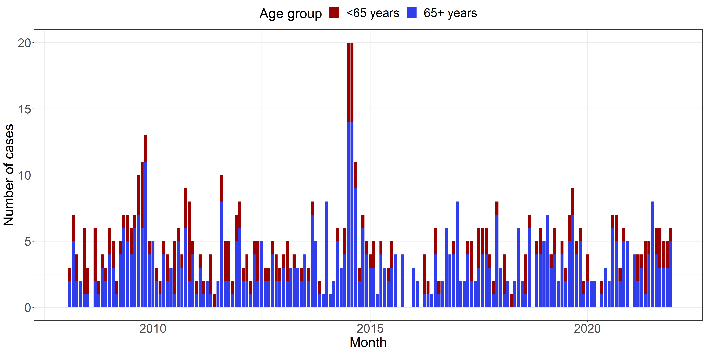
```

In general, SSI employs whole-genome sequencing (WGS) as the state-of-the-art method to detect disease outbreaks caused by \textit{Listeria monocytogenes}. This method involves mapping the entire DNA of the bacteria and enables SSI to identify cases where patients are infected with identical Listeria bacteria. However, it is important to note that for this master's thesis, the DNA typing data is unavailable for use.

The first notified outbreak in the 20th century occurred in 2009 [@Smith_2011]. This outbreak affected 8 people, of which two died. The patient samples were isolated between the 6th and 11th of May and it was believed that the cause was infected beef meat from a meals-on-wheels delivery.

Another notable outbreak investigated by SSI occurred between September 2013 and October 2014 [@Kvistholm_2016]. This LIST outbreak involved a total of 41 cases, resulting in 17 deaths. Deli meat products from a specific company were identified as the source of the outbreak. The high mortality rate may be attributed to the consumption of these products in nursing homes and hospitals, where patients are more vulnerable. Following the discovery of Listeria at the facility, the Danish Veterinary and Food Administration recalled all products from the company.

In another LIST outbreak investigated by SSI, the source was traced back to cold-smoked and cured salmon products [@Schjorring_2017]. A total of 5 related cases were identified, with 4 of them occurring in August 2017, and the fifth case in May 2017. 

In some cases, despite extensive investigations, the source of contamination in an outbreak cannot always be identified. Such was the case in an unresolved outbreak that took place between the 13th of May and the 6th of June, 2022. During this period, a total of nine cases were infected with the same type of Listeria, with the majority of affected patients located in the Capital Region of Denmark. Despite thorough efforts, the specific source of contamination remained unknown.

Early identification of outbreaks caused by \textit{Listeria monocytogenes} is crucial to implement timely interventions and mitigate the impact of the disease. Otherwise, these outbreaks can persist over an extended period. SSI has successfully resolved several long-spanned outbreaks in the last decade. For example, one investigation revealed that a single outbreak was actually two simultaneous outbreaks caused by the consumption of smoked fish. Each outbreak consisted of ten cases and spanned from May 2013 to July 2015 [@Gillesberg_2016]. 

Other documented long-spanned outbreaks investigated by SSI include: 

\begin{itemize}
  \item A cold-smoked fish outbreak with 9 cases spanning from December 2016 to February 2019.
  \item A prolonged outbreak with 6 cases from 2016 to 2019, traced back to a local greengrocer.
  \item An outbreak with 8 cases from October 2021 to June 2022, caused by a deli meat product.
  \item Two unresolved outbreaks with 9 cases and 12 cases from the end of 2018 to November 2021 and October 2020 to May 2022, respectively.
\end{itemize}

The use of WGS in these outbreaks provided the ability to link cases that occurred over a period of years and revealed that they were, in fact, continuous-source outbreaks.

In a recent outbreak investigated by SSI, the Danish Veterinary and Food Administration, and the National Food Institute at the Technical University of Denmark, fish patties were identified as the source of contamination. This outbreak occurred from August 2022 to December 2022 and affected a total of 11 cases.

(ref:LISTSSIoutbreaks) Timeline plot indicating the start (triangle) and duration (line) of documented outbreaks of LIST by SSI and possible collaborators.

```{r LISTSSIoutbreaks, echo=FALSE, out.width="100%", fig.cap="(ref:LISTSSIoutbreaks)", fig.pos = "H", fig.show = "hold"}
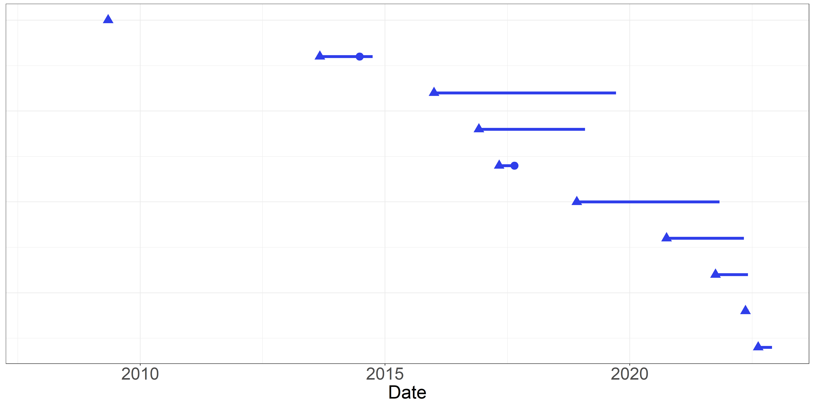
```

\subsection{\textit{Shiggellosis}}

SHIL is a diarrheal illness that is caused by a group of bacteria called \textit{Shigella}. There are four types of \textit{Shigella} bacteria, namely: \textit{Shigella dysenteriae}, \textit{Shigella boydii}, \textit{Shigella flexneri}, and \textit{Shigella sonnei}. The latter is the most common species in Denmark. The bacteria are highly contagious and can be transmitted through direct person-to-person contact, consumption of contaminated food, or ingestion of water contaminated with human feces. SHIL infections are most commonly observed in children under the age of 5, individuals traveling to regions with poor sanitation and unsafe water and food practices, as well as gay, bisexual, and other men who have sex with men. 

(ref:SHIGLongPlot) A stacked bar graph illustrating the number of SHIL cases observed in the period from 2008 to 2022 for the age groups below and above 25 years.

```{r SHIGLongPlot, echo=FALSE, out.width="100%", fig.cap="(ref:SHIGLongPlot)", fig.pos = "H", fig.show = "hold"}
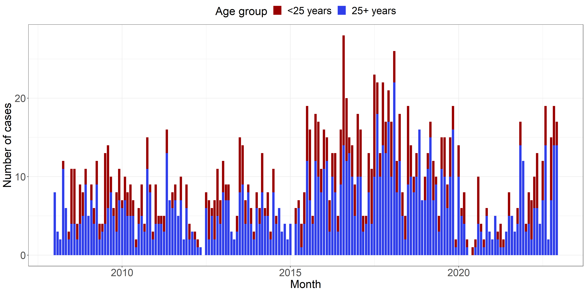
```

In Denmark, another significant cause of SHIL outbreaks is the importation of contaminated vegetables. This was evident in several incidents, including a 2007 outbreak where 215 individuals fell ill after consuming imported contaminated baby corn [@Lewis_2009], a smaller outbreak in 2009 linked to sugar snap peas from Kenya [@Muller_2009], and a 2020 outbreak associated with fresh mint as the source of infection. 

The 2020 outbreak is indeed a significant focus of this study, as it serves as a benchmark for evaluating the effectiveness of outbreak detection algorithms. It took place from the 22th of August to the 9th of September and was investigated by SSI in collaboration with the Danish Veterinary and Food Administration and the National Food Institute at the Technical University of Denmark. The outbreak affected 44 patients, mainly concentrated in the Capital Region of Denmark. During the investigation, at least five events were identified where individuals subsequently developed \textit{Shigellosis}.

(ref:SHIGSSIoutbreaks) Timeline plot indicating the start (triangle) and duration (line) of documented outbreaks of SHIL by SSI and possible collaborators.

```{r SHIGSSIoutbreaks, echo=FALSE, out.width="100%", fig.cap="(ref:SHIGSSIoutbreaks)", fig.pos = "H", fig.show = "hold"}
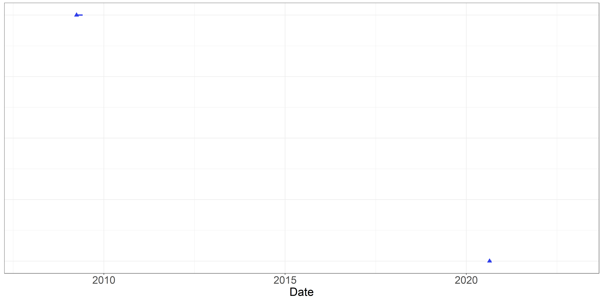
```

\subsection{Shiga toxin (verotoxin)-producing \textit{Escherichia coli}}

STEC primarily spreads through contaminated food. Less common sources of infection include contaminated drinking and bathing water, as well as direct or indirect contact with infected animals. Cattle and other ruminants are primary reservoirs for STEC serotypes that are frequently associated with human disease [@Menge_2020]. Therefore, in Denmark, the source of infection is often products derived from beef, non-heat-treated dairy products, or other foods such as ready-to-eat vegetables, leafy greens, vegetable sprouts, and berries contaminated with feces from cows. \textit{Hemolytic uremic syndrome} (HUS) is a severe complication that, in some cases, particularly in children, can develop following an infection with STEC.

(ref:STECLongPlot) A stacked bar graph illustrating the number of STEC cases observed in the period from 2008 to 2022 for the six age groups.

```{r STECLongPlot, echo=FALSE, out.width="100%", fig.cap="(ref:STECLongPlot)", fig.pos = "H", fig.show = "hold"}
knitr::include_graphics("../figures/STEC_long_plot.png")
```


In general, stool samples are commonly used for diagnostic purposes in cases of STEC infections. Until 2018, most clinical microbiology departments relied on culture-based methods to detect and identify STEC bacteria in stool samples. However, in recent years, PCR methods have been increasingly adopted as a replacement for culture-based methods in the diagnosis of STEC infections [@Svendsen_2023]. PCR methods offer advantages such as increased sensitivity and faster turnaround time, contributing to their growing popularity in clinical laboratories. 

It is important to note that not all patients are routinely tested for STEC, and therefore, physicians need to specifically request STEC testing when submitting stool samples.

One of the earliest documented STEC outbreaks occurred in 2007, involving 18 laboratory-confirmed cases over a six-week period. The outbreak primarily affected children in daycare settings, and most patients experienced mild symptoms without bloody diarrhea. Investigations indicated a specific brand of organic beef sausage as the likely source of infection.

In September to October 2012, a STEC outbreak with a high risk of HUS was observed. Thirteen cases were diagnosed, with eight individuals developing HUS. Epidemiological investigations suggested that ground beef was the vehicle of the outbreak [@Soborg_2013].

More recent outbreaks include a 38-case outbreak from September to November 2018, with a suspected association with beef sausage as the source of infection. Additionally, there were two unresolved outbreaks with 11 and 14 cases occurring from May to July 2019 and from December 2021 to January 2022, respectively. The latter outbreak included three cases of HUS.

(ref:STECSSIoutbreaks) Timeline plot indicating the start (triangle) and duration (line) of documented outbreaks of STEC by SSI and possible collaborators.

```{r STECSSIoutbreaks, echo=FALSE, out.width="100%", fig.cap="(ref:STECSSIoutbreaks)", fig.pos = "H", fig.show = "hold"}
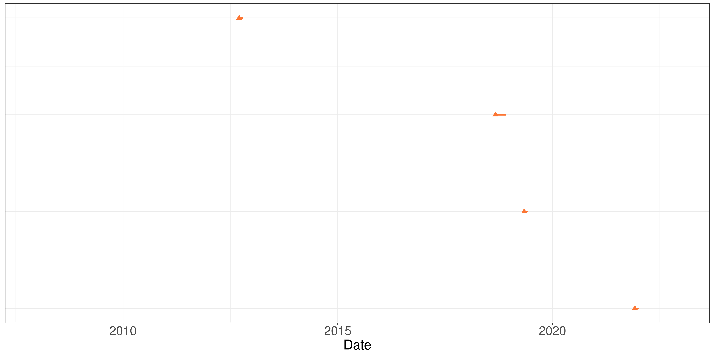
```

\subsection{\textit{Salmonellosis}}

SALM is a bacterial disease that primarily affects the intestinal tracts of humans. The \textit{Salmonella} bacteria are commonly found in the intestines of animals and humans and are excreted in feces. Human infection typically occurs through the consumption of contaminated food or water. Salmonella infections are often associated with the consumption of raw or under cooked meat, poultry, eggs or egg products, as well as unpasteurized milk.  

(ref:SALMLongPlot) A stacked bar graph illustrating the number of SALM cases observed in the period from 2008 to 2022 for the six age groups.

```{r SALMLongPlot, echo=FALSE, out.width="100%", fig.cap="(ref:SALMLongPlot)", fig.pos = "H", fig.show = "hold"}
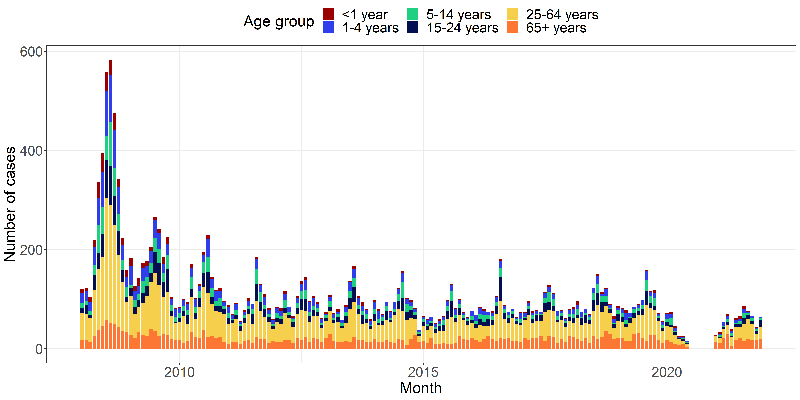
```

It is worth noting that an increasing proportion of infections in Denmark are now observed in connection with international travel, particularly since \textit{Salmonella} has been eliminated from commercial chicken flocks in Denmark, making Danish eggs and poultry meat free from the bacteria. However, imported meat products can still pose a risk of contamination.

In 2015, three outbreaks of SALM with patients in two or more regions were investigated [@Helwigh_2016]:

\begin{itemize}
  \item An outbreak caused by \textit{S}. Newport affecting 6 people in the period from March to April 2015.
  \item A long-lasting outbreak caused by \textit{S}. Oranienburg with 14 genetically linked cases from July 2015 to January 2016.
  \item An outbreak with 6 patients from November 2015 to January 2016.
\end{itemize}

Other resolved and well-documented outbreaks include:

\begin{itemize}
  \item An outbreak with 49 cases from October 2018 to January 2019, where Mediterranean sausage was identified as a possible source of contamination.
  \item An outbreak with 45 cases from November 2020 to April 2021, linked to the consumption of the natural remedy HUSK Psyllium.
  \item An international outbreak from March to July 2021, with more than 300 cases in Europe, including 39 cases in Denmark. Imported melons were suspected as the source of infection.
  \item An outbreak caused by eggs from a Danish producer, resulting in 24 cases registered from September to November 2021.
  \item An international outbreak with a total of 392 cases across 12 countries in the EU/EEA and the UK, including 4 cases in Denmark. Kinder chocolate products were identified as the source of infection.
\end{itemize}


There were also outbreaks where it was not possible to identify the source of contamination, including:

\begin{itemize}
  \item An outbreak with 26 cases in the period from May to August 2019.
  \item An outbreak with 11 cases in the period from June to July 2020.
  \item An outbreak with 24 cases in the period from March to September 2022.
  \item An outbreak with 15 cases in the period from August to September 2022.
\end{itemize}

(ref:SALMSSIoutbreaks) Timeline plot indicating the start (triangle) and duration (line) of documented outbreaks of SALM by SSI and possible collaborators.

```{r SALMSSIoutbreaks, echo=FALSE, out.width="100%", fig.cap="(ref:SALMSSIoutbreaks)", fig.pos = "H", fig.show = "hold"}
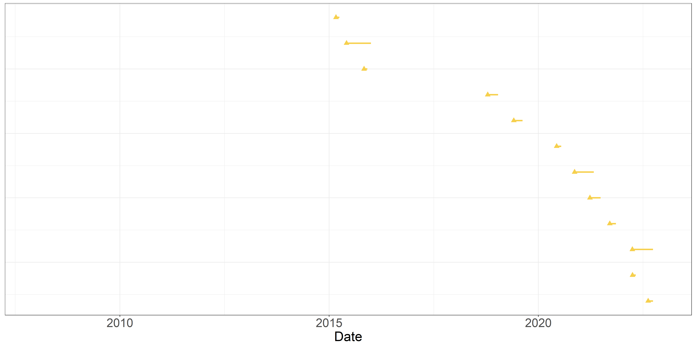
```

\cleardoublepage

<!--chapter:end:Chapters/03-Dataset.Rmd-->

\chapter{Methods}

In this chapter, the current state-of-the-art methods for disease outbreak detection will be outlined. Furthermore, the novel outbreak detection algorithm will be introduced, along with the theory related to generalized mixed effects models and hierarchical generalized linear models. These modeling frameworks are utilized in this master's thesis to analyze the count observations denoted as $\boldsymbol{y}$, but more importantly they play a crucial role in assessing the unobserved random variables or random effects represented by $\boldsymbol{u}$, which are directly employed in the detection algorithm for characterizing outbreaks.

Due to the complexity of generalized mixed effects models, obtaining closed-form solutions is generally not feasible. Therefore, an overview of the Laplace approximation technique will be provided in this chapter, which allows for approximating the likelihood function in these models. Additionally, the implementation of these models in the R programming language will be presented.

\section{State-of-the-art outbreak detection algorithm}\label{StateOfTheArt}

In this section, the Farrington method introduced by @Farrington_1996 and the subsequent improvements proposed by @Noufaily_2013 will be outlined. These methods are recognized as the current state-of-the-art for disease outbreak detection and will be used as benchmarks to evaluate the performance of the novel outbreak detection algorithm proposed in this master's thesis. Both of the aforementioned methods have been implemented in the R package called \textbf{surveillance} by @Salmon_2016, which can be accessed from the Comprehensive R Archive Network (CRAN) at \href{https://cran.r-project.org/web/packages/surveillance/index.html}{\nolinkurl{https://cran.r-project.org/web/packages/surveillance/index.html}}. The presentation of these methods are strongly inspired by @Salmon_2016.

Both methods follow the same steps in the algorithm. The first step involves fitting an over-dispersed Poisson generalized linear model (GLM) with a log link to the reference data. In this model, the baseline count $y_t$ corresponding to the baseline time point $t$ is assumed to have an expected value $\lambda_t$ and a variance $\phi\lambda_t$, where $\phi\geq1$ is ensured to account for over-dispersion. The systematic component of the model includes only a linear time trend in the frequency of reports. Therefore, the systematic component can be expressed as

\begin{equation}
  \log(\lambda_t)=\alpha+\beta t
\end{equation}

The original method incorporated seasonal effects by considering counts from comparable periods in past years for threshold calculation. This approach is similar to the one used by @Stroup_1989. The baseline weeks, which are used as reference, are determined by two integers: $b$ represents the number of years back, and $w$ represents the window half-width. For a given current week $x$ of year $h$, only data from weeks $x-w$ to $x+w$ of years $h-b$ to $h-1$ are considered, resulting in a total of $n=b(2w+1)$ baseline weeks. The default values are $b=5$ and $w=3$, resulting in a total of $n=35$ baseline values. 

However, @Noufaily_2013 demonstrated that the algorithm performs better when utilizing more historical data without disregarding seasonality. To achieve this, the author introduced a 10-level factor with a 7-week reference period and nine additional 5-week periods in each year. As a result, the systematic component of the model is modified as follows

\begin{equation}
\log(\lambda_t) = \alpha + \beta t + \delta_{j(t)}
\end{equation}

In this equation, $j(t)$ represents the seasonal factor level corresponding to time point $t$. The reference week $t_0$ is always associated with the reference seasonal level, denoted by $j(t_0) = 0$ and $\delta_0 = 0$.

The idea of incorporating more data while preserving seasonality has been further expanded in the implementation of the method in the \textbf{surveillance} R package. The package allows the user to choose an arbitrary number of periods in each year. Consequently, the systematic component is adjusted as follows

\begin{equation}
\log(\lambda_t) = \alpha + \beta t + \delta_{c(t)}
\end{equation}

In this equation, $c(t)$ represents the coefficients of a zero-order spline with $\mathtt{noPeriods}+1$ knots. It can be conveniently represented as a `noPeriods`-level factor that captures seasonality. The function $c(t)$ indicates which season or period of the year $t$ belongs to.

Furthermore, @Noufaily_2013 demonstrated that it is beneficial to exclude the last 26 weeks before $t_0$ from the baseline calculation. This exclusion helps prevent a reduction in sensitivity when an outbreak has recently started before $t_0$.

In the second step, the algorithm predicts the expected number of counts $\lambda_{t_0}$ for the current time point $t_0$ using the fitted generalized linear model. Both methods differ in their assumptions for calculating the upper bound $U_{t_0}$.

The original method assumes that a transformation of the prediction error, denoted as $g(y_{t_0}-\hat{\lambda}_{t_0})$, follows a normal distribution. For example, when using the identity transformation $g(x)=x$, the assumption becomes

\begin{equation}
y_{t_0} - \hat{\lambda}_{t_0} \sim \N(0, \V(y_{t_0}-\hat{\lambda}_{t_0}))
\end{equation}

The upper bound of the prediction interval is then calculated based on this distribution. The variance of the prediction error is given by

\begin{equation}
\V(y_{t_0}-\hat{\lambda}_{t_0}) = \V(\hat{y}_{t_0}) + \V(\hat{\lambda}_{t_0}) = \phi\lambda_{t_0}
\end{equation}

Here, $\V(\hat{y}_{t_0})$ represents the variance of an observation, and $V(\hat{\lambda}_{t_0})$ represents the variance of the estimate. The threshold, defined as the upper bound of a one-sided $(1-\alpha)\cdot100\%$ prediction interval, is calculated as

\begin{equation}
U_{t_0} = \hat{\lambda}_{0} + z_{1-\alpha}\hat{V}(y_{t_0}-\hat{\lambda}_{t_0})
\end{equation}

However, this method's weakness lies in the assumption of normality itself. Therefore, an alternative assumption was presented in @Noufaily_2013. This approach assumes that $y_{t_0}$ follows a negative binomial distribution, denoted as $\text{NB}(\lambda_{t_0}, \nu)$, where $\lambda_{t_0}$ represents the mean and $\nu = \frac{\lambda_{t_0}}{\phi-1}$ represents the over-dispersion parameter. In this parameterization, the expected value of $y_t$ remains $\lambda_t$, and the variance of $y_t$ is $\phi\lambda_t$, with $\phi > 1$. If $\phi \leq 1$, a Poisson distribution is assumed for the observed count. The threshold is defined as a quantile of the negative binomial distribution using the plug-in estimates $\hat{\lambda}_{t_0}$ and $\hat{\phi}$.

In the final step, the observed count $y_{t_0}$ is compared to the upper bound $U_{t_0}$, and an alarm is raised if $y_{t_0} > U_{t_0}$. The fitting of the GLM in both methods involves three important steps.

First, the algorithm optionally performs a power transformation to correct for skewness and stabilize the variance of the data.

Next, the significance of the time trend is checked. The time trend is included in the model only if it is statistically significant at a chosen significance level, there are more than three years of reference data, and there is no over-extrapolation due to the time trend.

Finally, past outbreaks are reweighted based on their Anscombe residuals. If the Anscombe residual of a count exceeds a certain weight threshold, it is reweighted in a second fitting of the GLM. In the original method by @Farrington_1996, a reweighting threshold of 1 was used. However, @Noufaily_2013 suggests using a value of 2.56 for the weight threshold to make the reweighting procedure less drastic, as it also reduces the variance of the observations.

\section{Novel outbreak detection algorithm}\label{Novel}

In this section, the novel algorithm for the prospective detection of disease outbreaks proposed in this master's thesis is outlined. The algorithm utilizes a generalized mixed effects model or a hierarchical generalized linear model as a modeling framework to model the count observations $\boldsymbol y$ and assess the unobserved random effects $\boldsymbol u$. These random effects are used directly in the detection algorithm to characterize an outbreak. The theoretical foundations of these models will be further discussed in Section \ref{GLMM} and Section \ref{HLMM}.

The first step involves fitting either a hierarchical Poisson Normal or Poisson Gamma model with a log link to the reference data. Here, it is possible for the user to include an arbitrary number of covariates by supplying a model formula. In order to account for structural changes in the time series, e.g. an improved and more sensitive diagnostic method or a new screening strategy at hospitals, a rolling window with width $k$ is used to estimate the time-varying model parameters. Also, it is assumed that the count is proportional to the population size $\boldsymbol n$. Hence, in terms of the canonical link the model for the fixed effects is

\begin{equation}
  \log(\lambda_{it})=\boldsymbol x_{it} \boldsymbol\beta + \log(n_{it}), \quad i=1,\dots,m, \quad t=1,\dots,T
\end{equation}

Here $\boldsymbol x_{it}$ and $\boldsymbol\beta$ are $p$-dimensional vectors of covariates and fixed effects parameters respectively, where $p$ denotes the number of covariates or fixed effects parameters, $m$ denotes the number of groups, and $T$ denotes the length of the period.


In the second step of the algorithm, as a new observation becomes available, the algorithm infers the one-step ahead random effect $u_{i{t_1}}$ for each group using the obtained model estimates $\hat{\theta}_{t_0}$. Here, $t_0$ represents the current time point, and $t_1$ represents the one-step ahead time point. The threshold $U_{t_0}$ for detecting outbreaks is defined as a quantile of the distribution of the random effects in the second stage model. This threshold can be calculated based on either a Gaussian distribution using the plug-in estimate $\hat{\sigma}$ or a Gamma distribution using the plug-in estimate $\hat{\phi}$. The choice of distribution depends on the specific modeling framework and assumptions used in the analysis.

In the final step, the inferred random effect $\hat{u}_{i{t}_1}$ is compared to the upper bound $U_{t_0}$, and an alarm is raised if $\hat{u}_{i{t}_1}>U_{t_0}$. If an outbreak is detected, the related observation $y_{i1}$ is omitted from the parameter estimation in the future. Thus, resulting in a smaller sample size for the rolling window until that specific observation is discarded.

\section{General mixed effects models}\label{GLMM}

In this section selected theory related to generalized mixed effects models is presented. The presentation of Section \@ref(GLMM) and Section \@ref(HLMM) is mostly inspired by @Madsen_2010. 

The general mixed effects model can be represented by its likelihood function

\begin{equation}\label{eq:glmm}
  L_{M}(\boldsymbol{\theta; y})=\int_{\mathbb{R}^{q}} L(\boldsymbol{\theta;u,y}) d\boldsymbol{u}
\end{equation}

where $\boldsymbol{y}$ is the observed random variable, $\boldsymbol{\theta}$ is the model parameters to be estimated and $\boldsymbol{U}$ is the $q$ unobserved random variables. The likelihood function $L$ is the joint likelihood of both the observed and the unobserved random variables. The likelihood function for estimating $\boldsymbol{\theta}$ is the marginal likelihood $L_{M}$ obtained by integrating out the unobserved random variables. In general it is difficult to solve the integral in \eqref{eq:glmm} if the number of unobserved random variables is more than a few and hence numerical methods must be used. Thus, an outline of the Laplace approximation is included in this section.

\subsection{Hierarchical models}\label{hierarchicalModels}

It is useful to formulate the model as a hierarchical model containing a \textit{first stage model}

\begin{equation}\label{eq:firstStage}
  f_{Y|u}(\boldsymbol{y;u,\beta})
\end{equation}

which is a model for the observed random variables given the unobserved random variables, and a \textit{second stage model}

\begin{equation}\label{eq:secondStage}
  f_{U}(\boldsymbol{u; \Psi})
\end{equation}

which is a model for the unobserved random variables. Here $\boldsymbol{\beta}$ represent the fixed effects parameters and $\boldsymbol{\Psi}$ is a model parameter. The total set of parameters is $\boldsymbol{\theta}=(\beta, \Psi)$. Hence the joint likelihood is given as

\begin{equation}\label{eq:jl}
  L(\boldsymbol{\beta, \Psi; u, y})=f_{Y|u}(\boldsymbol{y;u,\beta}) f_{U}(\boldsymbol{u; \Psi})
\end{equation}

To obtain the likelihood for the model parameters $(\boldsymbol{\beta, \Psi})$ the unobserved random variables are integrated out. The likelihood function for estimating $(\boldsymbol{\beta, \Psi})$ is as in \eqref{eq:glmm} the marginal likelihood

\begin{equation}\label{eq:glmm2}
  L_{M}(\boldsymbol{\beta, \Psi; y})=\int_{\mathbb{R}^{q}} L(\boldsymbol{\beta, \Psi;u,y}) d\boldsymbol{u}
\end{equation}

where $q$ is the number of unobserved random variables, and $\boldsymbol{\beta}$ and $\boldsymbol{\Psi}$ are the parameters to be estimated.

\subsection{Laplace Approximation}

The Laplace approximation will be outlined in the following. A thorough description of the Laplace approximation in nonlinear mixed effects models is found in @Wolfinger_1997.

For a given set of model parameters $\boldsymbol{\theta}$ the joint log-likelihood $\ell(\boldsymbol{\theta, u, y})=\log\big(L(\boldsymbol{\theta, u, y})\big)$ is approximated using a second order Taylor approximation around the optimum $\boldsymbol{\tilde{u}}=\boldsymbol{\hat{u}_\theta}$ of the log-likelihood function w.r.t. the unobserved random variables $\boldsymbol{u}$, i.e.,

\begin{equation}\label{eq:laplaceApprox}
  \ell(\boldsymbol{\theta, u, y})\approx\ell(\boldsymbol{\theta, \tilde{u}, y}) - \frac{1}{2}(\boldsymbol{u-\tilde{u}})^T \boldsymbol{H}(\boldsymbol{\tilde{u}})(\boldsymbol{u-\tilde{u}})
\end{equation}

where the first-order term of the Taylor expansion disappears since the expansion is done around the optimum $\boldsymbol{\tilde {u}}$ and $\boldsymbol{H}(\boldsymbol{\tilde{u}})=-\ell_{uu}''(\boldsymbol{\theta, u, y})|_{\boldsymbol{u=\tilde{u}}}$ is the negative Hessian of the joint log-likelihood evaluated at $\boldsymbol{\tilde{u}}$. 

It is readily seen that the joint log-likelihood for the hierarchical model specified in \eqref{eq:firstStage} and \eqref{eq:secondStage} is

\begin{equation}
  \ell(\boldsymbol{\theta, u, y}) = \ell(\boldsymbol{\beta, \Psi, u, y}) = \log f_{Y|u}(\boldsymbol{y;u,\beta})+\log f_U(\boldsymbol{u;\Psi})
\end{equation}

which implies that the Laplace approximation becomes

\begin{equation}
  \ell_{M,LA}(\boldsymbol{\theta, y})=\log f_{Y|u}(\boldsymbol{y; \tilde{u},\beta})+\log f_U(\boldsymbol{\tilde{u}, \Psi})-\frac{1}{2}\log\Bigg|\frac{\boldsymbol{H}(\boldsymbol{\tilde{u}})}{2\pi}\Bigg|
\end{equation}

\subsection{Formulation of the generalized mixed effects model}

The generalized mixed effects model utilized in this master's thesis to model the count observations $\boldsymbol y$ and assess the random effects $\boldsymbol u$ is presented in Theorem \@ref(thm:poisnTheorem), along with the joint likelihood function for the first and second stage models.

::: {.theorem #poisnTheorem name="Hierarchical Poisson Normal model"}
In order to simplify the notation, the probability density functions are presented for a specific observation and hence the subscripts indicating the group and time are omitted. The conditional distribution of the count observations is assumed to be a Poisson distribution with intensities $\boldsymbol \lambda$

\begin{equation}
  f_{Y|u}(y; u, \boldsymbol{\beta})=\frac{\lambda\exp(u)^{y}}{y!}\exp\big(-\lambda\exp(u)\big)
\end{equation}

Also, it is assumed that the count is proportional to the population size $\boldsymbol{n}$. Hence, in terms of the canonical link for the Poisson distribution the model for the fixed effects is

\begin{equation}
\log(\lambda_{it})=\boldsymbol x_{it} \boldsymbol\beta + \log(n_{it}), \quad i=1,\dots,m, \quad t=1,\dots,T
\end{equation}

The probability density function for the distribution of the random effects is assumed to follow a zero mean Gaussian distribution, $\boldsymbol u\sim\N(\boldsymbol 0,I\sigma^2)$, i.e.

\begin{equation}
  f_U(u;\sigma)=\frac{1}{\sigma\sqrt{2\pi}}\exp\Bigg(-\frac{u^2}{2\sigma^2}\Bigg)
\end{equation}

where $\sigma$ is a model parameter. 

Henceforth, the total set of parameters are $\boldsymbol{\theta}=(\boldsymbol{\beta},\sigma)$ and the model can be formulated as a two-level hierarchical model

\begin{subequations} \label{eq:PoisN}
  \begin{alignat}{2}
    \boldsymbol{Y|u} &\sim \Pois \big( \boldsymbol{\lambda} \exp(\boldsymbol{u}) \big) \label{eq:pois_n0} \\ 
    \boldsymbol{u} &\sim \N(\boldsymbol{0},I\sigma^2) \label{eq:pois_n1}
  \end{alignat}
\end{subequations}

The joint likelihood for the count observations $\boldsymbol y$ and the random effects $\boldsymbol u$ becomes

\begin{multline}\label{eq:jnllPoisN}
  L(\boldsymbol{\beta}, \sigma;u_{it},y_{it})=\\
  \prod_{t=1}^{T}\prod_{i=1}^{m} \frac{(\lambda_{it}\exp(u_{it}))^{y_{it}}}{y_{it}!}\exp\big(-\lambda_{it}\exp(u_{it})\big) \prod_{t=1}^{T}\prod_{i=1}^{m} \frac{1}{\sigma\sqrt{2\pi}}\exp\Bigg(-\frac{u_{it}^2}{2\sigma^2}\Bigg)
\end{multline}
:::

\section{Hierarchical generalized linear models}\label{HLMM}

In this section selected theory related to hierarchical generalized linear models is presented. The model class was initially formulated by @Lee_1996 as a natural generalization of the generalized linear models to also incorporate random effects. A starting point in hierarchical modelling is an assumption that the distribution of random effects may be modeled by an exponential dispersion family. This family of models were first introduced by @Fisher_1922, and has proven to play an important role in mathematical statistics because of their simple inferential properties. The exponential dispersion family considers a family of distributions, which can be written on the form

\begin{equation}\label{eq:expDispFam}
  f_Y(y;\theta)=c(y,\lambda)\exp\big(\lambda \{\theta y-\kappa(\theta) \}\big)
\end{equation}

Here the parameter $\lambda>0$ is called the \textit{precision parameter}, which in some cases represents a known shape parameter as for the Gamma distribution. In other cases the precision parameter represents an over-dispersion that is not related to the mean. These distributions combine with the so-called \textit{standard conjugate distributions} in a simple way, and lead to marginal distributions that may be expressed in a closed form suited for likelihood calculations. For an introduction to the concept of \textit{standard conjugate distributions} and the definition of a hierarchical generalized linear model, refer to Section 6.3 and Section 6.5 of @Madsen_2010, respectively.

In general, when the conditional distribution of $Y|u$ is a Poisson distribution, and the the conjugate distribution is assumed to be a Gamma distribution with mean value 1, it follows that the distribution of $Y$ is a negative binomial distribution.

To further motivate this choice of distribution for the second stage model, an illustrative example is presented.

::: {.example #poisgExample name="Variation between observed cases of LIST"}

```{r PoisGexample, echo=FALSE}

dat <- read_rds("../data/processed/dat5.rds")

LIST <- dat %>%
  filter(caseDef == "LIST") %>% 
  group_by(Date) %>%
  reframe(y = sum(cases), n = sum(n))

momentsLIST <- LIST %>%
  summarize(var(y), mean(y))

poisNBExp <- tibble(y = as_factor(0:20), 
                  poisExp = dpois(x = as.integer(y), lambda = momentsLIST$`mean(y)`) * nrow(LIST),
                  NBExp = dnbinom(x = as.integer(y), prob = momentsLIST$`mean(y)`/momentsLIST$`var(y)`, size = momentsLIST$`mean(y)`^2/(momentsLIST$`var(y)`-momentsLIST$`mean(y)`)) * nrow(LIST)) %>%
  mutate(y = fct_collapse(y, `10+`=c(as.character(10:20)))) %>%
  group_by(y) %>%
  reframe(sum(poisExp), sum(NBExp))

meanYExample <- round(momentsLIST$`mean(y)`,2)
varYExample <- round(momentsLIST$`var(y)`,2)

```
Usually, it is reasonable to assume a Poisson distribution for count data, where the expected value and variance are both equal to $\lambda$. However, it should be noted that this assumption may not always hold true when modeling count data.

```{r PoisGexampleTbl, echo=FALSE}

LIST %>% 
  mutate(y = as_factor(y), y = fct_collapse(y, `10+`=c("10","11","12","13","14","15","20"))) %>%
  group_by(y) %>% 
  reframe(observed = n()) %>%
  full_join(y = poisNBExp, by = join_by(y)) %>%
  kbl(booktabs = TRUE, escape = FALSE, align = "l", caption = "The distribution of cases with $1,2,\\cdots,10+$ cases of LIST.", col.names = c("Number of LIST\ncases","Number of times\nobserved", "Poisson\nexpected", "Negative binomial\nexpected"), digits = 2, linesep = "") %>%
  kable_paper(latex_options = c("HOLD_position"), full_width = TRUE)

```

Take, for example, the monthly cases of LIST analyzed in this master's thesis. Table \@ref(tab:PoisGexampleTbl) presents the distribution of these cases from 2008 to 2022, along with the expected numbers from both the Poisson and Negative binomial distributions. The distribution of cases over time is visualized in Figure \@ref(fig:PoisGexampleFig).

As observed, the actual distribution has significantly heavier tails compared to the Poisson distribution. Additionally, the mean of the Poisson distribution for the monthly LIST cases is $\hat{\lambda}=\bar{y}=`r meanYExample`$, while the empirical variance is $s^2=`r varYExample`$, which is considerably larger than the mean. These findings indicate overdispersion, suggesting that a Negative binomial model would be more appropriate for modeling the data.

(ref:PoisGexampleFig) Distribution of monthly cases of LIST together with the expected numbers from both the Poisson and Negative binomial distributions

```{r PoisGexampleFig, echo=FALSE, out.width="80%", fig.cap="(ref:PoisGexampleFig)", fig.pos = "H", fig.show = "hold", fig.align='center'}

PoisGcustomPalette <- c("#990000","#2F3EEA","#1FD082")

LIST %>% 
  mutate(y = as_factor(y), y = fct_collapse(y, `10+`=c("10","11","12","13","14","15","20"))) %>%
  group_by(y) %>% 
  reframe(observed = n()) %>%
  full_join(y = poisNBExp, by = join_by(y)) %>%
  pivot_longer(cols = observed:`sum(NBExp)`) %>%
  mutate(name = factor(name,
                       levels = c("sum(poisExp)","observed", "sum(NBExp)"),
                       labels = c("Poisson exp.", "Observed", "Neg. Bin. exp.") )) %>%
  ggplot() +
  geom_linerange(mapping = aes(x = y, ymin = 0, ymax = value, group = name, colour = name), position = position_dodge2(width=0.3)) +
  geom_point(mapping = aes(x = y, y = value, group = name, shape = name, colour = name), position = position_dodge2(width=0.3)) +
  scale_shape_manual(name = "", values = c(1, 19, 2)) +
  scale_y_continuous(name = "Number of times observed") +
  scale_x_discrete(name = "Number of LIST cases") +
  scale_colour_manual(values = PoisGcustomPalette) +
  theme_bw() +
  guides(colour = "none", shape = guide_legend(override.aes = list(colour = PoisGcustomPalette, size = 2))) +
  theme(legend.position = "top",
        axis.text = element_text(size = 12),
        axis.title = element_text(size = 15),
        legend.text = element_text(size = 12),
        legend.key.size = unit(1, 'cm'))

```
:::

\subsection{Formulation of the hierarchical model}

The hierarchical model used in this master's thesis to model the count observations $\boldsymbol y$ and assess the random effects $\boldsymbol u$ is presented in Theorem \@ref(thm:poisgTheorem), along with the derivation of the marginal distribution of $Y$ and the joint likelihood function.

::: {.theorem #poisgTheorem name="Compound Poisson Gamma model"}
In the compound Poisson Gamma model the conditional distribution of the count observations are assumed to be a Poisson distribution with intensities $\boldsymbol \lambda$

\begin{equation}\label{eq:pdfPois}
  f_{Y|u}(y;u,\boldsymbol{\beta})=\frac{(\lambda u)^{y}}{y!}\exp(-\lambda u)
\end{equation}

The probability density function for the random effects $\boldsymbol u$ are assumed to follow a reparametrized Gamma distribution with mean $\boldsymbol 1$, $\boldsymbol u \sim \G(\boldsymbol 1/\phi,\phi)$ that is

\begin{equation} \label{eq:pdfGamma}
  f_{u}(u;\phi)=\frac{1}{\phi \Gamma(1/\phi)} \bigg(\frac{u}{\phi}\bigg)^{1/\phi-1} \exp (-u/\phi)
\end{equation}

Subsequently, the model can be formulated as a two-level hierarchical model

\begin{subequations} \label{eq:PoisGam}
  \begin{alignat}{2}
    \boldsymbol{Y|u} &\sim \Pois (\boldsymbol{\lambda u}) \label{eq:pois_g0} \\ 
    \boldsymbol{u} &\sim \G(\boldsymbol 1/\phi,\phi) \label{eq:pois_g1}
  \end{alignat}
\end{subequations}

Given \eqref{eq:pdfPois} and \eqref{eq:pdfGamma}, the probability function for the marginal distribution of $\boldsymbol Y$ is determined from

\begin{equation} \label{eq:marMix}
  \begin{aligned}
    g_{Y}(y;\beta,\phi)&=\int_{u=0}^\infty f_{Y|u}(y;u,\beta) f_{u}(u;\phi) \,du \\
    &=\int_{u=0}^\infty \frac{(\lambda u)^y}{y!} \exp (-\lambda u) \frac{1}{\phi \Gamma(1/\phi)} \bigg(\frac{u}{\phi}\bigg)^{1/\phi-1} \exp (-u /\phi) \,du\\
    &=\frac{\lambda^{y}}{y!\Gamma(1/\phi)\phi^{1/\phi}} \int_{u=0}^\infty u^{y+1/\phi-1} \exp \big(-u(\lambda \phi+1)/\phi\big) \,du
  \end{aligned}
\end{equation}

In \eqref{eq:marMix} it is noted that the integrand is the kernel in the probability density function for a Gamma distribution, $\G\big(y+1/\phi,\phi/(\lambda \phi+1)\big)$. As the integral of the density shall equal one, we find by adjusting the norming constant that

\begin{equation}
  \int_{u=0}^\infty  u^{ y+ 1/\phi-1} \exp \bigg(- u/\Big(\phi/( \lambda \phi+1)\Big)\bigg) \,du = \frac{\phi^{ y+ 1/\phi}\Gamma( y+\boldsymbol 1/\phi)}{( \lambda \phi + 1)^{y+1/\phi}}
\end{equation}

Therefore, it can be shown that the marginal distribution of $Y$ is a negative binomial distribution, $Y\sim\NB\big(1/\phi,1/(\lambda\phi+1)\big)$. The probability function for $Y$ is 

\begin{equation} \label{eq:pdfMix}
  \begin{aligned}
    P[Y=y]&=g_{Y}(y;\boldsymbol \beta, \phi) \\
    &=\frac{\lambda^{y}}{y!\Gamma(1/\phi)\phi^{1/\phi}}\frac{\phi^{y+1/\phi}\Gamma(y+1/\phi)}{(\lambda \phi + 1)^{y+1/\phi}} \\
    &=\frac{\Gamma(y+1/\phi)}{\Gamma(1/\phi)y!}\frac{1}{(\lambda\phi+1)^{1/\phi}}\bigg(\frac{\lambda\phi}{\lambda\phi+1}\bigg)^{y} \\
    &=\begin{pmatrix} y+1/\phi-1 \\ y \end{pmatrix} \frac{1}{(\lambda\phi+1)^{1/\phi}}\bigg(\frac{\lambda\phi}{\lambda\phi+1}\bigg)^{y} \ , \quad \mathrm{for} \ y = 0, 1, 2, \dots
  \end{aligned}
\end{equation}

where we have used the convention

\begin{equation}
  \begin{pmatrix} z\\y \end{pmatrix} = \frac{\Gamma(z+1)}{\Gamma(z+1-y)y!}
\end{equation}

for $z$ real and $y$ integer values. Consequently, the mean and variance of $Y$ are given by

\begin{equation}\label{eq:meanNB}
  \E[Y] = \lambda \qquad \V[Y] = \lambda (\lambda \phi + 1)
\end{equation}

The joint likelihood function for estimating $(\boldsymbol \beta,\phi)$ is

\begin{equation}\label{eq:jnllPoisG}
  L(\boldsymbol \beta, \phi; y_{it})=\prod_{t=1}^{T}\prod_{i=1}^{m} \begin{pmatrix} y_{it}+1/\phi-1 \\ y_{it} \end{pmatrix} \frac{1}{(\lambda_{it}\phi+1)^{1/\phi}}\bigg(\frac{\lambda_{it}\phi}{\lambda_{it}\phi+1}\bigg)^{y_{it}}
\end{equation}
:::

\subsubsection{Inference on individual groups}

Consider the compound Poisson Gamma model in \eqref{eq:PoisGam}, and assume that a value $Y=y$ has been observed.

Then the conditional distribution of $u$ for given $Y=y$ is found using Bayes Theorem. In order to simplify the notation, the subscript indicating the group and time are omitted. 

\begin{equation}
  \begin{aligned}
    g_{u}(u|Y=y)&=\frac{f_{y,u}(y,u)}{g_Y(y;\lambda, \phi)} \\
    &=\frac{f_{y|u}(y;u)g_{u}(u)}{g_{Y}(y;\lambda,\phi)} \\
    &=\frac{1}{g_{Y}(y;\lambda,\phi)}\bigg(\frac{(\lambda u)^y}{y!} \exp (-\lambda u) \frac{1}{\phi \Gamma(1/\phi)} \bigg(\frac{u}{\phi}\bigg)^{1/\phi-1} \exp (-u/\phi)\bigg) \\
    &\propto u^{y+1/\phi-1} \exp \big(- u(\lambda\phi+1)/\phi\big)
  \end{aligned}
\end{equation}

We identify the \textit{kernel} of the probability density function

\begin{equation}
  u^{y+1/\phi-1} \exp (- u(\lambda\phi+1)/\phi)
\end{equation}

as the kernel of a Gamma distribution, $\G(y+1/\phi,\phi/(\lambda\phi+1))$, i.e. the conditional distribution of $u$ for given $Y=y$ can be written as

\begin{equation}
  u| Y=y\sim \G\big(y+1/\phi,\phi/(\lambda \phi+1)\big)
\end{equation}

The mean of the conditional distribution is given by:

\begin{equation}
  \E[u|Y=y]=\frac{y\phi+1}{\lambda \phi+1}
\end{equation}

And the variance of the conditional distribution is:                                            
\begin{equation}
  \V[u|Y=y]=\frac{( \phi^2+\phi)}{(\lambda \phi + 1)^2}
\end{equation}

These formulas provide the mean and variance of the conditional distribution of $u$ given the observed value $Y=y$. 

\subsubsection{Why is the Gamma distribution chosen to represent the variation between months?}

The choice of the Gamma distribution for modeling the random effects has been motivated by several reasons. Firstly, the support of the Gamma distribution, which ranges from 0 to infinity, aligns with the mean-value space, denoted as $\mathcal{M}$, for the Poisson distribution. This ensures that the random effects are constrained within a meaningful range for the underlying Poisson process.

Secondly, the two-parameter family of Gamma distributions offers considerable flexibility, encompassing a wide range of shapes and distributions that can span from exponential-like distributions to fairly symmetrical distributions on the positive real line. This flexibility allows the model to capture various patterns and characteristics observed in the data.

Additionally, the choice of the Gamma distribution has benefits in terms of the derivation of the marginal distribution of the response variable $Y$. The kernel $u^{\alpha-1}\exp(-u/\beta)$ of the Gamma distribution used for modeling the random effects exhibits a similar structure to the kernel $u^y\exp(-u)$ of the likelihood function corresponding to the sampling distribution of $Y$. This similarity facilitates the analytical computation of the integral involved in deriving the marginal distribution, as it can be expressed in terms of known functions.

Overall, the Gamma distribution is selected due to its alignment with the mean-value space of the Poisson distribution, its flexibility in capturing diverse distributions, and its analytical convenience in computing the marginal distribution of the response variable.

\section{Parameter estimation}

In this section, the parameter estimation and implementation of the models used in the novel outbreak detection algorithm are presented. These model are implemented in R using the open-source R package \textbf{TMB} (Template Model Builder) developed by @Kristensen_2016. This package facilitates efficient maximum likelihood estimation and uncertainty calculations for the parameter set $\boldsymbol \theta=(\boldsymbol{\beta, \Psi})$ and random effects $\boldsymbol u$. The presentation of the parameter estimation conducted in \textbf{TMB} is strongly inspired by Chapter 2 in @Kristensen_2016 and Section 5.10 in @Madsen_2010.

\textbf{TMB} maximizes a user-provided objective function in the form of a C++ template, to estimate the maximum likelihood for the parameter set $\boldsymbol \theta = (\boldsymbol{\beta, \Psi})$. Refer to \@ref(cpp) to access the C++ template files used in this master's thesis. The objective function maximizes the marginal log-likelihood function, which integrates out the random effects $\boldsymbol u$

\begin{equation}
  \ell_{M}(\boldsymbol{\theta; y})=\int_{\mathbb{R}^{q}} \ell (\boldsymbol{\theta;u,y}) d\boldsymbol{u}
\end{equation}

where $\ell(\boldsymbol{\theta, u,y})$ is the joint log-likelihood function of the data given the parameters and random effects. The maximizer $\hat{\boldsymbol u}_{\boldsymbol \theta}$ of the joint log-likelihood $\ell(\boldsymbol{\theta;u,y})$ with respect to the random effects $\boldsymbol u$ is defined as:

\begin{equation}
  \hat{\boldsymbol u}_{\boldsymbol \theta}=\argmax_{\boldsymbol u} \ell(\boldsymbol{\theta;u,y})
\end{equation}

Using $H(\hat{\boldsymbol u}_{\boldsymbol \theta})$ to denote the negative Hessian of the joint log-likelihood evaluated at $\hat{\boldsymbol u}_{\boldsymbol \theta}$; i.e,

\begin{equation}
  H(\hat{\boldsymbol u}_{\boldsymbol \theta}) =-\ell_{uu}''(\boldsymbol{\theta, u, y})|_{\boldsymbol u=\hat{\boldsymbol u}_{\boldsymbol \theta}}
\end{equation}

The Laplace approximation for the marginal log-likelihood $\ell_M(\boldsymbol \theta)$ is

\begin{equation}
  \ell_{M,LA}(\boldsymbol{\theta, y})=\ell(\boldsymbol{\theta,u,y})-\frac{1}{2}\log \Big|\frac{H(\hat{\boldsymbol u}_{\boldsymbol \theta})}{2\pi}\Big|
\end{equation}

Our estimate of $\theta$ minimizes the negative log of the Laplace approximation, i.e.,

\begin{equation}
  -\ell_{M,LA}(\boldsymbol{\theta, y}) = - \ell(\boldsymbol{\theta, u, y}) + \frac{1}{2} \log \Big|\frac{H(\hat{\boldsymbol u}_{\boldsymbol \theta})}{2\pi} \Big|
\end{equation}

The maximization of the Laplace approximation for the marginal likelihood is then performed using conventional R optimization routines (e.g., BFGS) to optimize the objective and obtain our estimate $\hat{\boldsymbol \theta}$. Uncertainty of the estimate $\hat{\boldsymbol \theta}$, or any differentiable function of the estimate $\phi(\hat{\boldsymbol \theta})$, is obtained by the $\delta$-method:

\begin{equation}
  \V\big(\phi(\hat{\boldsymbol \theta})\big)=-\phi_{\boldsymbol \theta}'(\hat{\boldsymbol \theta})\Big(\Delta^2 \ell_{M,LA}(\boldsymbol{\hat{\theta}, y})\Big)^{-1} \phi_{\boldsymbol \theta}'(\hat{\boldsymbol \theta})^T
\end{equation}

Additionally, \textbf{TMB} utilizes Automatic Differentiation (AD) techniques [@Griewank_2008] to evaluate first, second, and potentially third-order derivatives. This approach enhances the computational efficiency and accuracy of the parameter estimation process in the implemented models. Therefore, even though the random effects are analytically integrated out in \eqref{eq:jnllPoisG}, and the Laplace approximation is not needed, implementing the joint log-likelihood function in \textbf{TMB} can still result in more efficient computations.

For a comprehensive introduction to the concept of AD, it is recommended to read Section 2.1 and Section 2.2 of @Fournier_2012. 

\section{Scoring rule}

In this section, the scoring rule used to evaluate the overall score of the models is outlined. The approach is inspired by @Blicher_2021.  For a given time series ${y_t}={y_1,\dots,y_N}$, each forecast and its corresponding realized observation pair $(G_t,y_t)$ is evaluated. The overall score of the model is then reported as the average score:

\begin{equation}\label{eq:averageLogS}
\bar{S}(G,y)=\frac{1}{N} \sum_{t=1}^{N}S(G_t,y_t)
\end{equation}

One commonly used scoring rule is the \textit{logarithmic score} derived from likelihood theory, which is defined as $S(G,y)=-\log\big(f(y)\big)$ [@Good_1992; @Tilmann_2007]. This scoring rule is based on the probability density function and is equivalent to the log-likelihood of the forecast model. It has desirable properties as it captures all possible information about the observed data in relation to the model. However, it has a potential drawback in that it heavily penalizes unlikely observations. Consequently, even small changes in the tails of a density forecast can lead to significant changes in the \textit{logarithmic score}, even when the overall shape of the density remains unchanged.

The calculation of the logarithmic score is shown in Example \@ref(exm:logs), which is adapted from @Blicher_2021.

::: {.example #logs name="Calculation of the logarithmic score"}

The Gamma distribution is used to represent the probabilistic forecast in this example. The Gamma distribution is parametrized by two parameters, shape ($\alpha$) and rate ($\beta$), and its probability density function (PDF) is given by:

\begin{equation}
f(y) = \frac{1}{\Gamma(\alpha)\beta}\left(\frac{y}{\beta}\right)^{\alpha-1}\exp\left(-\frac{y}{\beta}\right)
\end{equation}

In this example, the parameters of the true model, denoted as $f$, is chosen to be $(\alpha,\beta)=(3,3)$. We simulate 10 observations, denoted as $y_1,y_2,\dots,y_{10}$, which are shown in Table \@ref(tab:LogSExample). The true model $f$ is compared to a competing model, denoted as $g$, which is a Gamma distribution with parameters $(\alpha,\beta)=(3,8)$. The true model $f$, the competing model $g$, and the observations $\boldsymbol y$ are illustrated in Figure \@ref(fig:LogSExamplePlot).

```{r LogSExample, echo=FALSE}

set.seed(666)

y <- round(rgamma(n = 10, shape = 3, rate = 3),3)

t(tibble(`$i$` = paste(1:10), `$y_i$` = y)) %>% 
  kbl(booktabs = TRUE, escape = FALSE, caption = "10 simulated observations following a G(3,3)-distribution.") %>%
  kable_paper(full_width = TRUE, latex_options = "HOLD_position")

```


(ref:LogSExamplePlot) Observations (green dots) were simulated from a $\G(3,3)$-distribution. The true model $f$ (blue) is shown, along with the PDF for the competing model $g$, which follows a $G(3,8)$-distribution.

```{r LogSExamplePlot, echo=FALSE, out.width="80%", fig.cap="(ref:LogSExamplePlot)", fig.pos = "H", fig.show = "hold", fig.align='center'}

cust_palette <- c("#2F3EEA", "#990000")

plotData <- tibble(x = seq(from=0,to=3,length.out=10), y = y)

ggplot(data = plotData, aes(x = x)) +
  stat_function(fun = dgamma, args=list(3,3), linewidth = 1.2, aes(colour = "f(y) (True)")) +
  stat_function(fun = dgamma, args=list(3,8), linewidth = 1.2, aes(colour = "g(y) (Wrong)")) +
  geom_point(mapping = aes(x = y, y = 0), inherit.aes = FALSE, colour = "#008835", size = 2) +
  geom_point(mapping = aes(x = y, y = 0), inherit.aes = FALSE, pch = 1, size = 2) +
  scale_y_continuous(name = "PDF") +
  scale_x_continuous(name = "y") +
  scale_colour_manual(name = "", values = cust_palette) +
  theme_bw() +
  theme(legend.position = "top",
        axis.text = element_text(size = 12),
          axis.title = element_text(size = 15),
          legend.text = element_text(size = 12))

LogSf <- -dgamma(x = y, shape = 3, rate = 4, log = TRUE)
LogSg <- -dgamma(x = y, shape = 3, rate = 8, log = TRUE)

```

The logarithmic score of the true model $f$ for the first observation, $y_1=`r y[1]`$, is calculated as follows

\begin{equation}
  \begin{aligned}
  -\log\big(f(y_1)\big)&=-\log\big(f(`r y[1]`)\big) \\
  &=-\log\left[ \frac{1}{\Gamma(3)4}\Big(\frac{`r y[1]`}{4}\Big)^{3-1}\exp(-`r y[1]`/4)\right] \\
  &=`r round(dgamma(x = y[1], shape = 3, rate = 4, log = TRUE),3)`
  \end{aligned}
\end{equation}

Similarly, the logarithmic scores for the other observations can be calculated using the same formula. The individual logarithmic scores for all 10 observations are presented in Table \@ref(tab:tabLogS). Among the 10 observations, `r sum(LogSf < LogSg)` of them are more likely to occur under the true model $f$ compared to the competing model $g$. The final key quantity, the average logarithmic score, $\bar{S}(G,\boldsymbol y)$, can be calculated using Equation \eqref{eq:averageLogS}.

\begin{equation}
  \begin{aligned}
    \bar{S}(f,\boldsymbol y) &=`r round(mean(LogSf),2)` \\
    \bar{S}(g,\boldsymbol y) &=`r round(mean(LogSg),2)`
  \end{aligned}
\end{equation}

```{r tabLogS, echo=FALSE}

t(tibble(`$i$` = paste(1:10), `$\\bar{S}(f,y_i)$` = round(LogSf,2), `$\\bar{S}(g,y_i)$` = round(LogSg,2))) %>%
  kbl(booktabs = TRUE, escape = FALSE, caption = "Logarithmic scores of the two different Gamma models w.r.t. the 10 individual observations.") %>%
  kable_paper(full_width = TRUE, latex_options = "HOLD_position")

```
:::


\cleardoublepage

<!--chapter:end:Chapters/04-Methods.Rmd-->

\chapter{Case studies}

This chapter presents the findings obtained from applying both the state-of-the-art outbreak detection algorithm and the novel outbreak detection algorithm to the subset of diseases examined in this master's thesis. To demonstrate the practical application of these algorithms, a comprehensive case study focused on STEC will be presented as the primary focus. The results of the remaining case studies will be presented in a more concise manner to maintain reader engagement.  For a complete collection of related figures and tables, please refer to Appendix \@ref(FigAndTabCaseStudy).

It is widely recognized that effective monitoring of a surveillance time series necessitates accurate modeling of the time series prior to assessing aberrations. Therefore, the performance of these algorithms in identifying outbreaks within the selected diseases will be thoroughly discussed and analyzed. Both the state-of-the-art algorithms and the novel algorithms take into account trends and seasonality, which will be addressed in the analysis.

Furthermore, a comprehensive comparative analysis will be conducted to provide valuable insights into the strengths and limitations of both the state-of-the-art algorithms and, more importantly, the novel algorithms.

For a detailed presentation of the data used to generate these results, please refer to Chapter \@ref(Dataset).

\section{Shiga toxin (verotoxin)-producing \textit{Escherichia coli}}

The initial analysis focuses on STEC. The data set comprises monthly counts of Danish STEC cases, denoted as $y_{it}$, where $i=1,\dots,6$ represents the six age groups and $t=1,\dots,T$ represents the time period of $T=180$ months starting in 2008. The first step involves applying the state-of-the-art outbreak detection algorithms to identify potential outbreaks in the time series.

Following that, the novel outbreak detection algorithm is utilized, and different models for the fixed effects are proposed. Both the hierarchical Poisson Normal model and the hierarchical Poisson Gamma model is considered for the modeling framework. The performance of these models is compared using the average logarithmic score, $\bar{S}(G,y)$, to determine the most appropriate model for further analysis.

\subsection{Applying the state-of-the-art outbreak detection algorithm to Shiga toxin (verotoxin)-producing \textit{Escherichia coli}}

To investigate outbreak detection, the Farrington method and the Noufaily method, as described in Section \@ref(StateOfTheArt), are initially explored. These methods can be implemented using the `farringtonFlexible` function, which is available in the R package called \textbf{surveillance}. The specific `control` arguments for each method can be found in Appendix \@ref(controlsStateOfTheArt).

For this analysis, the reference values are based on data collected from January 2008 to February 2011. Subsequently, surveillance is performed using the data spanning from March 2011 to December 2022. The resulting time series is visualized in Figure \@ref(fig:CompareStateOfTheArtSTEC).

(ref:CompareStateOfTheArtSTEC) Monthly STEC incidence per 100.000 in Denmark, 2008-2022. Monitored by (left) Farrington and (right) Noufaily method. Reference data for the estimation of model parameters from January 2008 to March 2011 (grey area). Threshold (dashed line) is computed for observations time points outside reference data. Alarm triggered (dark color) if observations exceeds threshold. 

```{r CompareStateOfTheArtSTEC, echo=FALSE, out.width="100%", fig.cap="(ref:CompareStateOfTheArtSTEC)", fig.pos = "H", fig.show = "hold"}
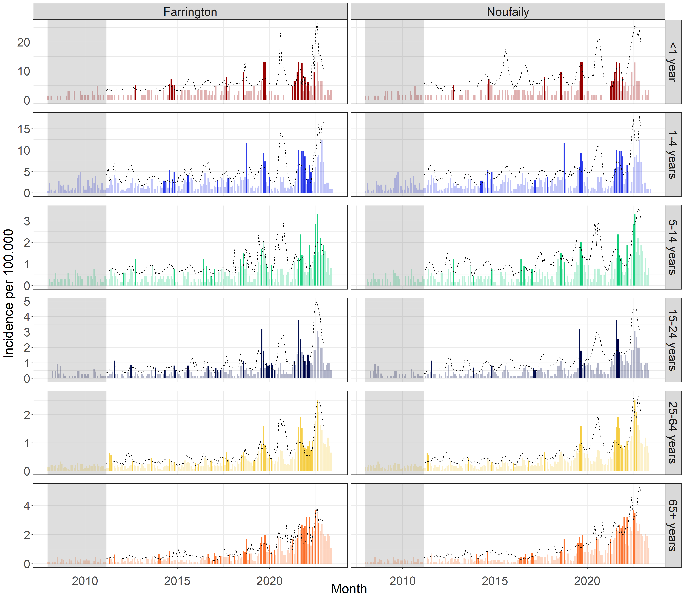
```

Multiple alarms are displayed in Figure \@ref(fig:CompareStateOfTheArtSTEC) for both the Farrington method and the Noufaily method. The Farrington method generates a total of `r STEC_alarms_Farrington %>% summarize(nAlarm = sum(alarm)) %>% .$nAlarm` alarms, while the Noufaily method produces a significantly lower count of `r STEC_alarms_Noufaily %>% summarize(nAlarm = sum(alarm)) %>% .$nAlarm` alarms.

The substantial number of alarms generated by both the Farrington method and the Noufaily method raises valid concerns. The sheer volume of alarms can overwhelm epidemiologists, posing challenges in effectively prioritizing and investigating potential outbreaks. It is crucial to avoid reacting solely to individual alarms and instead consider the bigger picture.

Of particular importance are alarms that are triggered simultaneously in multiple age groups or during concurrent time points. Such patterns indicate potential outbreaks that warrant further attention and investigation by epidemiologists. By analyzing and interpreting the alarms in context, epidemiologists can gain a more comprehensive understanding of the outbreak situation and make informed decisions about resource allocation and intervention strategies.

Furthermore, it is observed that the computed thresholds for both algorithms are inflated towards the end of the series. Specifically, the Noufaily method exhibits a higher threshold compared to the Farrington method. This behavior is expected since the Noufaily method employs a less drastic approach in weighting prior outbreaks, allowing more information to be transmitted from previous outbreaks. As a result, the algorithm may detect fewer outbreaks, leading to a higher threshold for declaring an aberration. This characteristic highlights the different sensitivities of the two methods.

\subsection{Applying the novel outbreak detection algorithm to Shiga toxin (verotoxin)-producing \textit{Escherichia coli}}

The subsequent investigation focuses on the application of the novel outbreak detection algorithm to analyze outbreaks. In this analysis, a rolling window with a width of $k=36$ months is selected. The reference values are established using monthly data collected from January 2008 to December 2010. Subsequently, the time series is monitored using data from January 2011 to December 2022.

To identify outbreaks, an observation is classified as such if the one-step ahead random effect $u_{i{t_1}}$ for the specific age group exceeds the upper bound $U_{t_0}$. The upper bound is determined as the 90\% quantile of the distribution of random effects obtained from the second stage model. This threshold helps identify significant deviations in the outbreak intensity.

To ensure effective monitoring, a series of models for the fixed effects are proposed, with each model building upon the previous one. These models aim to capture different aspects of the disease dynamics and improve the accuracy of outbreak detection.

In the initial model, the intensity $\lambda_{it}$ is assumed to be solely dependent on the age group and the population size $n_{it}$. The model is formulated as:

\begin{equation}\label{eq:Agegroup}
  \log(\lambda_{it}) = \beta(ageGroup_{i}) + \log(n_{it})
\end{equation}

Here, $\beta(ageGroup_{i})$ represents the fixed effect specific to the age group $i$, capturing the age group's influence on the outbreak intensity. The term $\log(n_{it})$ acts as an offset, accounting for the population size at time $t$ for age group $i$.

In the first extension of this initial model, the trend over time across all age groups is incorporated. The extended model is formulated as:

\begin{equation}\label{eq:Trend}
  \log(\lambda_{it})=\beta(ageGroup_{i}) + \beta_{trend} t + \log(n_{it})
\end{equation}

In this model, $\beta_{trend}$ quantifies the rate of change in the outbreak intensity over time. By including this parameter, the model accounts for the overall trend in the outbreak intensity across all age groups, allowing for a more comprehensive analysis of the outbreak dynamics.

In addition to the models described earlier, another model is proposed, which incorporates seasonality into the analysis. This model builds upon the initial model and assumes an annual seasonality pattern. The intensity $\lambda_{it}$ is modeled as follows:

\begin{equation}\label{eq:Seasonality}
\log(\lambda_{it})=\beta(ageGroup_{i})+ \sin \big(\frac{2\pi\cdot \tau_t}{12}\big) \beta_{\sin} + \cos \big(2\frac{\pi\cdot \tau_t}{12}\big) \beta_{\cos} + \log(n_{it})
\end{equation}

In this model, $\tau_t$ represents the time period $t$ within a year, ranging from 1 to 12 (corresponding to the months of January to December). The parameters $\beta_{\sin}$ and $\beta_{\cos}$ capture the effect of the seasonal pattern on the outbreak intensity. By including sine and cosine functions of $\tau_t$, the model accounts for the periodic fluctuations in the outbreak intensity observed throughout the year. This allows for the detection and analysis of seasonality patterns in the outbreak data, providing insights into the seasonal variations in disease occurrence.

In addition to the models described earlier, a final model is proposed that combines both trend and seasonality components. This model builds upon the previous models and includes the effects of both the overall trend over time and the seasonal patterns. The intensity $\lambda_{it}$ is modeled as follows:

\begin{equation}\label{eq:AgegroupTrendSeasonality}
  \log(\lambda_{it})=\beta(ageGroup_{i}) + \beta_{trend} t + \sin \big(\frac{2\pi\cdot \tau_t}{12}\big) \beta_{\sin} + \cos \big(\frac{2\pi\cdot \tau_t}{12}\big)\beta_{\cos} + \log(n_{it})
\end{equation}

The proposed models above are subsequently implemented and estimated in two different modeling frameworks: the hierarchical Poisson Normal model and the hierarchical Poisson Gamma model. The performance of these models is evaluated using the average logarithmic score, $\bar{S}(G,y)$. An excerpt of these results, namely for the models with the lowest logarithmic score, $\bar{S}(G,y)$, for both modeling frameworks, are summarized in Table \@ref(tab:STECNovelTbl). For the full table of results, refer to Table \@ref(tab:STECNovelTblAppendix).


```{r STECNovelTbl, echo=FALSE}
STEC_novel_tbl %>%
  filter(method %in% c("PoisN_ageGroup_trend_seasonality", "PoisG_ageGroup_trend_seasonality")) %>%
  mutate(`95\\% CI` = paste0("[",round(CI.lwr,2),", ",round(CI.upr,2),"]"),
         Model = case_when(
           grepl(pattern = "PoisN_", x = method) ~ "Poisson Normal",
           grepl(pattern = "PoisG_", x = method) ~ "Poisson Gamma"
           ),
         Formula = gsub(pattern = "PoisN_|PoisG_", replacement = "", x = method),
         avgLogS = paste0("$\\bar{S}(G,y)=", round(avgLogS,2),"$"),
         Parameter = case_when(
           Parameter == "ageGroup<1 year" ~ "$\\beta_{<1 year}$",
           Parameter == "ageGroup1-4 years" ~ "$\\beta_{1-4 years}$",
           Parameter == "ageGroup5-14 years" ~ "$\\beta_{5-14 years}$",
           Parameter == "ageGroup15-24 years" ~ "$\\beta_{15-24 years}$",
           Parameter == "ageGroup25-64 years" ~ "$\\beta_{25-64 years}$",
           Parameter == "ageGroup<65 years" ~ "$\\beta_{<65 years}$",
           Parameter == "ageGroup65+ years" ~ "$\\beta_{65+ years}$",
           Parameter == "t" ~ "$\\beta_{trend}$",
           Parameter == "log_sigma" ~ "$\\log(\\sigma)$",
           Parameter == "log_phi" ~ "$\\log(\\phi)$",
           Parameter == "sin(pi/6 * monthInYear)" ~ "$\\beta_{\\sin}$",
           Parameter == "cos(pi/6 * monthInYear)" ~ "$\\beta_{\\cos}$"
         )) %>%
  select(Model, ` ` = avgLogS, Parameter, Estimate = theta, `95\\% CI`) %>%
  kbl(booktabs = TRUE, escape = FALSE, align = "l", longtable = TRUE, caption = "Considering STEC. The average logarithmic score, $\\bar{S}(G, y)$, is computed for all the models described in \\eqref{eq:AgegroupTrendSeasonality} for the rolling window. The parameter estimates at time $t_0$ are also obtained for for both modeling frameworks. Confidence intervals for the parameter estimates are calculated using 95\\% profile likelihood confidence intervals.") %>%
  kable_paper(latex_options = c("repeat_header", "HOLD_position"), repeat_header_method = c("replace")) %>%
  column_spec(1, bold = T) %>%
  collapse_rows(columns = 1:2, 
                row_group_label_position = "stack",
                row_group_label_fonts = row_group_label_fonts,
                latex_hline = "custom",
                valign = "middle",
                custom_latex_hline = 1:2)
```


The models incorporating both trends and seasonality have shown improved performance in terms of lower logarithmic scores, indicating a better fit to the data. As a result, these models have been selected for further investigation regarding their ability to detect outbreaks.

Additionally, it is worth noting that the parameter estimates and confidence intervals for the fixed effects are consistent across the two modeling frameworks, despite the differences in assumptions about the distribution of random effects. This suggests that the choice of modeling framework does not have a substantial impact on the estimation of the fixed effects in this analysis.

Figure \@ref(fig:CompareNovelSTEC) shows the estimated one-step ahead random effects $\hat{u}_{i{t_1}}$ for each age group and the corresponding upper bounds $U_{t_0}$ for both modeling frameworks.

The random effects $u_{i{t_1}}$ represent the deviations from the expected outbreak intensity in the subsequent time period for each age group. These random effects provide information on whether there is an unusual or unexpected increase or decrease in the outbreak intensity compared to the expected values.

The upper bounds $U_{t_0}$ are calculated based on the 90% quantile of the distribution of the random effects obtained from the second stage model. They serve as threshold values to identify potential outbreaks. If the one-step ahead random effects exceed the upper bounds, it suggests a significant deviation from normal variation and indicates a potential outbreak.

By visualizing the one-step ahead random effects and the upper bounds together, epidemiologists can easily identify periods or age groups where the random effects surpass the upper bounds, highlighting potential outbreaks that require further investigation and monitoring.

(ref:CompareNovelSTEC) Estimated one-step ahead random effects $\hat u_{t_1}$ (circles) given the model described in \eqref{eq:AgegroupTrendSeasonality} for STEC in Denmark, 2011-2022. Poisson Normal model (right) and Poisson Gamma model (left) monitor the disease. Alarm raised (solid circle) if $\hat u_{i{t_1}}$ exceeds the threshold $U_{t_0}$ (dashed line).

```{r CompareNovelSTEC, echo=FALSE, out.width="100%", fig.cap="(ref:CompareNovelSTEC)", fig.pos = "H", fig.show = "hold"}
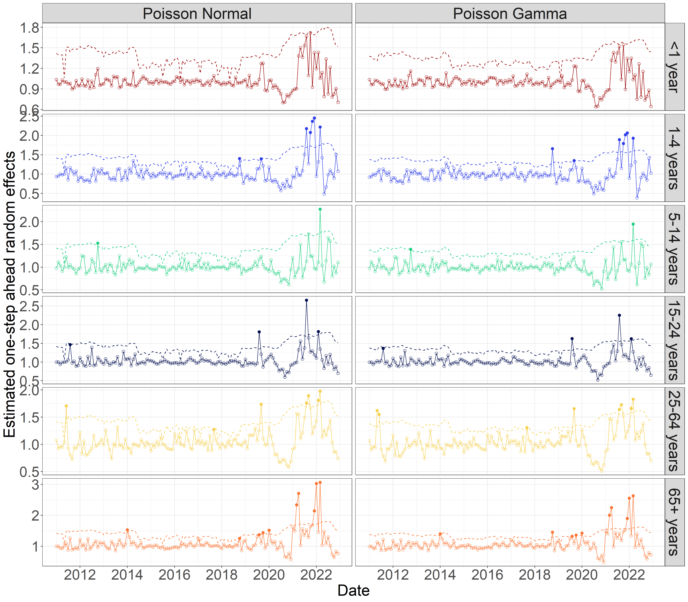
```

A slight, yet consistent, increase in the contribution from the age group to the overall intensity of STEC cases is observed in Figure \@ref(fig:STECnovelparageGroup) over the analyzed period, with only one instance of a decrease in intensity immediately after the 2020 Covid-19 lockdown.

It is worth noting that in the hierarchical Poisson Gamma model, the maximum likelihood estimate for $\hat\beta(ageGroup_i)$ directly represents the contribution of the age group to the disease intensity. This is possible due to the properties of the expected value described in Equation \eqref{eq:meanNB}. However, this direct interpretation does not hold for the parameter estimates obtained in the hierarchical Poisson Normal model Nevertheless, it can be observed that both sets of parameter estimates are similar throughout the entire time period, indicating that this discrepancy is not significant.

(ref:STECnovelparageGroup) Considering STEC in the time period between January 2011 and December 2022. Estimate (solid line) and 95% profile likelihood confidence interval (dashed line) of $\hat\beta(ageGroup_i)$ for the models given in Equation \eqref{eq:AgegroupTrendSeasonality} estimated using the rolling window with a width of $k=36$ months. 

```{r STECnovelparageGroup, echo=FALSE, out.width="100%", fig.cap="(ref:STECnovelparageGroup)", fig.pos = "H", fig.show = "hold"}
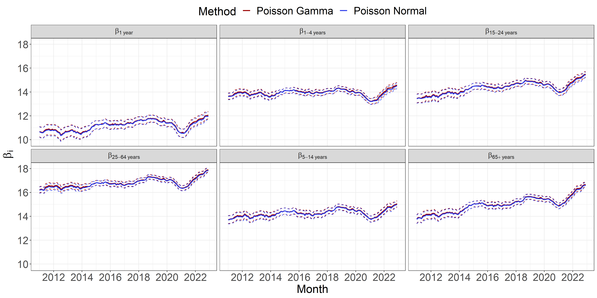
```

For the most, the maximum likelihood estimate for $\hat\beta_{trend}$ indicates a positive trend during the observed period (See Figure \@ref(fig:STECnovelpartrend)). However, it is important to note that the trend is not consistently statistically significant. The first significant positive trend is observed in the mid-2014, lasting until 2016. Another significant positive trend is observed in 2018, coinciding with the transition from a culture-based diagnostic method to a PCR method in most departments of clinical microbiology [@Svendsen_2023].

Notably, a significant drop in the trend is observed in the mid-2020, immediately after the Covid-19 lockdown, lasting until the mid-2021. Since then, the trend has been steadily increasing and is currently at an all-time high.

(ref:STECnovelpartrend) Considering STEC in the time period between January 2011 and December 2022. Estimates (solid line) and 95% profile likelihood confidence intervals (dashed line) of $\hat\beta_{trend}$ for the models given in Equation \eqref{eq:AgegroupTrendSeasonality} estimated using the rolling window with a width of $k=36$ months..

```{r STECnovelpartrend, echo=FALSE, out.width="100%", fig.cap="(ref:STECnovelpartrend)", fig.pos = "H", fig.show = "hold"}
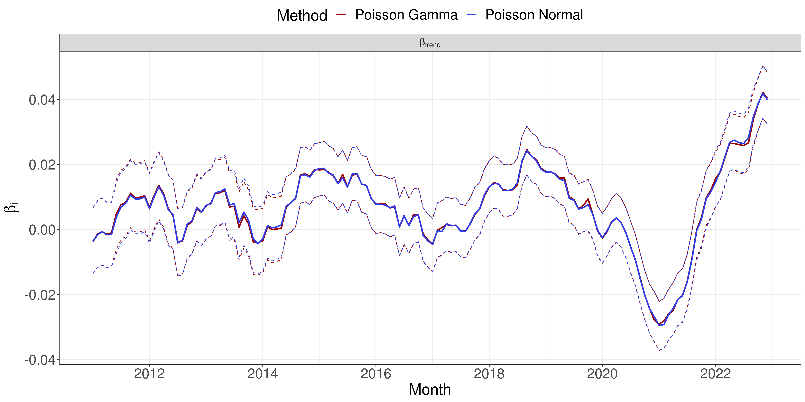
```


From Figure \@ref(fig:STECnovelparseasonality), it is evident that there is a pronounced and statistically significant seasonality in the observed period. Additionally, it is noteworthy that the amplitude of the seasonal component varies over time. Specifically, there is an increase in the amplitude of the seasonal pattern after 2018, coinciding with the introduction of a PCR method for diagnostics. This change in diagnostic practices may have influenced the detection and reporting of STEC cases, leading to a seemingly intensified seasonal pattern in the data. However, it is most likely due to a change in the observational bias, as the PCR method is more sensitive than previous methods used. The varying amplitude emphasizes the importance of considering temporal changes and external factors when modeling and interpreting disease outbreak data.

(ref:STECnovelparseasonality) Considering STEC in the time period between January 2011 and December 2022. Estimates (solid line) and 95% profile likelihood confidence intervals (dashed line) of $\hat\beta_{\cos}$ and $\hat\beta_{\sin}$ for the models given in Equation \eqref{eq:AgegroupTrendSeasonality} estimated using the rolling window with a width of $k=36$ months..

```{r STECnovelparseasonality, echo=FALSE, out.width="100%", fig.cap="(ref:STECnovelparseasonality)", fig.pos = "H", fig.show = "hold"}
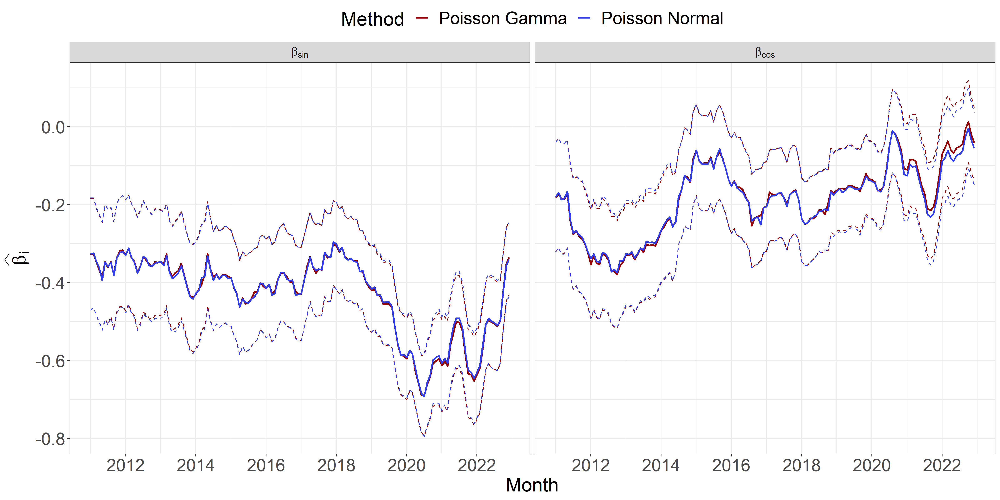
```

The estimated variance $\hat{\sigma}$ for the hierarchical Poisson Normal model and the estimated dispersion $\hat{\phi}$ for the hierarchical Poisson Gamma model are visualized in Figure \@ref(fig:STECnovelparseaDispersion). These parameters provide insights into the variability of the random effects and play a crucial role in determining the threshold for detecting outbreaks. The values of $\hat{\sigma}$ and $\hat{\phi}$ help assess the magnitude of deviations from the expected outbreak intensity and aid in distinguishing significant aberrations from normal fluctuations in the data

(ref:STECnovelparseaDispersion) Estimates (solid line) and 95\% profile likelihood confidence intervals (dashed line) of $\hat\phi$ and $\hat\sigma$ are shown using a rolling window with a width of $k=36$ months for the time period between January 2011 and December 2022 for STEC.

```{r STECnovelparseaDispersion, echo=FALSE, out.width="100%", fig.cap="(ref:STECnovelparseaDispersion)", fig.pos = "H", fig.show = "hold"}
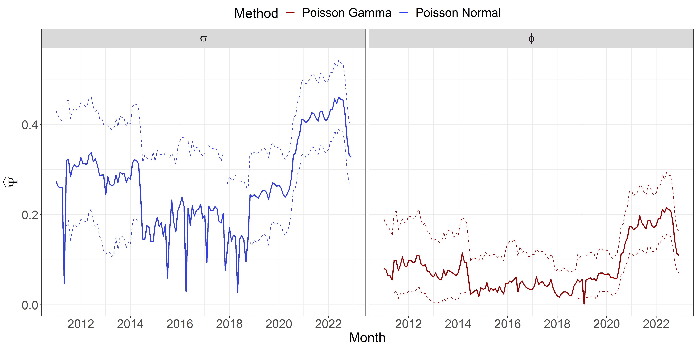
```

It should be noted that the inability of the second stage model parameters ($\sigma$ or $\phi$) to converge during certain periods does not affect the performance of the outbreak detection algorithms. These periods typically correspond to time periods with relatively few cases, indicating no outbreaks, and the data show no overdispersion. In such cases, the time series can be adequately modeled by a Poisson distribution, and therefore the second stage model is not informed. This observation is particularly relevant in the next case study, which focuses on LIST and provides a more explicit example of this scenario.

\section{\textit{Listeriosis}}

Intuitively, it is not common to employ statistical methods for monitoring and detecting outbreaks of LIST. The current state-of-the-art approach for detecting outbreaks of this disease relies on laboratory-based methods, specifically WGS. WGS enables epidemiologists to link cases that have occurred over an extended period, even months or years apart, and identify them as part of a continuous-source outbreak. Statistical methods may face challenges in detecting such outbreaks due to their complex and prolonged nature. However, it is crucial to include this case study in the master's thesis to highlight both the strengths and limitations of the proposed method.

The data set used in this case study consists of monthly counts of Danish LIST cases, denoted as $y_{it}$. The subscript $i$ distinguishes between two age groups, with $i=1$ representing the age group below 65 years and $i=2$ representing the age group above 65 years. The subscript $t$ represents the time period, ranging from $t=1,\cdots,T$, where $T=180$ corresponds to the total number of months starting in 2008.

Both the state-of-the-art outbreak detection algorithm and the novel outbreak detection algorithm are applied to this data set.

\subsection{Applying the state-of-the-art outbreak detection algorithm to \textit{Listeriosis}}

Firstly, outbreak detection using the Farrington method and the Noufaily method is investigated. For this analysis, the reference values for the analysis are based on data from January 2008 to February 2011. Subsequently, surveillance is conducted using the data from March 2011 to December 2022. 

The resulting series is visualized in Figure \@ref(fig:CompareStateOfTheArtLIST). 

(ref:CompareStateOfTheArtLIST) Estimated one-step ahead random effects $\hat u_{t_1}$ (circles) given the model described in \eqref{eq:Agegroup} for LIST in Denmark, 2011-2022. Poisson Normal model (right) and Poisson Gamma model (left) monitor the disease. Alarm raised (solid circle) if $\hat u_{t_1}$ exceeds the threshold $U_{t_0}$ (dashed line).

```{r CompareStateOfTheArtLIST, echo=FALSE, out.width="100%", fig.cap="(ref:CompareStateOfTheArtLIST)", fig.pos = "H", fig.show = "hold"}
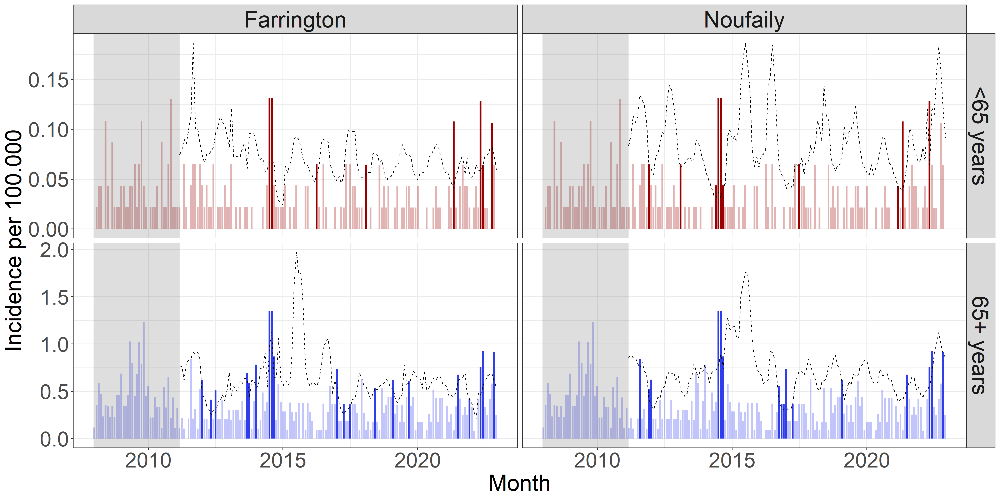
```

In Figure \@ref(fig:CompareStateOfTheArtLIST), multiple alarms can be observed for both the Farrington method and the Noufaily method. The Farrington method triggers a total of `r LIST_alarms_Farrington %>% summarize(nAlarm = sum(alarm)) %>% .$nAlarm` alarms, while the Noufaily method produces slightly fewer alarms, specifically `r LIST_alarms_Noufaily %>% summarize(nAlarm = sum(alarm)) %>% .$nAlarm` alarms.

Interestingly, both the Farrington method and the Noufaily method demonstrate the ability to correctly raise alarms during ongoing outbreak investigations by SSI. One notable example is the outbreak investigated by SSI, which involved 41 cases and resulted in 17 deaths. The Farrington method successfully flags this event in September 2013, with alarms occurring sporadically in the subsequent period. The Noufaily method also identifies this outbreak, although it does so one month later in October 2013.

It is worth noting that the other observations flagged by the methods may be related to some of the numerous other long-spanned outbreaks that occurred concurrently in the period from 2016 to 2021. However, it is out of scope for this master's thesis, to directly link individual alarms to specific outbreaks. For a full list over the observations flagged by the state-of-the-art outbreak detection algorithms see Table \@ref(tab:LISTStateOfTheArtTbl).

\subsection{Applying the novel outbreak detection algorithm to \textit{Listeriosis}}

For this disease, it is found that the constant age group model for the fixed effects described in \eqref{eq:Agegroup} yields the lowest average logarithmic score, $\bar S(G.y)$. Therefore, it is not recommended to include trends, seasonalities, or both in the modeling of this disease.

The one-step ahead random effects $\hat u_{i{t_1}}$ for the disease are depicted in Figure \@ref(fig:CompareNovelLIST). It is evident that the models struggle to accurately capture the underlying process of the disease. There are prolonged periods where the random effects collapse, indicating that there is insufficient information in the data to inform the second stage model. This is particularly noticeable in the hierarchical Poisson Normal model, where the estimate of the variance parameter $\hat\sigma$ approaches zero.

However, as mentioned earlier, the periods during which the model parameters ($\hat\sigma$ or $\hat\phi$) fail to converge coincide with periods where it is not feasible to obtain statistical evidence for an ongoing outbreak. This is because these periods are characterized by a relatively low number of cases, but more importantly, the absence of overdispersion in the data.

Additionally, it is worth noting that both modeling frameworks identify the same observations as outbreaks, all of which coincide with one or more concurrent outbreaks investigated by SSI. The first two observations characterized as outbreaks occur in August and September 2014. The third outbreak is in January 2017, and the last two outbreaks are in June and November 2022.

(ref:CompareNovelLIST) Estimate one-step ahead random effects $\hat u_{t_1}$ (circles) given the model described in \eqref{eq:Agegroup} of LIST in Denmark, 2011-2022, as circles. Poisson Normal model (top) and Poisson Gamma model (bottom) monitor the disease. Alarm raised (solid circle) if $\hat u_{t_1}$ exceeds the threshold $U_{t_0}$ (dashed line).

```{r CompareNovelLIST, echo=FALSE, out.width="100%", fig.cap="(ref:CompareNovelLIST)", fig.pos = "H", fig.show = "hold"}
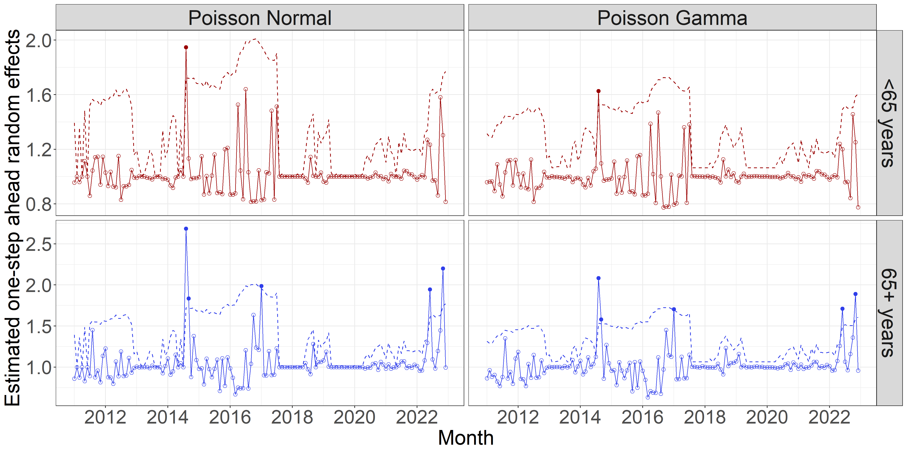
```

To further investigate the lack of convergence in the model, the mean and variance of the series are visualized in Figure \@ref(fig:LISTmeanAndStandardDeviation) using a rolling window approach. The width of the rolling window is set to be the same as the parameter estimation window, which is 36 months in this case.

(ref:LISTmeanAndStandardDeviation) Placeholder caption

```{r LISTmeanAndStandardDeviation, echo=FALSE, out.width="100%", fig.cap="(ref:LISTmeanAndStandardDeviation)", fig.pos = "H", fig.show = "hold"}
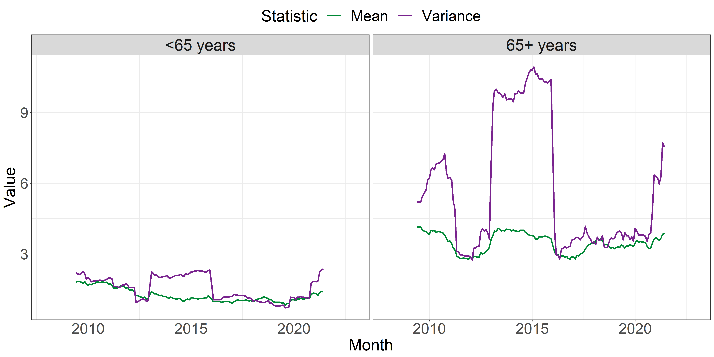
```

It is evident that there are prolonged periods in the sample window where overdispersion is absent. The range of the window with overdispersion is directly influenced by the chosen window size, and even a small number of observations can introduce significant overdispersion into the data, thereby informing the second stage model.

It is important to emphasize that the periods with overdispersion are of particular interest in this master's thesis and in disease outbreak detection. These periods are where outbreaks are expected to be observed, as they are directly defined by their aberrant counts, and can not be modeled adequately by a Poisson distribution alone.

\section{\textit{Shiggellosis}}

In Denmark, the surveillance of SHIL involves both individual notifications and the laboratory notification system. The data from the laboratory notification system is generally preferred, as it often includes information about the specific type of \textit{Shigella} bacteria. In Denmark, the majority of SHIL infections are caused by \textit{Shigella sonnei}. However, for the purpose of this master's thesis, all four types of \textit{Shigella} bacteria are analyzed collectively, regardless of the availability of type-specific information in the data.

In this case study, both the state-of-the-art and novel oubteak detection algorithms are applied to the SHIL data set. The data set comprises monthly counts of Danish SHIL cases, denoted as $y_{it}$. The subscript $i$ distinguishes between two age groups, namely $i=1$ representing the age group below 25 years and $i=2$ representing the age group above 25 years. The subscript $t$ represents the time period, ranging from $t=1,\cdots,T$, where $T=180$ corresponds to the total number of months starting in 2008.

\subsection{Applying the state-of-the-art outbreak detection algorithm to \textit{Shigellosis}}

Outbreak detection utilizing the state-of-the-art outbreak algorithms are performed on the data set. The reference values for the analysis are based on data ranging the period from January 2008 to February 2011. Hereafter, surveillance is conducted using the data from March 2011 to December 2022.

In Figure \@ref(fig:CompareStateOfTheArtSHIL), a significant number of alarms are observed sporadically in the time series for both methods. For the Farrington method, the number of alarms is `r SHIL_alarms_Farrington %>% summarize(nAlarm = sum(alarm)) %>% .$nAlarm`, while for the Noufaily method, the number of alarms is `r SHIL_alarms_Noufaily %>% summarize(nAlarm = sum(alarm)) %>% .$nAlarm`.

(ref:CompareStateOfTheArtSHIL) Monthly SHIL incidence per 100.000 in Denmark, 2008-2022. Monitored by (left) Farrington and (right) Noufaily method. Reference data for the estimation of model parameters from January 2008 to March 2011 (grey area). Threshold (dashed line) is computed for observations time points outside reference data. Alarm triggered (full opacity) if observations exceeds threshold. 

```{r CompareStateOfTheArtSHIL, echo=FALSE, out.width="100%", fig.cap="(ref:CompareStateOfTheArtSHIL)", fig.pos = "H", fig.show = "hold"}
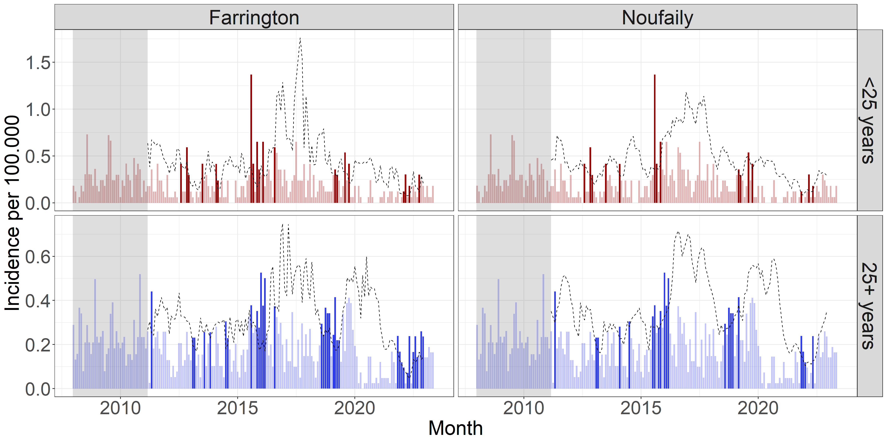
```

It is worth noting that some of these alarms occur in clusters over a specific time period and are raised simultaneously in both age groups. This clustering is particularly evident in the period from July 2015 to August 2016, where multiple alarms are observed. However, it is important to consider that the threshold for detection during this period is relatively low due to the very few cases reported up to that point. Therefore, these alarms may be an artifact of the method used rather than indicative of true outbreaks. Atleast, no outbreaks were investigated by SSI in the same period. 

Another cluster is forming towards the end of the series.


\subsection{Applying the novel outbreak detection algorithm to \textit{Shigellosis}}


For this disease, it is found that including a trend in the model results in the lowest logarithmic score $\bar S(G,y)$ for both modeling frameworks. Therefore, the analysis is continued using the formula described in \eqref{eq:Trend}.

The one-step ahead random effects $u_{i{t_1}}$ are depicted in Figure \@ref(fig:CompareNovelSHIL). It is observed that the hierarchical Poisson Normal model generates two additional alarms in the age group below 25 years compared to the hierarchical Poisson Gamma model. However, it can be seen that the corresponding random effects in the latter model are borderline significant.

(ref:CompareNovelSHIL) One-step ahead random effects $\hat u_{t_1}$ of SHIL in Denmark, 2011-2022, as circles. Poisson Normal model (top) and Poisson Gamma model (bottom) monitor the disease. Alarm raised (solid circle) if $\hat u_{t_1}$ exceeds the threshold $U_{t_0}$ (dashed line).

```{r CompareNovelSHIL, echo=FALSE, out.width="100%", fig.cap="(ref:CompareNovelSHIL)", fig.pos = "H", fig.show = "hold"}
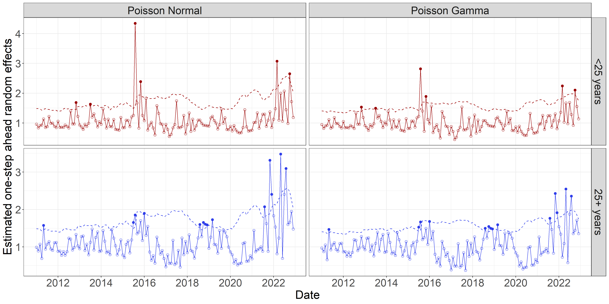
```

It is worth noting that the novel outbreak detection algorithms identify significantly fewer alarms compared to the state-of-the-art outbreak detection algorithm. However, they still detect some alarms in the same time periods.

\section{\textit{Salmonellosis}}

The data set utilized in this case study comprises monthly counts of Danish salmonella cases, denoted as $y_{it}$. The subscript $i$ differentiates between the six age groups $i=1,\dots,6$. The subscript $t$ represents the time period, ranging from $t = 1,\cdots, T$, where $T = 180$ corresponds to the total number of months starting in 2008.

Both the state-of-the-art outbreak detection algorithm and the novel outbreak detection algorithm are applied to this data set.

\subsection{Applying the state-of-the-art outbreak detection algorithm to \textit{Salmonellosis}}

WRITE HERE

(ref:CompareStateOfTheArtSALM) Monthly SALM incidence per 100.000 in Denmark, 2008-2022. Monitored by (left) Farrington and (right) Noufaily method. Reference data for the estimation of model parameters from January 2008 to March 2011 (grey area). Threshold (dashed line) is computed for observations time points outside reference data. Alarm triggered (full opacity) if observations exceeds threshold. 

```{r CompareStateOfTheArtSALM, echo=FALSE, out.width="100%", fig.cap="(ref:CompareStateOfTheArtSALM)", fig.pos = "H", fig.show = "hold"}
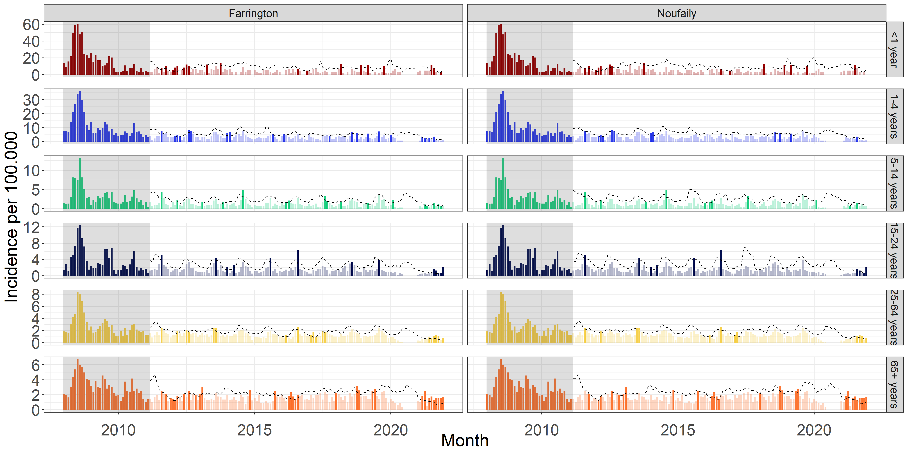
```

\subsection{Applying the novel outbreak detection algorithm to \textit{Salmonellosis}}

WRITE HERE

(ref:CompareNovelSALM) Estimated one-step ahead random effects $\hat u_{t_1}$ of SALM in Denmark, 2011-2022, as circles. Poisson Normal model (top) and Poisson Gamma model (bottom) monitor the disease. Alarm raised (solid circle) if $\hat u_{t_1}$ exceeds the threshold $U_{t_0}$ (dashed line).

```{r ref:CompareNovelSALM, echo=FALSE, out.width="100%", fig.cap="(ref:CompareNovelSALM)", fig.pos = "H", fig.show = "hold"}
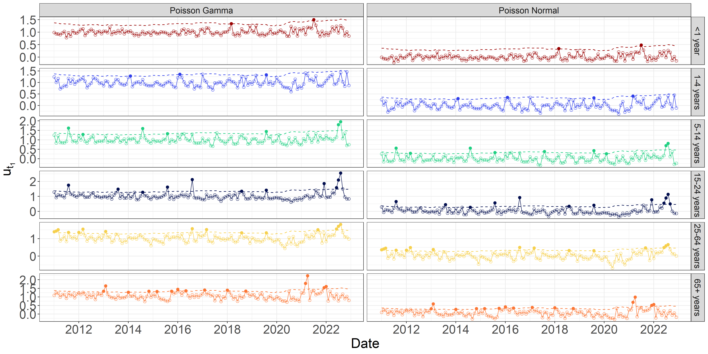
```


\section{Performance comparison of novel methods}

(ref:CompareAlarmsSTEC) Alarm plot displaying alarms for Shiga toxin (verotoxin)-producing \textit{Escherichia coli} time series using four different algorithms, along with outbreaks investigated by SSI.

```{r CompareAlarmsSTEC, echo=FALSE, out.width="100%", fig.cap="(ref:CompareAlarmsSTEC)", fig.pos = "H", fig.show = "hold"}
knitr::include_graphics("../figures/Compare_alarms_STEC.png")
```

WRITE HERE

(ref:CompareAlarmsLIST) Alarm plot displaying alarms for LIST time series using four different algorithms, along with outbreaks investigated by SSI.

```{r CompareAlarmsLIST, echo=FALSE, out.width="100%", fig.cap="(ref:CompareAlarmsLIST)", fig.pos = "H", fig.show = "hold"}
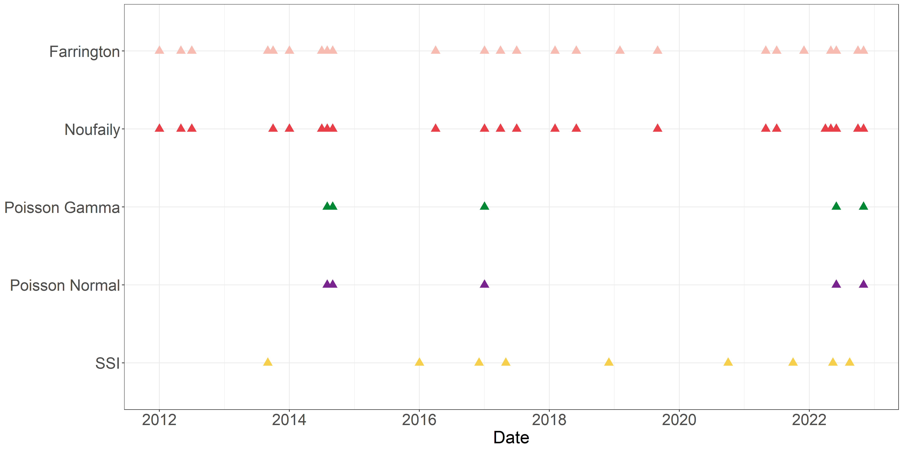
```

WRITE HERE

(ref:CompareAlarmsSHIL) Alarm plot displaying alarms for SHIL time series using four different algorithms, along with outbreaks investigated by SSI.

```{r CompareAlarmsSHIL, echo=FALSE, out.width="100%", fig.cap="(ref:CompareAlarmsSHIL)", fig.pos = "H", fig.show = "hold"}
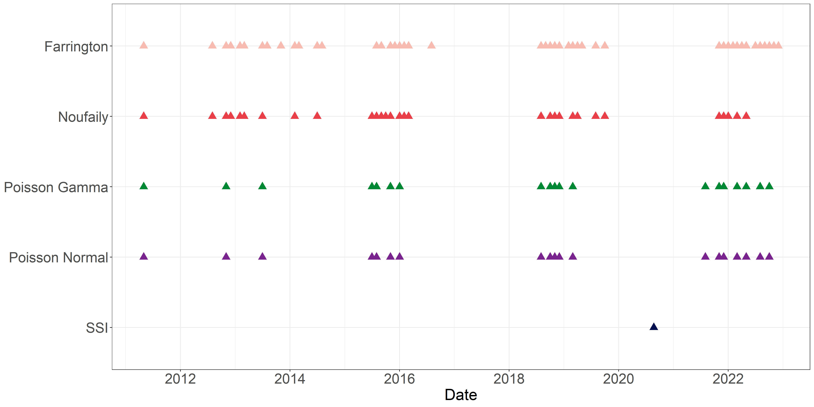
```

WRITE HERE

(ref:CompareAlarmsSALM) Alarm plot displaying alarms for SALM time series using four different algorithms, along with outbreaks investigated by SSI.

```{r CompareAlarmsSALM, echo=FALSE, out.width="100%", fig.cap="(ref:CompareAlarmsSALM)", fig.pos = "H", fig.show = "hold"}
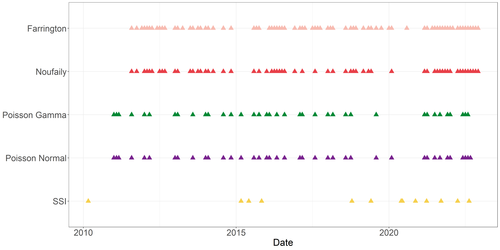
```

INCLUDE A TABLE THAT SUMMARIZES THESE RESULTS. AN IDEA IS TO CALCULATE A CONFUSION MATRIX!

\cleardoublepage


<!--chapter:end:Chapters/05-Cases.Rmd-->

\chapter{Simulation study}

In this chapter, comprehensive simulations are performed to assess the performance of the novel outbreak detection algorithm in comparisons to the state-of-the-art outbreak detection algorithms. The simulations cover a variety of contrasting scenarios adapted from the study by @Noufaily_2013. However, for the purpose of this master's thesis, the focus is not on diseases with bi-annual seasonality. Therefore, the scenarios involving bi-annual seasonality are excluded from the simulation study.

\section{The simulated baseline data}

The simulated baseline data is generated using a negative binomial model with a mean parameter $\mu$ and a variance parameter $\phi\mu$. The dispersion parameter $\phi$ is assumed to be greater than or equal to 1. The mean $\mu(t)$ is defined by a linear predictor that includes a trend component and a seasonality component represented by Fourier terms.

The equation for $\mu(t)$ is given as:

\begin{equation}
\mu(t)=\exp\left(\theta+\beta_t+\sum_{j=1}^m \left(\gamma_1 \cos\left(\frac{2\pi jt}{52}\right) + \gamma_2 \sin \left(\frac{2\pi jt}{52} \right)\right)\right)
\end{equation}

In this equation, $m$ represents the number of Fourier terms used to model seasonality. When $m=0$, it indicates the absence of seasonality, while $m=1$ corresponds to annual seasonality.

To cover a wide range of data sets encountered in practical applications, 28 different parameter combinations are generated. These combinations vary in terms of trends (represented by different values of $\beta$), seasonalities (represented by different values of $\gamma_1$ and $\gamma_2$), baseline frequencies of reports (represented by different values of $\theta$), and dispersion (represented by different values of $\phi$). The specific parameter values for the 28 scenarios are provided in Table \@ref(tab:scenariosTbl).

```{r scenariosTbl, echo=FALSE}

scenarios %>%
  mutate(Scenario = row_number()) %>%
  select(Scenario, theta, beta, gamma1, gamma2, phi, m, trend) %>%
  rename(`$\\theta$` = theta, `$\\beta$` = beta, `$m$` = m, `$\\phi$` = phi, `$\\gamma_1$` = gamma1, `$\\gamma_2$` = gamma2, Trend = trend) %>%
  kbl(booktabs = TRUE, escape = FALSE, align = "l", longtable = TRUE, caption = "Parameters and criteria utilized to generate the 28 scenarios.",
      linesep = c(rep("", 3), "\\addlinespace")) %>%
  kable_paper(latex_options = c("repeat_header", "HOLD_position"), repeat_header_method = c("replace"))

```


To simulate the baseline data without outbreaks, 100 replicates are generated for each of the 28 parameter scenarios. Each replicate consist of a time series of size $T=624$ weeks. 

The 624 weeks are divided into three periods: 1-313 are used as training weeks for the adaptive re-weighting schemes, weeks 313-575 are considered as baseline weeks, and weeks 576-624 are designated as the "current" weeks for evaluation. 

The simulation results are based on the "current" weeks of all the replicates, totaling $100\times 49=4900$ replicates, for each of the 28 data scenarios and each method investigated.S

(ref:Realizations) Insert some realization examples

```{r Realizations, echo=FALSE, out.width="100%", fig.cap="(ref:Realizations)", fig.pos = "H", fig.show = "hold"}

knitr::include_graphics("../figures/Placeholder.png")

```


\section{The simulated outbreaks}

The outbreaks starting in week $t$ are simulated using the following procedure. First, a constant value $k$ is chosen. The size of the outbreak, denoted as $n$, is then generated randomly from a Poisson distribution with a mean equal to $k$ times the standard deviation of the baseline count at time $t$.

Next, the outbreak is distributed randomly in time according to a log-normal distribution with a mean of 0 and a standard deviation of 0.5, represented as $Z \sim \LN(0,0.5^2)$. This is achieved by drawing $n$ random numbers from the log-normal distribution, which correspond to the outbreak size, and then rounding down these numbers to the nearest integer, denoted as $\lfloor \boldsymbol{z} \rfloor$.

The probability density function for the log-normal distribution is visualized in Figure \@ref(fig:PDFLogNormal).

(ref:PDFLogNormal) Placeholder caption

```{r PDFLogNormal, echo=FALSE, out.width="100%", fig.cap="(ref:PDFLogNormal)", fig.pos = "H", fig.show = "hold"}

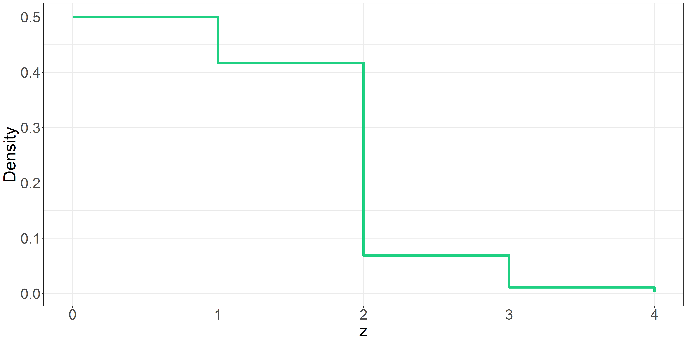

```

Typically, outbreak durations of 2-8 weeks are observed when values of $k$ are in the range of 2-10. To simulate the outbreaks, the outbreak cases are added to the baseline count in week $t+z_i$, where $t$ represents the start time of the outbreak and $z_i$ represents the number of weeks after the start of the outbreak. The start and end times of the outbreaks are recorded for evaluating the performance of the methods.

To simulate outbreaks, the following procedure is followed:

\begin{itemize} 
\item \textit{Outbreaks in baseline weeks.} For each data series, four outbreaks are generated. The start time of each outbreak is randomly selected from the baseline weeks (weeks 313-575). The value of $k$ is sampled randomly with replacement from the set $\{2, 3, 5, 10\}$. It should be noted that different outbreaks are generated for each of the 2800 runs.
\item \textit{Outbreaks in current weeks.} For each data series, one outbreak is generated. The start time of the outbreak is randomly chosen from the last 49 weeks (weeks 576-624). The value of $k$ is sampled randomly in the range of 1 to 10. Similar to the previous case, different outbreaks are generated for each of the 2800 runs.
\end{itemize}

\section{Evaluation measures}

To evaluate the performance of the detection system, various measures are used to assess its effectiveness in both the absence and presence of current outbreaks. These measures are designed to capture meaningful quantities in the given context.

In scenarios where no outbreaks occur in the baselines, the False Positive Rate (FPR) is calculated for each of the 28 scenarios. The FPR is determined as the proportion of the current 49 weeks and 100 replicates in which the observed value exceeds the threshold, assuming no current outbreaks during those weeks.

To evaluate the impact of outbreaks in the baselines, the FPR is calculated in a similar manner, but only for the current weeks that coincide with at least one baseline week containing an outbreak.

The probability of detecting an outbreak (POD), also known as power, is calculated for each of the 28 scenarios. The algorithm is applied iteratively for the 49 current weeks, and an outbreak is considered detected if the observed value exceeds the threshold at least once within the start and end times of the outbreak. The POD is then determined as the proportion of outbreaks detected out of the 100 runs. There are no restrictions on the calculation when evaluating the impact of outbreaks in the baselines.

It is important to note that the FPR is a rate per week, while the POD is a rate per outbreak. These evaluation measures are chosen because they provide insights into the performance of the detection system on individual time series.

\section{Results of the simulations}

(ref:FPR) Insert FPR plot

```{r FPR, echo=FALSE, out.width="100%", fig.cap="(ref:FPR)", fig.pos = "H", fig.show = "hold"}

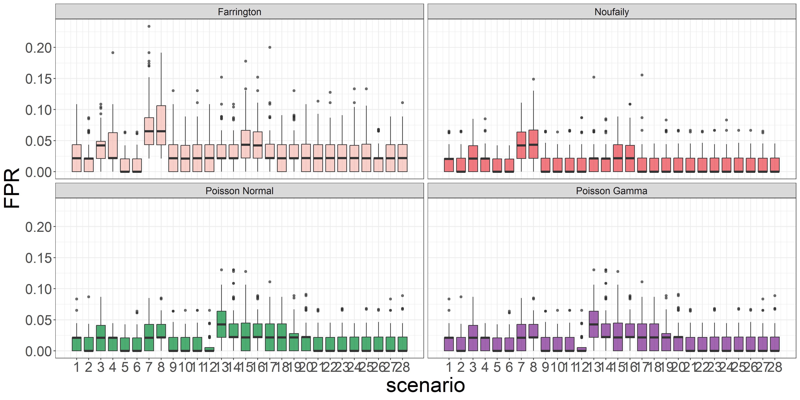

```


(ref:PropDetect) Placeholder caption

```{r PropDetect, echo=FALSE, out.width="100%", fig.cap="(ref:PropDetect)", fig.pos = "H", fig.show = "hold"}

knitr::include_graphics("../figures/PropDetect.png")

```


\cleardoublepage

<!--chapter:end:Chapters/06-Simulation.Rmd-->

\chapter{Discussion}

\blindtext

In the future, the utilization of MiBa-based surveillance has immense potential for disease surveillance. It has already demonstrated its value in various surveillance systems, such as the Healthcare-Associated Infections Database (HAIBA) for monitoring hospital-acquired infections and the COVID-19 surveillance system.

HAIBA, launched in 2015, was the first fully automated surveillance system built on MiBa data. It provides monitoring capabilities for hospital-acquired infections, enabling healthcare professionals to track and manage these infections more effectively. Similarly, the COVID-19 surveillance system, developed during 2020 and 2021, utilizes MiBa data to monitor and respond to the COVID-19 pandemic.

In addition to these systems, MiBa-based surveillance includes monitoring respiratory infections (such as influenza, pertussis, Mycoplasma pneumonia, and respiratory syncytial virus) and sexually transmitted diseases like chlamydia. While these surveillance systems currently have partial automation in data processing, there are plans to fully automate them in the near future.

Expanding on the field of automated disease outbreak detection is crucial to fully harness the potential of MiBa. By developing advanced algorithms and methodologies, it becomes possible to automatically analyze MiBa data and detect disease outbreaks in a timely manner. This can lead to early identification of outbreaks, allowing for prompt interventions and preventive measures.

Further research and development in automated disease outbreak detection, specifically tailored to leverage MiBa data, can significantly enhance our ability to detect and respond to infectious disease outbreaks more proactively and efficiently. By maximizing the potential of MiBa-based surveillance and continuously improving automated detection methods, we can strengthen our overall disease surveillance efforts and better protect public health.

...

One potential extension of the novel outbreak detection method proposed in this master's thesis is the incorporation of correlation, either in time or between groups. 

(ref:ACF) Maybe include an ACF plot of one of the disease investigated in this masters thesis, to highlight the correlation in time.

```{r ACF, echo=FALSE, out.width="100%", fig.cap="(ref:ACF)", fig.pos = "H", fig.show = "hold"}
knitr::include_graphics("../figures/Placeholder.png")
```

This extension can be readily implemented within the framework of the hierarchical Poisson Normal model. However, the implementation in the hierarchical Poisson Gamma model is more complex and requires further investigation.

\cleardoublepage

<!--chapter:end:Chapters/07-Discussion.Rmd-->

\chapter{Conclusion}

\blindtext

\cleardoublepage

<!--chapter:end:Chapters/08-Conclusion.Rmd-->

\printbibliography[heading=bibintoc,title={Bibliography}]
\cleardoublepage 
\appendix

\chapter{Some probability functions}

This chapter serves as a reference, specifying notation, properties, and moments related to the various distributions used in this master thesis.

\begin{table}[h!]
\centering
  \resizebox{\textwidth}{!}{\begin{tabular}{m{0.12\textwidth}m{0.2\textwidth}m{0.50\textwidth}m{0.09\textwidth}m{0.09\textwidth}}
    \toprule
    Name & Support & Density & $\E[Y]$ & $\V[Y]$ \\
    \midrule
    Poisson \newline $\Pois(\lambda)$ & $0, 1, 2,\dots$ \newline $\lambda \in \mathbb{R}_{+}$ & $\frac{\lambda^{y}}{y!}\exp(-\lambda)$ & $\lambda$ & $\lambda$ \\
    \midrule
    Gamma \newline $\G(\alpha,\beta)$ & $\mathbb{R_{+}}$ \newline $\alpha \in \mathbb{R}_{+}, \beta \in \mathbb{R}_{+}$ & $\frac{1}{\Gamma(\alpha)\beta}\Big(\frac{y}{\beta}\Big)^{\alpha-1}\exp(-y/\beta)$ & $\alpha\beta$ & $\alpha\beta^2$ \\
    \midrule
    Neg. Bin. \newline $\NB(r,p)$ & $0, 1, 2,\dots$ \newline $r\in\mathbb{R}_+, p \in]0,1]$ & $\begin{pmatrix} r+y-1 \\ y \end{pmatrix} p^r(1-p)^y$ & $\frac{r(1+p)}{p}$ & $\frac{r(1-p)}{p^2}$ \\
    \midrule
    Normal \newline $\N(\mu, \sigma^2)$ & $\mathbb{R}$ \newline $\mu\in\mathbb{R}, \sigma^2\in\mathbb{R}_+$ & $\frac{1}{\sigma\sqrt{2\pi}}\exp\Big(-\frac{(y-\mu)^2}{2\sigma^2}\Big)$ & $\mu$ & $\sigma^2$ \\
    \bottomrule
  \end{tabular}}
  \caption{Density, support, mean value, and variance for a number of distributions used in this master thesis.}
  \label{table:probabilityFunctions}
\end{table}


\chapter{C++ templates for the negative joint log-likelihood}\label{cpp}

This chapter presents the user templates for the hierarchical Poisson Normal model in \eqref{eq:PoisN} and the hierarachical Poisson Gamma model in \eqref{eq:PoisGam}.

The user template for the hierarchical Poisson Normal model specified in \eqref{eq:PoisN} is

```{Rcpp, eval=FALSE}
#include <TMB.hpp>
template<class Type>
Type objective_function<Type>::operator() ()
{
  // R input data
  DATA_VECTOR(y);                               // Count data
  DATA_VECTOR(x);                               // Population size
  DATA_MATRIX(X);                               // Design matrix
  PARAMETER_VECTOR(u);                          // Random effects
  // Parameters
  PARAMETER_VECTOR(beta);                       // Fixed effects parameters
  PARAMETER(log_sigma_u);                       // Model parameter
  vector<Type> lambda  = exp(X*beta-log(x)+u);  // Construct 'lambda'
  Type sigma_u = exp(log_sigma_u);              // And the model parameters
  Type mean_ran = Type(0);
  // Objective function
  Type f = 0;                                   // Declare the objective
  f -= sum(dnorm(u,mean_ran,sigma_u,true));     // Calculate the objective
  f -= sum(dpois(y,lambda,true));               // Calculate the objective
  return f;
}
```

The user template for the hierarchical Poisson Gamma model specified in \eqref{eq:PoisGam} is

```{Rcpp, eval=FALSE}
#include <TMB.hpp>
template<class Type>
Type objective_function<Type>::operator() ()
{
  // Data
  DATA_VECTOR(y);                             // Count data
  DATA_VECTOR(x);                             // Population size
  DATA_MATRIX(X);                             // Design matrix
  // Parameters
  PARAMETER_VECTOR(beta);                     // Fixed effects parameters
  PARAMETER(log_phi_u);                       // Model parameter
  vector<Type> lambda  = exp(X*beta-log(x));  // Construct 'lambda'
  Type phi_u = exp(log_phi_u);                // And the model parameters
  Type r = 1/phi_u;                           // Construct the size
  vector<Type> p = 1/(lambda*phi_u+1);        // And the prob. parameter
  // Objective function
  Type f = -sum(dnbinom(y, r, p,true));       // Calculate the objective
  return f;
}
```

\chapter{State-of-the-art detection algorithm}

\section{Controls}\label{controlsStateOfTheArt}

In the function `farringtonFlexible`, users can select either the original Farrington method or the improved method by Noufaily by specifying the appropriate `control` arguments. The choice of algorithm variant is determined by the contents of the `control` slot. In the example provided, `con.farrington` indicates the use of the original method, while `con.noufaily` represents the options for the improved method.

```{r ControlsLIST, eval=FALSE}

con.farrington <- list(
  range = NULL, b = 3, w = 2,
  reweight = TRUE, weightsThreshold = 1,
  verbose = TRUE, glmWarnings = TRUE,
  alpha = 0.05, trend = TRUE, pThresholdTrend = 0.05,
  limit54 = c(0,4), powertrans = "2/3",
  fitFun = "algo.farrington.fitGLM.flexible",
  populationOffset = TRUE,
  noPeriods = 1, pastWooksNotIncluded = NULL,
  thersholdMethod = "delta"
)

con.noufaily <- list(
  range = NULL, b = 3, w = 2,
  reweight = TRUE, weightsThreshold = 2.58,
  verbose = TRUE, glmWarnings = TRUE,
  alpha = 0.05, trend = TRUE, pThresholdTrend = 0.05,
  limit54 = c(0,4), powertrans = "2/3",
  fitFun = "algo.farrington.fitGLM.flexible",
  populationOffset = TRUE,
  noPeriods = 1, pastWooksNotIncluded = NULL,
  thersholdMethod = "Noufaily"
)

```


In this chapter an excerpt of the results


```{r LISTStateOfTheArtTbl, echo=FALSE}

LIST_alarms_StateOfTheArt %>%
  select(Date, ageGroup, method, y, threshold, alarm) %>%
  pivot_wider(names_from = method, values_from = c(threshold, alarm)) %>%
  select(Date, `Age group` = ageGroup, `$y_t$` = y, Treshold.1 = threshold_Farrington, Alarm.1 = alarm_Farrington, Threshold.2 = threshold_Noufaily, Alarm.2 = alarm_Noufaily) %>%
  kbl(booktabs = TRUE,
      longtable = TRUE,
      escape = FALSE,
      caption = "Longtable",
      col.names = gsub("\\.\\d", "", names(.))) %>%
  kable_paper(latex_options = c("repeat_header"),  repeat_header_method = c("replace")) %>%
  add_header_above(c(" " = 3, "Farrington" = 2, "Noufaily" = 2)) %>%
  column_spec(1, bold = TRUE) %>%
  collapse_rows(columns = 1)

```

```{r SHIGStateOfTheArtTbl, echo=FALSE, eval=FALSE}

SHIG_alarms_StateOfTheArt %>%
  select(Date, ageGroup, method, y, threshold, alarm) %>%
  pivot_wider(names_from = method, values_from = c(threshold, alarm)) %>%
  select(Date, `Age group` = ageGroup, `$y_t$` = y, Treshold.1 = threshold_Farrington, Alarm.1 = alarm_Farrington, Threshold.2 = threshold_Noufaily, Alarm.2 = alarm_Noufaily) %>%
  kbl(booktabs = TRUE,
      longtable = TRUE,
      escape = FALSE,
      caption = "Longtable",
      col.names = gsub("\\.\\d", "", names(.))) %>%
  kable_paper(latex_options = c("repeat_header"),  repeat_header_method = c("replace")) %>%
  add_header_above(c(" " = 3, "Farrington" = 2, "Noufaily" = 2)) %>%
  column_spec(1, bold = TRUE) %>%
  collapse_rows(columns = 1)

```

```{r STECStateOfTheArtTbl, echo=FALSE, eval=FALSE}

STEC_alarms_StateOfTheArt %>%
  select(Date, ageGroup, method, y, threshold, alarm) %>%
  pivot_wider(names_from = method, values_from = c(threshold, alarm)) %>%
  select(Date, `Age group` = ageGroup, `$y_t$` = y, Treshold.1 = threshold_Farrington, Alarm.1 = alarm_Farrington, Threshold.2 = threshold_Noufaily, Alarm.2 = alarm_Noufaily) %>%
  kbl(booktabs = TRUE,
      longtable = TRUE,
      escape = FALSE,
      caption = "Longtable",
      col.names = gsub("\\.\\d", "", names(.))) %>%
  kable_paper(latex_options = c("repeat_header"),  repeat_header_method = c("replace")) %>%
  add_header_above(c(" " = 3, "Farrington" = 2, "Noufaily" = 2)) %>%
  column_spec(1, bold = TRUE) %>%
  collapse_rows(columns = 1)

```

```{r SALMStateOfTheArtTbl, echo=FALSE, eval=FALSE}

SALM_alarms_StateOfTheArt %>%
  select(Date, ageGroup, method, y, threshold, alarm) %>%
  pivot_wider(names_from = method, values_from = c(threshold, alarm)) %>%
  select(Date, `Age group` = ageGroup, `$y_t$` = y, Treshold.1 = threshold_Farrington, Alarm.1 = alarm_Farrington, Threshold.2 = threshold_Noufaily, Alarm.2 = alarm_Noufaily) %>%
  kbl(booktabs = TRUE,
      longtable = TRUE,
      escape = FALSE,
      caption = "Longtable",
      col.names = gsub("\\.\\d", "", names(.))) %>%
  kable_paper(latex_options = c("repeat_header"),  repeat_header_method = c("replace")) %>%
  add_header_above(c(" " = 3, "Farrington" = 2, "Noufaily" = 2)) %>%
  column_spec(1, bold = TRUE) %>%
  collapse_rows(columns = 1)

```


\chapter{Figures and Tables related to the case studies}\label{FigAndTabCaseStudy}


\section{\textit{Listeriosis}}

```{r LISTNovelTblAppendix, echo=FALSE}

LIST_novel_tbl %>%
  mutate(`Estimate (95\\% CI)` = paste0(round(theta,2), " (",round(CI.lwr,2),", ",round(CI.upr,2),")"),
         Model = case_when(
           grepl(pattern = "PoisN_", x = method) ~ "Poisson Normal",
           grepl(pattern = "PoisG_", x = method) ~ "Poisson Gamma"
           ),
         Formula = gsub(pattern = "PoisN_|PoisG_", replacement = "", x = method),
         Parameter = case_when(
           Parameter == "ageGroup<1 year" ~ "$\\beta_{<1 year}$",
           Parameter == "ageGroup1-4 years" ~ "$\\beta_{1-4 years}$",
           Parameter == "ageGroup5-14 years" ~ "$\\beta_{5-14 years}$",
           Parameter == "ageGroup15-24 years" ~ "$\\beta_{15-24 years}$",
           Parameter == "ageGroup25-64 years" ~ "$\\beta_{25-64 years}$",
           Parameter == "ageGroup<65 years" ~ "$\\beta_{<65 years}$",
           Parameter == "ageGroup65+ years" ~ "$\\beta_{65+ years}$",
           Parameter == "t" ~ "$\\beta_{trend}$",
           Parameter == "log_sigma" ~ "$\\log(\\sigma)$",
           Parameter == "log_phi" ~ "$\\log(\\phi)$",
           Parameter == "sin(pi/6 * monthInYear)" ~ "$\\beta_{\\sin}$",
           Parameter == "cos(pi/6 * monthInYear)" ~ "$\\beta_{\\cos}$"
         )) %>%
  # mutate(Formula = gsub(pattern = "_", replacement = "", x = Formula)) %>%
  mutate(Formula = case_when(
    Formula == "ageGroup" ~ "\\begin{math}\\log(\\lambda_{it})=\\beta(ageGroup_{i})+\\log(n_{it})\\end{math}",
    Formula == "ageGroup_trend" ~ "\\begin{math}\\log(\\lambda_{it})=\\beta(ageGroup_{i})+\\beta_{trend} t +\\log(n_{it})\\end{math}",
    Formula == "ageGroup_seasonality" ~ "\\begin{math}\\log(\\lambda_{it})=\\beta(ageGroup_{i})+\\beta_{\\sin}\\sin\\Big(\\frac{\\pi\\cdot \\tau_{t}}{6}\\Big) + \\beta_{\\cos} \\cos\\Big(\\frac{\\pi \\cdot \\tau_{t}}{6}\\Big)+\\log(n_{it})\\end{math}",
    Formula == "ageGroup_trend_seasonality" ~ "\\begin{math}\\log(\\lambda_{it})=\\beta(ageGroup_{i})+\\beta_{trend} t + \\beta_{\\sin} \\sin\\Big(\\frac{\\pi\\cdot \\tau_{t}}{6}\\Big) + \\beta_{\\cos} \\cos\\Big(\\frac{\\pi \\cdot \\tau_{t}}{6}\\Big)+\\log(n_{it})\\end{math}"
  )) %>%
  select(Model, Formula, `$\\bar{S}(G,y)$` = avgLogS, Parameter, `Estimate (95\\% CI)`) %>%
  kbl(booktabs = TRUE, escape = FALSE, longtable = TRUE, caption = "The average logarithmic score, $\\bar{S}(G,y)$, along with the parameter estimates at $t_{0}$ for a suite of models modelling \\textit{Listeriosis}, assuming either the hierarchical Poisson Normal model or the hierarchical Poisson Gamma model.  The confidence intervals for the estimates are calculated using profile likelihood confidence intervals.") %>%
  kable_paper(latex_options = c("repeat_header", "HOLD_position"), repeat_header_method = c("replace")) %>%
  collapse_rows(columns = 1:3, 
                row_group_label_position = "stack",
                row_group_label_fonts = row_group_label_fonts,
                latex_hline = "custom",
                custom_latex_hline = 1:3)

```

\section{\textit{Shigellosis}}

```{r SHIGNovelTblAppendix, echo=FALSE}

SHIG_novel_tbl %>%
  mutate(`Estimate (95\\% CI)` = paste0(round(theta,2), " (",round(CI.lwr,2),", ",round(CI.upr,2),")"),
         Model = case_when(
           grepl(pattern = "PoisN_", x = method) ~ "Poisson Normal",
           grepl(pattern = "PoisG_", x = method) ~ "Poisson Gamma"
           ),
         Formula = gsub(pattern = "PoisN_|PoisG_", replacement = "", x = method),
         Parameter = case_when(
           Parameter == "ageGroup<25 years" ~ "$\\beta_{<25 years}$",
           Parameter == "ageGroup25+ years" ~ "$\\beta_{25+ years}$",
           Parameter == "t" ~ "$\\beta_{trend}$",
           Parameter == "log_sigma" ~ "$\\log(\\sigma)$",
           Parameter == "log_phi" ~ "$\\log(\\phi)$",
           Parameter == "sin(pi/6 * monthInYear)" ~ "$\\beta_{\\sin}$",
           Parameter == "cos(pi/6 * monthInYear)" ~ "$\\beta_{\\cos}$"
         )) %>%
  # mutate(Formula = gsub(pattern = "_", replacement = "", x = Formula)) %>%
  mutate(Formula = case_when(
    Formula == "ageGroup" ~ "\\begin{math}\\log(\\lambda_{it})=\\beta(ageGroup_{i})+\\log(n_{it})\\end{math}",
    Formula == "ageGroup_trend" ~ "\\begin{math}\\log(\\lambda_{it})=\\beta(ageGroup_{i})+\\beta_{trend} t +\\log(n_{it})\\end{math}",
    Formula == "ageGroup_seasonality" ~ "\\begin{math}\\log(\\lambda_{it})=\\beta(ageGroup_{i})+\\beta_{\\sin}\\sin\\Big(\\frac{\\pi\\cdot \\tau_{t}}{6}\\Big) + \\beta_{\\cos} \\cos\\Big(\\frac{\\pi \\cdot \\tau_{t}}{6}\\Big)+\\log(n_{it})\\end{math}",
    Formula == "ageGroup_trend_seasonality" ~ "\\begin{math}\\log(\\lambda_{it})=\\beta(ageGroup_{i})+\\beta_{trend} t + \\beta_{\\sin} \\sin\\Big(\\frac{\\pi\\cdot \\tau_{t}}{6}\\Big) + \\beta_{\\cos} \\cos\\Big(\\frac{\\pi \\cdot \\tau_{t}}{6}\\Big)+\\log(n_{it})\\end{math}"
  )) %>%
  select(Model, Formula, `$\\bar{S}(G,y)$` = avgLogS, Parameter, `Estimate (95\\% CI)`) %>%
  kbl(booktabs = TRUE, escape = FALSE, longtable = TRUE, caption = "The average logarithmic score, $\\bar{S}(G,y)$, along with the parameter estimates at $t_{0}$ for a suite of models modelling \\textit{Shigellosis}, assuming either the hierarchical Poisson Normal model or the hierarchical Poisson Gamma model.  The confidence intervals for the estimates are calculated using profile likelihood confidence intervals.") %>%
  kable_paper(latex_options = c("repeat_header", "HOLD_position"), repeat_header_method = c("replace")) %>%
  collapse_rows(columns = 1:3, 
                row_group_label_position = "stack",
                row_group_label_fonts = row_group_label_fonts,
                latex_hline = "custom",
                custom_latex_hline = 1:3)

```

\section{Shiga toxin (verotoxin)-producing \textit{Escherichia coli}}

```{r STECNovelTblAppendix, echo=FALSE}

STEC_novel_tbl %>%
  mutate(`Estimate (95\\% CI)` = paste0(round(theta,2), " (",round(CI.lwr,2),", ",round(CI.upr,2),")"),
         Model = case_when(
           grepl(pattern = "PoisN_", x = method) ~ "Poisson Normal",
           grepl(pattern = "PoisG_", x = method) ~ "Poisson Gamma"
           ),
         Formula = gsub(pattern = "PoisN_|PoisG_", replacement = "", x = method),
         Parameter = case_when(
           Parameter == "ageGroup<1 year" ~ "$\\beta_{<1 year}$",
           Parameter == "ageGroup1-4 years" ~ "$\\beta_{1-4 years}$",
           Parameter == "ageGroup5-14 years" ~ "$\\beta_{5-14 years}$",
           Parameter == "ageGroup15-24 years" ~ "$\\beta_{15-24 years}$",
           Parameter == "ageGroup25-64 years" ~ "$\\beta_{25-64 years}$",
           Parameter == "ageGroup<65 years" ~ "$\\beta_{<65 years}$",
           Parameter == "ageGroup65+ years" ~ "$\\beta_{65+ years}$",
           Parameter == "t" ~ "$\\beta_{trend}$",
           Parameter == "log_sigma" ~ "$\\log(\\sigma)$",
           Parameter == "log_phi" ~ "$\\log(\\phi)$",
           Parameter == "sin(pi/6 * monthInYear)" ~ "$\\beta_{\\sin}$",
           Parameter == "cos(pi/6 * monthInYear)" ~ "$\\beta_{\\cos}$"
         )) %>%
  # mutate(Formula = gsub(pattern = "_", replacement = "", x = Formula)) %>%
  mutate(Formula = case_when(
    Formula == "ageGroup" ~ "\\begin{math}\\log(\\lambda_{it})=\\beta(ageGroup_{i})+\\log(n_{it})\\end{math}",
    Formula == "ageGroup_trend" ~ "\\begin{math}\\log(\\lambda_{it})=\\beta(ageGroup_{i})+\\beta_{trend} t +\\log(n_{it})\\end{math}",
    Formula == "ageGroup_seasonality" ~ "\\begin{math}\\log(\\lambda_{it})=\\beta(ageGroup_{i})+\\beta_{\\sin}\\sin\\Big(\\frac{\\pi\\cdot \\tau_{t}}{6}\\Big) + \\beta_{\\cos} \\cos\\Big(\\frac{\\pi \\cdot \\tau_{t}}{6}\\Big)+\\log(n_{it})\\end{math}",
    Formula == "ageGroup_trend_seasonality" ~ "\\begin{math}\\log(\\lambda_{it})=\\beta(ageGroup_{i})+\\beta_{trend} t + \\beta_{\\sin} \\sin\\Big(\\frac{\\pi\\cdot \\tau_{t}}{6}\\Big) + \\beta_{\\cos} \\cos\\Big(\\frac{\\pi \\cdot \\tau_{t}}{6}\\Big)+\\log(n_{it})\\end{math}"
  )) %>%
  select(Model, Formula, `$\\bar{S}(G,y)$` = avgLogS, Parameter, `Estimate (95\\% CI)`) %>%
  kbl(booktabs = TRUE, escape = FALSE, longtable = TRUE, caption = "The average logarithmic score, $\\bar{S}(G,y)$, along with the parameter estimates at $t_{0}$ for a suite of models modelling Shiga toxin (verotoxin)-producing \\textit{Escherichia coli}, assuming either the hierarchical Poisson Normal model or the hierarchical Poisson Gamma model.  The confidence intervals for the estimates are calculated using profile likelihood confidence intervals.") %>%
  kable_paper(latex_options = c("repeat_header", "HOLD_position"), repeat_header_method = c("replace")) %>%
  collapse_rows(columns = 1:3, 
                row_group_label_position = "stack",
                row_group_label_fonts = row_group_label_fonts,
                latex_hline = "custom",
                custom_latex_hline = 1:3)

```

\section{\textit{Salmonellosis}}

```{r SALMNovelTblAppendix, echo=FALSE}

SALM_novel_tbl %>%
  mutate(`Estimate (95\\% CI)` = paste0(round(theta,2), " (",round(CI.lwr,2),", ",round(CI.upr,2),")"),
         Model = case_when(
           grepl(pattern = "PoisN_", x = method) ~ "Poisson Normal",
           grepl(pattern = "PoisG_", x = method) ~ "Poisson Gamma"
           ),
         Formula = gsub(pattern = "PoisN_|PoisG_", replacement = "", x = method),
         Parameter = case_when(
           Parameter == "ageGroup<1 year" ~ "$\\beta_{<1 year}$",
           Parameter == "ageGroup1-4 years" ~ "$\\beta_{1-4 years}$",
           Parameter == "ageGroup5-14 years" ~ "$\\beta_{5-14 years}$",
           Parameter == "ageGroup15-24 years" ~ "$\\beta_{15-24 years}$",
           Parameter == "ageGroup25-64 years" ~ "$\\beta_{25-64 years}$",
           Parameter == "ageGroup<65 years" ~ "$\\beta_{<65 years}$",
           Parameter == "ageGroup65+ years" ~ "$\\beta_{65+ years}$",
           Parameter == "t" ~ "$\\beta_{trend}$",
           Parameter == "log_sigma" ~ "$\\log(\\sigma)$",
           Parameter == "log_phi" ~ "$\\log(\\phi)$",
           Parameter == "sin(pi/6 * monthInYear)" ~ "$\\beta_{\\sin}$",
           Parameter == "cos(pi/6 * monthInYear)" ~ "$\\beta_{\\cos}$"
         )) %>%
  # mutate(Formula = gsub(pattern = "_", replacement = "", x = Formula)) %>%
  mutate(Formula = case_when(
    Formula == "ageGroup" ~ "\\begin{math}\\log(\\lambda_{it})=\\beta(ageGroup_{i})+\\log(n_{it})\\end{math}",
    Formula == "ageGroup_trend" ~ "\\begin{math}\\log(\\lambda_{it})=\\beta(ageGroup_{i})+\\beta_{trend} t +\\log(n_{it})\\end{math}",
    Formula == "ageGroup_seasonality" ~ "\\begin{math}\\log(\\lambda_{it})=\\beta(ageGroup_{i})+\\beta_{\\sin}\\sin\\Big(\\frac{\\pi\\cdot \\tau_{t}}{6}\\Big) + \\beta_{\\cos} \\cos\\Big(\\frac{\\pi \\cdot \\tau_{t}}{6}\\Big)+\\log(n_{it})\\end{math}",
    Formula == "ageGroup_trend_seasonality" ~ "\\begin{math}\\log(\\lambda_{it})=\\beta(ageGroup_{i})+\\beta_{trend} t + \\beta_{\\sin} \\sin\\Big(\\frac{\\pi\\cdot \\tau_{t}}{6}\\Big) + \\beta_{\\cos} \\cos\\Big(\\frac{\\pi \\cdot \\tau_{t}}{6}\\Big)+\\log(n_{it})\\end{math}"
  )) %>%
  select(Model, Formula, `$\\bar{S}(G,y)$` = avgLogS, Parameter, `Estimate (95\\% CI)`) %>%
  kbl(booktabs = TRUE, escape = FALSE, longtable = TRUE, caption = "The average logarithmic score, $\\bar{S}(G,y)$, along with the parameter estimates at $t_{0}$ for a suite of models modelling \\textit{Listeriosis}, assuming either the hierarchical Poisson Normal model or the hierarchical Poisson Gamma model.  The confidence intervals for the estimates are calculated using profile likelihood confidence intervals.") %>%
  kable_paper(latex_options = c("repeat_header", "HOLD_position"), repeat_header_method = c("replace")) %>%
  collapse_rows(columns = 1:3, 
                row_group_label_position = "stack",
                row_group_label_fonts = row_group_label_fonts,
                latex_hline = "custom",
                custom_latex_hline = 1:3)

```


<!--chapter:end:Backmatter/99-Appendix.Rmd-->

